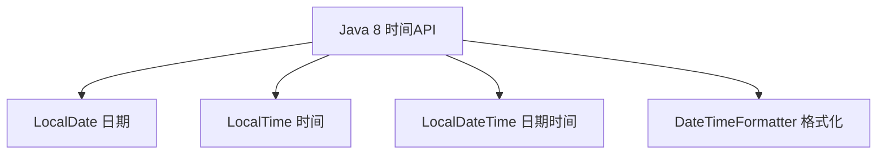
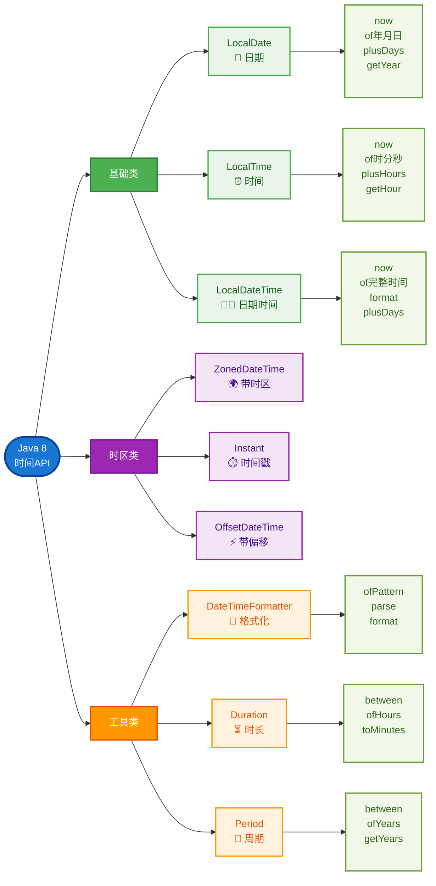

# 数据加解密

## RSA 加解密

RSA 加密算法是一种非对称加密算法，即 RSA 拥有一对密钥（公钥 和 私钥），公钥可公开。公钥加密的数据，只能由私钥解密；私钥加密的数据只能由公钥解密。

用生活例子理解 RSA
想象一下邮箱和钥匙的例子：

```
传统方式（对称加密）：
你和朋友共用一个邮箱，你们俩都有同一把钥匙
问题：如何安全地把钥匙给朋友？

RSA方式（非对称加密）：
你有一个特殊的邮箱：
- 投递口（公钥）：任何人都可以往里投信
- 取信钥匙（私钥）：只有你有，只有你能取信

流程：
1. 你把邮箱地址告诉所有人（公钥公开）
2. 朋友用投递口投信（用公钥加密）
3. 只有你能用钥匙取信（用私钥解密）
```

**RSA 的核心特点**

```
公钥（Public Key）：
- 可以公开给任何人
- 用来加密数据
- 就像邮箱的投递口

私钥（Private Key）：
- 绝对保密，只有自己知道
- 用来解密数据
- 就像邮箱的钥匙

神奇之处：
公钥加密的数据，只有对应的私钥才能解密！
```

**RSA 的优缺点**

✅ 优点

1. 安全性极高：基于数学难题,"大数分解"
2. 密钥分发简单：公钥可以公开传输
3. 支持数字签名：可以验证身份

❌ 缺点

1. 速度慢：比 AES 慢 100-1000 倍
2. 数据大小限制：只能加密小数据（通常<245 字节）
3. 计算复杂：需要大量 CPU 资源
4. 密钥长度大：通常需要 2048 位以上

---

登录加解密流程


**使用场景：**

- 🔐 用户登录密码加密传输
- 📧 敏感信息加密存储
- 🔑 API 密钥安全传输
- 💳 支付信息加密处理

为什么要在服务启动时自动初始化 RSA 密钥？

RSA 密钥生成耗时较长

测试时间：

```
RSA-1024位: ~50-100ms
RSA-2048位: ~200-500ms  ← 我们用的
RSA-4096位: ~1-3秒
```

用户体验：

```
用户A (第一个请求): 等待500ms ❌ 体验差
用户B (后续请求):   立即响应   ✅ 体验好
```

📝 总结

- 每人一对 RSA 密钥 ← 这是端到端加密模式
- 服务器一对 RSA 密钥 ← 这是传输加密模式

## AES 加解密

**什么是 AES？**

AES = `Advanced Encryption Standard`（高级加密标准）

- 对称加密算法：加密和解密使用同一个密钥
- 速度很快：比 RSA 快 100-1000 倍
- 安全性高：美国政府标准，军用级别加密
- 支持大数据：可以加密任意大小的数据

**对称加密 vs 非对称加密**

> RSA（非对称加密）

- 公钥加密 → 私钥解密
- 优点：安全性高，不需要共享密钥
- 缺点：速度慢，只能加密小数据

> AES（对称加密）

- 密钥加密 → 同一个密钥解密
- 优点：速度快，可以加密大数据
- 缺点：需要安全地共享密钥

**AES 工作原理（简化版）**

加密过程

```
原始数据: "Hello World"
密钥:     "MySecretKey123456"
        ↓
    【AES加密算法】
        ↓
加密结果: "j8vV2K+5x9..."（乱码）
```

解密过程

```
加密数据: "j8vV2K+5x9..."
密钥:     "MySecretKey123456"（必须是同一个密钥）
        ↓
    【AES解密算法】
        ↓
原始数据: "Hello World"
```

✅ AES 优点

- 对称加密，实现简单：加密解密用同一个密钥
- 速度快：比 RSA 快几百倍
- 无大小限制：可以加密任意大小的数据
- 资源消耗低,CPU 占用很少,内存占用很少

❌ AES 缺点

```
1. 🔑 密钥分发困难
   - 如何安全地把密钥给对方？
   - 网络传输密钥有风险
   - 需要提前约定密钥

2. 👥 密钥管理复杂
   - 每个用户都需要不同密钥
   - 密钥泄露影响范围大
   - 密钥更新困难

3. 🚫 无法数字签名
   - 不能验证消息来源
   - 不能防止否认
   - 需要额外的认证机制

4. 🔄 密钥共享问题
   - 同一密钥加密所有数据
   - 一处泄露，全盘皆输
   - 无法区分不同用户
```

**RSA vs AES 详细对比解析**

| 特性         | RSA (非对称加密)   | AES (对称加密)    |
| ------------ | ------------------ | ----------------- |
| 加密类型     | 非对称 (公钥+私钥) | 对称 (同一密钥)   |
| 密钥数量     | 2 个 (公钥+私钥)   | 1 个 (共享密钥)   |
| 加密速度     | 很慢               | 很快              |
| 数据大小限制 | 有限制 (~245 字节) | 无限制            |
| 密钥分发     | 简单 (公钥可公开)  | 复杂 (需安全传输) |
| 主要用途     | 密钥交换、数字签名 | 大量数据加密      |
| 计算复杂度   | 高                 | 低                |
| 密钥长度     | 2048-4096 位       | 128-256 位        |

## RSA + AES 组合加密

🤔 为什么要组合使用？

```ts
// ❌ 只用RSA的问题
const bigData = "一个1MB的文件内容...";
const encrypted = RSA.encrypt(bigData, publicKey);
// 💥 报错！RSA只能加密245字节

// ❌ 只用AES的问题
const data = "敏感数据";
const key = "mySecretKey123"; // 🚨 如何安全地把这个密钥给对方？
const encrypted = AES.encrypt(data, key);
```

组合使用的天才之处

```ts
// ✅ RSA + AES 完美结合
// RSA负责：安全传输AES密钥（小数据）
// AES负责：快速加密实际数据（大数据）
```

---

**前端加密传输**

流程如下

```
阶段一：密钥准备
前端 → 请求后端RSA公钥 → 后端返回公钥 → 前端缓存公钥

阶段二：数据加密
前端生成AES密钥 → 用AES加密数据 → 用RSA加密AES密钥 → 打包发送 (用RSA公钥加密的AES密钥、加密的数据包)

阶段三：数据传输
前端发送加密包 → 网络传输 → 后端接收加密包

阶段四：数据解密
后端用RSA私钥解密AES密钥 → 用AES密钥解密数据 → 获得原始数据

阶段五：业务处理
后端处理业务逻辑 → 返回处理结果
```

数据包结构:

```json
{
  "encryptedData": "AES加密后的数据",
  "encryptedKey": "RSA加密后的AES密钥",
  "timestamp": 1703123456789,
  "algorithm": "RSA-2048+AES-256",
  "version": "1.0"
}
```


**密钥管理**

```
// ✅ 正确做法
- RSA私钥只存在服务器端
- RSA公钥可以缓存，但定期更新
- AES密钥每次随机生成，用完即废

// ❌ 错误做法
- 把RSA私钥存在前端
- 重复使用同一个AES密钥
- 把密钥硬编码在代码中
```

**后端响应加密**

逻辑反转：前端生成密钥对


流程如下

```
加密通信：

1. 前端生成RSA密钥对（公钥 + 私钥）
2. 前端保存私钥到本地
3. 前端发送公钥到后端注册
4. 后端保存前端公钥到Redis

解密响应：

5. 前端请求敏感数据（携带keyId + requireEncrypted标识）
6. 后端检查请求标识
7. 后端生成随机AES密钥
8. 后端用AES密钥加密响应数据
9. 后端用前端公钥加密AES密钥
10. 后端返回加密包


11. 前端接收加密响应包
12. 前端用私钥解密AES密钥
13. 前端用AES密钥解密响应数据
14. 前端得到原始响应数据

```

---

防攻击措施

:::warning

- ✅ 前端私钥永远不发送给后端
- ✅ 前端公钥有过期时间（24 小时）
- ✅ AES 密钥每次随机生成，用完即废
- ✅ 使用 Redis 存储临时密钥信息
  :::

## 最佳实践

```bash
pnpm add jsencrypt crypto-js

pnpm add -D @types/crypto-js
```

**ts 工具类**

```ts
// src/utils/cryptoUtils.ts

import JSEncrypt from "jsencrypt";
import CryptoJS from "crypto-js";

/**
 * RSA密钥对接口，定义了密钥对的结构
 */
export interface RsaKeyPair {
  publicKey: string; // Base64编码的公钥
  privateKey: string; // Base64编码的私钥
}

/**
 * 前端RSA和AES加解密工具类
 *
 * JSEncrypt: 用于处理RSA非对称加密，通常用于加密少量敏感数据（如AES密钥）。
 * CryptoJS: 用于处理AES对称加密，通常用于加密大量业务数据。
 *
 * 推荐用法 (混合加密):
 * 1. 从后端获取RSA公钥。
 * 2. 在前端生成一个随机的AES密钥和IV。
 * 3. 使用AES加密业务数据。
 * 4. 使用RSA公钥加密AES密钥。
 * 5. 将RSA加密后的AES密钥、AES加密后的数据以及IV一起发送给后端。
 */
export class CryptoUtils {
  // =================================================================================
  // RSA (非对称加密) 相关方法
  // =================================================================================

  /**
   * 同步生成RSA密钥对
   *
   * @param keySize 密钥大小 (1024, 2048, 4096)，默认为 2048 位。
   * @returns 返回一个包含公钥和私钥的对象 (RsaKeyPair)。
   *
   * @description
   * 这个方法会阻塞主线程直到密钥生成完毕。
   * 对于需要立即获取密钥的简单场景很方便。
   */
  public static generateKeyPairSync(
    keySize: 1024 | 2048 | 4096 = 2048
  ): RsaKeyPair {
    const encrypt = new JSEncrypt({ default_key_size: keySize.toString() });

    // JSEncrypt 在实例化时会自动生成密钥
    // 我们可以直接获取它们
    const publicKey = encrypt.getPublicKey();
    const privateKey = encrypt.getPrivateKey();

    return {
      publicKey,
      privateKey,
    };
  }

  /**
   * 异步生成RSA密钥对
   *
   * @param keySize 密钥大小 (1024, 2048, 4096)，默认为 2048 位。
   * @returns 返回一个Promise，解析后得到包含公钥和私钥的对象 (RsaKeyPair)。
   *
   * @description
   * 推荐在生产环境中使用此方法，因为它不会阻塞UI线程。
   * 特别是生成4096位密钥时，同步方法可能会导致页面卡顿。
   */
  public static generateKeyPairAsync(
    keySize: 1024 | 2048 | 4096 = 2048
  ): Promise<RsaKeyPair> {
    return new Promise((resolve, reject) => {
      try {
        const encrypt = new JSEncrypt({ default_key_size: keySize.toString() });

        // JSEncrypt的密钥生成是在构造函数中同步执行的，
        // 但为了提供一个标准的异步接口，我们将其包装在Promise中。
        // 这也使得未来如果库更新为真正的异步生成，我们可以平滑过渡。
        const keyPair: RsaKeyPair = {
          publicKey: encrypt.getPublicKey(),
          privateKey: encrypt.getPrivateKey(),
        };

        // 使用 setTimeout(0) 将解析操作推到下一个事件循环，
        // 模拟异步行为，让调用方可以一致地使用 .then()
        setTimeout(() => {
          resolve(keyPair);
        }, 0);
      } catch (error) {
        reject(error);
      }
    });
  }

  /**
   * RSA公钥加密
   * @param data 待加密的明文数据
   * @param publicKeyBase64 Base64编码的RSA公钥字符串
   * @returns Base64编码的加密后字符串，如果加密失败则返回false
   */
  public static rsaEncrypt(
    data: string,
    publicKeyBase64: string
  ): string | false {
    const encrypt = new JSEncrypt();
    encrypt.setPublicKey(publicKeyBase64);
    return encrypt.encrypt(data);
  }

  /**
   * RSA私钥解密 (注意：私钥通常不应在前端存储或使用)
   * @param encryptedData Base64编码的加密字符串
   * @param privateKeyBase64 Base64编码的RSA私钥字符串
   * @returns 解密后的明文数据，如果解密失败则返回false
   */
  public static rsaDecrypt(
    encryptedData: string,
    privateKeyBase64: string
  ): string | false {
    const decrypt = new JSEncrypt();
    decrypt.setPrivateKey(privateKeyBase64);
    return decrypt.decrypt(encryptedData);
  }

  // =================================================================================
  // AES (对称加密) 相关方法
  // =================================================================================

  /**
   * 生成随机AES密钥
   * @param keySize 密钥大小 (128, 192, 256)，单位：位。返回的密钥长度为 keySize / 8 字节。
   * @returns Base64编码的AES密钥字符串
   */
  public static generateAesKey(keySize: 128 | 192 | 256 = 256): string {
    const key = CryptoJS.lib.WordArray.random(keySize / 8);
    return CryptoJS.enc.Base64.stringify(key);
  }

  /**
   * 生成随机AES初始化向量 (IV)
   * @returns Base64编码的IV字符串 (16字节)
   */
  public static generateIv(): string {
    const iv = CryptoJS.lib.WordArray.random(16);
    return CryptoJS.enc.Base64.stringify(iv);
  }

  /**
   * AES加密 (AES-256-CBC)
   * @param data 待加密的明文数据
   * @param keyBase64 Base64编码的AES密钥
   * @param ivBase64 Base64编码的IV
   * @returns Base64编码的加密后字符串
   */
  public static aesEncrypt(
    data: string,
    keyBase64: string,
    ivBase64: string
  ): string {
    const key = CryptoJS.enc.Base64.parse(keyBase64);
    const iv = CryptoJS.enc.Base64.parse(ivBase64);
    const encrypted = CryptoJS.AES.encrypt(data, key, {
      iv: iv,
      mode: CryptoJS.mode.CBC,
      padding: CryptoJS.pad.Pkcs7,
    });
    return encrypted.toString();
  }

  /**
   * AES解密 (AES-256-CBC)
   * @param encryptedData Base64编码的加密字符串
   * @param keyBase64 Base64编码的AES密钥
   * @param ivBase64 Base64编码的IV
   * @returns 解密后的明文数据
   */
  public static aesDecrypt(
    encryptedData: string,
    keyBase64: string,
    ivBase64: string
  ): string {
    const key = CryptoJS.enc.Base64.parse(keyBase64);
    const iv = CryptoJS.enc.Base64.parse(ivBase64);
    const decrypted = CryptoJS.AES.decrypt(encryptedData, key, {
      iv: iv,
      mode: CryptoJS.mode.CBC,
      padding: CryptoJS.pad.Pkcs7,
    });
    return decrypted.toString(CryptoJS.enc.Utf8);
  }
}

// =================================================================================
// 使用示例 - 你可以在Vue组件的 onMounted 钩子或某个方法中调用
// =================================================================================
export function runCryptoDemo() {
  console.log("=============== 前端加密工具类示例 ===============");

  // 模拟从后端获取到的RSA公钥
  // 这是一个示例公钥，实际项目中应通过API从后端获取
  const backendRsaPublicKey =
    "MIIBIjANBgkqhkiG9w0BAQEFAAOCAQ8AMIIBCgKCAQEAyXQ2s/53/7Z+a/gJ" +
    "cEIFGZfz9Jt1OV3a/1D/Shs8s5g8F7/C2sp7a0eC6X7JGjM2Zg6QcZJj/O" +
    "LqJzYh+0Xl/gVcY8Y5T6Z8f6d8a7c6b9e/c8a9f6d7g8e/b7a6f5e8d9c0" +
    "b/f6a8e7d5f4g3h2j1k0l/m5n7o9p1q2r4s6t8v0w+x3y5z7A9B1C3D5E7" +
    "F9G1H3J5K7L9M1N3O5P7R9T1V3W5X7Z9A1B3C5D7E9F1G3H5J7K9L1M3N5" +
    "O7P9R1T3V5W7X9Z1A3B5C7D9E1F3G5H7J9K1L3M5N7O9P1R3V5W7X9Z1A3" +
    "B5C7D9E1F3G5H7J9K1L3M5N7O9P1R3V5W7X9Z1A3B5C7D9E1F3G5H7J9K" +
    "1L3M5N7O9P1R3V5W7X9Z==";

  // ==================== AES示例 ====================
  console.log("\n=============== AES示例 ===============");
  // 1. 生成AES密钥和IV
  const aesKey = CryptoUtils.generateAesKey(256);
  const iv = CryptoUtils.generateIv();
  console.log("生成的AES密钥 (Base64):", aesKey);
  console.log("生成的IV (Base64):", iv);

  // 2. AES加密
  const aesOriginalText = "这是前端用AES加密的大量业务数据。";
  const aesEncrypted = CryptoUtils.aesEncrypt(aesOriginalText, aesKey, iv);
  console.log("AES加密后:", aesEncrypted);

  // 3. AES解密 (仅用于演示)
  const aesDecrypted = CryptoUtils.aesDecrypt(aesEncrypted, aesKey, iv);
  console.log("AES解密后:", aesDecrypted);
  console.log("AES加解密是否成功:", aesOriginalText === aesDecrypted);

  // ==================== 混合加密示例（推荐用法） ====================
  console.log("\n=============== 混合加密示例 ===============");
  const sensitiveData = JSON.stringify({
    username: "frontend_user",
    password: "secure_password_123",
    action: "login",
  });
  console.log("原始敏感数据:", sensitiveData);

  // 1. 生成临时的AES密钥和IV
  const sessionAesKey = CryptoUtils.generateAesKey(256);
  const sessionIv = CryptoUtils.generateIv();

  // 2. 使用AES加密敏感数据
  const encryptedData = CryptoUtils.aesEncrypt(
    sensitiveData,
    sessionAesKey,
    sessionIv
  );
  console.log("AES加密后的数据:", encryptedData);

  // 3. 使用从后端获取的RSA公钥加密AES密钥
  const encryptedAesKey = CryptoUtils.rsaEncrypt(
    sessionAesKey,
    backendRsaPublicKey
  );
  if (!encryptedAesKey) {
    console.error("RSA加密AES密钥失败！");
    return;
  }
  console.log("RSA加密后的AES密钥:", encryptedAesKey);

  // 4. 准备发送到后端的数据包
  const payload = {
    key: encryptedAesKey, // RSA加密的AES密钥
    data: encryptedData, // AES加密的业务数据
    iv: sessionIv, // AES的IV
    timestamp: Date.now(),
  };

  console.log("\n准备发送到后端的数据包:", JSON.stringify(payload, null, 2));

  // 5. 接下来可以通过axios等发送payload到后端
  // axios.post('/api/secure/data', payload).then(...)
}
```

**java 工具类**

```java
package com.zzy.admin.utils;

import java.security.KeyPair;
import java.security.KeyPairGenerator;
import java.security.NoSuchAlgorithmException;
import java.security.PrivateKey;
import java.security.PublicKey;
import java.security.SecureRandom;
import java.security.spec.PKCS8EncodedKeySpec;
import java.security.spec.X509EncodedKeySpec;
import javax.crypto.Cipher;
import javax.crypto.KeyGenerator;
import javax.crypto.SecretKey;
import javax.crypto.spec.IvParameterSpec;
import javax.crypto.spec.SecretKeySpec;
import java.nio.charset.StandardCharsets;
import java.util.Base64;
import java.security.KeyFactory;

/**
 * RSA和AES加解密工具类
 * <p>
 * RSA (非对称加密): 用于加密小数据（如AES密钥）、数字签名。速度慢。
 * AES (对称加密): 用于加密大量数据。速度快。
 * <p>
 * 推荐用法 (混合加密):
 * 1. 后端生成RSA密钥对（公钥+私钥）。
 * 2. 前端请求后端获取RSA公钥。
 * 3. 前端生成一个随机的AES密钥。
 * 4. 前端用AES密钥加密业务数据。
 * 5. 前端用RSA公钥加密AES密钥。
 * 6. 将RSA加密后的AES密钥和AES加密后的数据一起发送给后端。
 * 7. 后端用RSA私钥解密AES密钥。
 * 8. 后端用解密后的AES密钥解密业务数据。
 */
public class CryptoUtils {
    // RSA算法标识
    private static final String RSA_ALGORITHM = "RSA";
    // AES算法标识 (CBC模式，PKCS5填充)
    private static final String AES_ALGORITHM = "AES/CBC/PKCS5Padding";
    // AES密钥算法
    private static final String AES_KEY_ALGORITHM = "AES";

    /**
     * 私有构造函数，防止实例化
     */
    private CryptoUtils() {
    }

    // =================================================================================
    // RSA (非对称加密) 相关方法
    // =================================================================================

    /**
     * 生成RSA密钥对
     *
     * @param keySize 密钥大小 (推荐 2048)
     * @return KeyPair 密钥对对象
     * @throws NoSuchAlgorithmException 如果请求的加密算法不可用
     */
    public static KeyPair generateRsaKeyPair(int keySize) throws NoSuchAlgorithmException {
        KeyPairGenerator keyPairGenerator = KeyPairGenerator.getInstance(RSA_ALGORITHM);
        keyPairGenerator.initialize(keySize);
        return keyPairGenerator.generateKeyPair();
    }

    /**
     * RSA公钥加密
     *
     * @param data      待加密的明文数据
     * @param publicKey RSA公钥
     * @return Base64编码的加密后字符串
     * @throws Exception 加密过程中可能发生异常
     */
    public static String rsaEncrypt(String data, PublicKey publicKey) throws Exception {
        Cipher cipher = Cipher.getInstance(RSA_ALGORITHM);
        cipher.init(Cipher.ENCRYPT_MODE, publicKey);
        byte[] encryptedBytes = cipher.doFinal(data.getBytes(StandardCharsets.UTF_8));
        return Base64.getEncoder().encodeToString(encryptedBytes);
    }

    /**
     * RSA私钥解密
     *
     * @param encryptedData Base64编码的加密字符串
     * @param privateKey    RSA私钥
     * @return 解密后的明文数据
     * @throws Exception 解密过程中可能发生异常
     */
    public static String rsaDecrypt(String encryptedData, PrivateKey privateKey) throws Exception {
        byte[] encryptedBytes = Base64.getDecoder().decode(encryptedData);
        Cipher cipher = Cipher.getInstance(RSA_ALGORITHM);
        cipher.init(Cipher.DECRYPT_MODE, privateKey);
        byte[] decryptedBytes = cipher.doFinal(encryptedBytes);
        return new String(decryptedBytes, StandardCharsets.UTF_8);
    }

    // =================================================================================
    // AES (对称加密) 相关方法
    // =================================================================================

    /**
     * 生成AES密钥
     *
     * @param keySize 密钥大小 (推荐 128, 192, 256)
     * @return SecretKey AES密钥对象
     * @throws NoSuchAlgorithmException 如果请求的加密算法不可用
     */
    public static SecretKey generateAesKey(int keySize) throws NoSuchAlgorithmException {
        KeyGenerator keyGenerator = KeyGenerator.getInstance(AES_KEY_ALGORITHM);
        keyGenerator.init(keySize);
        return keyGenerator.generateKey();
    }

    /**
     * AES加密
     *
     * @param data      待加密的明文数据
     * @param secretKey AES密钥
     * @param iv        初始化向量 (16字节)
     * @return Base64编码的加密后字符串
     * @throws Exception 加密过程中可能发生异常
     */
    public static String aesEncrypt(String data, SecretKey secretKey, IvParameterSpec iv) throws Exception {
        Cipher cipher = Cipher.getInstance(AES_ALGORITHM);
        cipher.init(Cipher.ENCRYPT_MODE, secretKey, iv);
        byte[] encryptedBytes = cipher.doFinal(data.getBytes(StandardCharsets.UTF_8));
        return Base64.getEncoder().encodeToString(encryptedBytes);
    }

    /**
     * AES解密
     *
     * @param encryptedData Base64编码的加密字符串
     * @param secretKey     AES密钥
     * @param iv            初始化向量 (16字节)
     * @return 解密后的明文数据
     * @throws Exception 解密过程中可能发生异常
     */
    public static String aesDecrypt(String encryptedData, SecretKey secretKey, IvParameterSpec iv) throws Exception {
        byte[] encryptedBytes = Base64.getDecoder().decode(encryptedData);
        Cipher cipher = Cipher.getInstance(AES_ALGORITHM);
        cipher.init(Cipher.DECRYPT_MODE, secretKey, iv);
        byte[] decryptedBytes = cipher.doFinal(encryptedBytes);
        return new String(decryptedBytes, StandardCharsets.UTF_8);
    }

    /**
     * 生成一个随机的16字节初始化向量 (IV)
     *
     * @return IvParameterSpec IV对象
     */
    public static IvParameterSpec generateIv() {
        byte[] iv = new byte[16];
        new SecureRandom().nextBytes(iv);
        return new IvParameterSpec(iv);
    }

    // =================================================================================
    // 密钥转换和存储相关方法
    // =================================================================================

    /**
     * 将公钥对象转换为Base64编码的字符串 (方便传输)
     *
     * @param publicKey 公钥对象
     * @return Base64字符串
     */
    public static String publicKeyToString(PublicKey publicKey) {
        return Base64.getEncoder().encodeToString(publicKey.getEncoded());
    }

    /**
     * 将私钥对象转换为Base64编码的字符串 (方便存储)
     *
     * @param privateKey 私钥对象
     * @return Base64字符串
     */
    public static String privateKeyToString(PrivateKey privateKey) {
        return Base64.getEncoder().encodeToString(privateKey.getEncoded());
    }

    /**
     * 将AES密钥对象转换为Base64编码的字符串 (方便传输和存储)
     *
     * @param secretKey AES密钥对象
     * @return Base64字符串
     */
    public static String aesKeyToString(SecretKey secretKey) {
        return Base64.getEncoder().encodeToString(secretKey.getEncoded());
    }

    /**
     * 将Base64编码的公钥字符串转换回PublicKey对象
     *
     * @param publicKeyString Base64编码的公钥字符串
     * @return PublicKey对象
     * @throws Exception 转换异常
     */
    public static PublicKey stringToPublicKey(String publicKeyString) throws Exception {
        byte[] keyBytes = Base64.getDecoder().decode(publicKeyString);
        X509EncodedKeySpec keySpec = new X509EncodedKeySpec(keyBytes);
        KeyFactory keyFactory = KeyFactory.getInstance(RSA_ALGORITHM);
        return keyFactory.generatePublic(keySpec);
    }

    /**
     * 将Base64编码的私钥字符串转换回PrivateKey对象
     *
     * @param privateKeyString Base64编码的私钥字符串
     * @return PrivateKey对象
     * @throws Exception 转换异常
     */
    public static PrivateKey stringToPrivateKey(String privateKeyString) throws Exception {
        byte[] keyBytes = Base64.getDecoder().decode(privateKeyString);
        PKCS8EncodedKeySpec keySpec = new PKCS8EncodedKeySpec(keyBytes);
        KeyFactory keyFactory = KeyFactory.getInstance(RSA_ALGORITHM);
        return keyFactory.generatePrivate(keySpec);
    }

    /**
     * 将Base64编码的AES密钥字符串转换回SecretKey对象
     *
     * @param secretKeyString Base64编码的AES密钥字符串
     * @return SecretKey对象
     */
    public static SecretKey stringToAesKey(String secretKeyString) {
        byte[] keyBytes = Base64.getDecoder().decode(secretKeyString);
        return new SecretKeySpec(keyBytes, AES_KEY_ALGORITHM);
    }

    // =================================================================================
    // Main方法 - 使用示例
    // =================================================================================
    public static void main(String[] args) {
        try {
            // ==================== RSA示例 ====================
            System.out.println("=============== RSA示例 ===============");
            // 1. 生成RSA密钥对
            KeyPair rsaKeyPair = generateRsaKeyPair(2048);
            PublicKey rsaPublicKey = rsaKeyPair.getPublic();
            PrivateKey rsaPrivateKey = rsaKeyPair.getPrivate();

            // 2. 将密钥转换为字符串（方便查看和传输）
            String rsaPublicKeyStr = publicKeyToString(rsaPublicKey);
            String rsaPrivateKeyStr = privateKeyToString(rsaPrivateKey);
            System.out.println("RSA公钥 (Base64): " + rsaPublicKeyStr);
            System.out.println("RSA私钥 (Base64): " + rsaPrivateKeyStr);

            // 3. RSA加密
            String originalText = "这是一段需要RSA加密的敏感信息";
            String rsaEncryptedText = rsaEncrypt(originalText, rsaPublicKey);
            System.out.println("RSA加密后: " + rsaEncryptedText);

            // 4. RSA解密
            String rsaDecryptedText = rsaDecrypt(rsaEncryptedText, rsaPrivateKey);
            System.out.println("RSA解密后: " + rsaDecryptedText);
            System.out.println("RSA加解密是否成功: " + originalText.equals(rsaDecryptedText));

            // ==================== AES示例 ====================
            System.out.println("\n=============== AES示例 ===============");
            // 1. 生成AES密钥
            SecretKey aesKey = generateAesKey(256);
            String aesKeyStr = aesKeyToString(aesKey);
            System.out.println("AES密钥 (Base64): " + aesKeyStr);

            // 2. 生成初始化向量IV
            IvParameterSpec iv = generateIv();
            String ivStr = Base64.getEncoder().encodeToString(iv.getIV());
            System.out.println("AES初始化向量 (Base64): " + ivStr);


            // 3. AES加密
            String largeText = "这是一段比较长的数据，适合使用AES进行加密处理，因为AES速度更快。";
            String aesEncryptedText = aesEncrypt(largeText, aesKey, iv);
            System.out.println("AES加密后: " + aesEncryptedText);

            // 4. AES解密
            String aesDecryptedText = aesDecrypt(aesEncryptedText, aesKey, iv);
            System.out.println("AES解密后: " + aesDecryptedText);
            System.out.println("AES加解密是否成功: " + largeText.equals(aesDecryptedText));

            // ==================== 混合加密示例 ====================
            System.out.println("\n=============== 混合加密示例 ===============");
            String businessData = "{\"userId\": 123, \"orderId\": \"SN20240728\", \"amount\": 999.99}";
            System.out.println("原始业务数据: " + businessData);

            // 1. 生成临时的AES密钥和IV
            SecretKey sessionAesKey = generateAesKey(256);
            IvParameterSpec sessionIv = generateIv();

            // 2. 使用AES加密业务数据
            String encryptedBusinessData = aesEncrypt(businessData, sessionAesKey, sessionIv);
            System.out.println("AES加密后的业务数据: " + encryptedBusinessData);

            // 3. 使用RSA公钥加密AES密钥
            String aesKeyString = aesKeyToString(sessionAesKey);
            String encryptedAesKey = rsaEncrypt(aesKeyString, rsaPublicKey);
            System.out.println("RSA加密后的AES密钥: " + encryptedAesKey);

            // 4. [网络传输] 将 encryptedAesKey, encryptedBusinessData, 和 IV 发送给后端...

            // 5. [后端接收] 后端使用RSA私钥解密AES密钥
            String decryptedAesKeyString = rsaDecrypt(encryptedAesKey, rsaPrivateKey);
            SecretKey restoredAesKey = stringToAesKey(decryptedAesKeyString);
            System.out.println("RSA解密后的AES密钥与原始AES密钥是否一致: " + aesKeyString.equals(decryptedAesKeyString));


            // 6. 后端使用解密后的AES密钥解密业务数据
            String decryptedBusinessData = aesDecrypt(encryptedBusinessData, restoredAesKey, sessionIv);
            System.out.println("AES解密后的业务数据: " + decryptedBusinessData);
            System.out.println("混合加密流程是否成功: " + businessData.equals(decryptedBusinessData));

        } catch (Exception e) {
            e.printStackTrace();
        }
    }

}

```

### Base64 编码在加密中的作用

🤔 为什么要转为 Base64？

核心原因：二进制数据传输问题

```java
// 原始密钥是什么样的？
KeyPair keyPair = keyPairGenerator.generateKeyPair();
PublicKey publicKey = keyPair.getPublic();

// 获取原始字节数据
byte[] publicKeyBytes = publicKey.getEncoded();
System.out.println("原始字节数据: " + Arrays.toString(publicKeyBytes));
// 输出：[48, -126, 1, 34, 48, 13, 6, 9, 42, -122, 72, -122, -9, 13, 1, 1...]
// 这是二进制数据，包含不可打印字符！

// 如果直接转字符串会怎样？
String badString = new String(publicKeyBytes);
System.out.println("直接转字符串: " + badString);
// 输出：0☺"0 ♪*☻H☻ù ♪♪☺♪☺☺♪♪○...乱码！❌
```

数据传输的挑战

```ts
// 网络传输场景
const request = {
  publicKey: '0☺"0\r\u0006\t*☻H☻ù\r\u0001\u0001...', // ❌ 包含控制字符
};

// JSON序列化会出错
JSON.stringify(request); // ❌ 可能报错或丢失数据

// HTTP传输也会有问题
fetch("/api/keys", {
  body: JSON.stringify(request), // ❌ 特殊字符可能被破坏
});
```

🎯 Base64 解决了什么问题？

Base64 的特点

```txt
Base64字符集：A-Z, a-z, 0-9, +, /（64个字符）
- 所有字符都是可打印的
- 不包含控制字符
- 安全传输通过HTTP、JSON、XML等文本协议
- 不会被各种系统误解或破坏
```

编码前后对比

```java
// 编码前：二进制字节
byte[] keyBytes = {48, -126, 1, 34, 48, 13, 6, 9, 42, -122, 72, -122, -9, 13};
System.out.println("二进制: " + Arrays.toString(keyBytes));
// 输出：[48, -126, 1, 34, 48, 13, 6, 9, 42, -122, 72, -122, -9, 13]

// 编码后：Base64字符串
String base64String = Base64.encodeBase64String(keyBytes);
System.out.println("Base64: " + base64String);
// 输出：MIIBIjANBgkqhkiG9w0BAQEFAAOCAQ8AMIIBCgKCAQEA...
// 全部是可打印字符！✅
```

# Java Keystore

`Java Keystore` (密钥库)，顾名思义，是一个用来**存储和管理密钥**（Keys）和证书（Certificates）的安全容器。

你可以把它想象成一个加密的保险箱。这个保险箱本身有一个主密码（storepass），用来打开它。保险箱里面可以放很多个带锁的小盒子，每个小盒子都装着敏感的东西（比如私钥或证书），并且每个小盒子也可以有自己独立的小锁密码（keypass）。

核心特点：

1. 是一个文件：它在物理上就是一个文件，常见后缀有.jks, .p12, .pfx。
2. 内容是加密的：没有正确的密码，无法查看或使用里面的内容。
3. 结构化存储：内部通过别名（alias）来唯一标识和区分每一个存储的条目（Entry）。
4. Java 原生支持：Java 的 java.security 包提供了完整的 API 来创建、加载和操作 Keystore。

🎯 **为什么要用它？**

在软件开发中，尤其是涉及到网络通信和数据安全时，我们不可避免地要处理各种密钥和证书。直接将这些敏感信息硬编码在代码里或明文存放在配置文件中是极其危险的。Keystore 的出现就是为了解决这个问题。

使用 Keystore 的核心目的：为了安全、统一地管理密钥和证书。

简单来说，不用 Keystore 就像把家里的钥匙直接挂在门上；用 Keystore 就像把钥匙锁在保险箱里

```bash
keytool -genkeypair \
  -alias spring_admin \
  -keyalg RSA \
  -keysize 2048 \
  -keystore zzy.jks \
  -validity 3650 \
  -storepass '%U4t#N7k!Bv2^Ec9*Zr0@Hx5*Mp3qJw' \
  -keypass '%U4t#N7k!Bv2^Ec9*Zr0@Hx5*Mp3qJw' \
  -dname "CN=zzyang.top, OU=Tech, O=zzyang Inc, L=NanJing, ST=NanJing, C=CN"

```

**参数说明**

- -genkeypair

> 作用：生成密钥对（包含公钥和私钥）
>
> 用途：是创建证书的基本命令

- -alias spring_admin

> 作用：指定密钥对的别名
>
> 用途：用于在密钥库中标识和访问该密钥对
>
> 实践建议：使用有意义的名称，如项目名或域名

- -keyalg RSA

> 作用：指定加密算法为 RSA
>
> 用途：RSA 是一种非对称加密算法，广泛用于安全通信
>
> 替代选项：也可以使用 DSA 或 EC 算法

- -keysize 2048

> 作用：指定密钥长度为 2048 位

> 用途：决定加密强度

> 安全建议：2048 位是当前推荐的最小长度 可以使用 4096 位获得更高安全性 不建议使用低于 2048 位的密钥长度

- -keystore zzy.jks

> 作用：指定生成的密钥库文件名
>
> 用途：存储证书和密钥的容器
>
> 文件格式： .jks：Java 密钥库格式 也可以使用 .p12 (PKCS12 格式)

- -validity 3650

> 作用：设置证书有效期为 3650 天（10 年）
>
> 用途：确定证书的生命周期
>
> 建议： 开发环境可以设置较长时间 生产环境建议 1-2 年，定期更新

- -storepass '%U4t#N7k!Bv2^Ec9Zr0@Hx5Mp3qJw'

> 作用：设置密钥库的访问密码
>
> 用途：保护密钥库的安全
>
> 安全建议： 使用强密码 安全保存密码 生产环境应使用密码管理系统

- -keypass '%U4t#N7k!Bv2^Ec9Zr0@Hx5Mp3qJw'

> 作用：设置密钥对的访问密码
>
> 用途：保护私钥的安全
>
> 注意：通常与 storepass 设置相同值以简化管理

- -dname "CN=zzyang.top, OU=Tech, O=zzyang Inc, L=NanJing, ST=NanJing, C=CN"

> 作用：设置证书主题信息
>
> 各字段含义：
> CN (Common Name)：域名
>
> OU (Organizational Unit)：组织单位
>
> O (Organization)：组织名称
>
> L (Locality)：城市
>
> ST (State)：省份/州
>
> C (Country)：国家代码

⚠️ **使用 Keystore 的注意事项**

1. Keystore 文件本身的保护

- 不要提交到版本控制系统 (Git)：这是最最重要的一条！必须将.jks, .p12 等文件添加到.gitignore 中。
- 严格控制文件权限：在服务器上，设置 Keystore 文件的权限，确保只有运行应用程序的用户才能读取它（例如，chmod 400 your_keystore.jks）。
- 安全存放：不要将 Keystore 文件放在 Web 服务器的根目录或其他可被公开访问的路径下。应放在配置目录或专门的安全目录下（如/etc/certs/）。

2. 密码管理 (最关键的环节)

- 使用强密码：为 Keystore（storepass）和私钥条目（keypass）设置复杂的、无规律的强密码。
- 不要硬编码密码：绝对不要在 application.yml 或 Java 代码中明文写入密码。
- 推荐的密码管理方式：
  - 环境变量：通过服务器的环境变量传入密码 (${KEYSTORE_PASSWORD})。这是最简单、最常用的方式。
  - 配置中心：使用如 Nacos, Apollo, Spring Cloud Config 等配置中心来管理密码。
  - Docker Secrets / Kubernetes Secrets：在容器化环境中，使用编排工具提供的 Secrets 管理机制。
  - 云服务 KMS/Vault：使用云厂商提供的密钥管理服务或 HashiCorp Vault 来管理密码。

3. 密钥和证书的生命周期管理

- 定期轮换 (Rotation)：制定策略定期更换 Keystore 中的密钥和证书，以降低因密钥泄露造成的长期风险。
- 备份与恢复：建立 Keystore 文件的备份和恢复机制。如果文件损坏或丢失，且没有备份，所有依赖它的加密/签名功能都会瘫痪。
- 记录信息：记录好每个 Keystore 中每个别名（alias）对应的密钥用途、有效期等元数据，方便维护。

4. 选择合适的 Keystore 类型

- `JKS (.jks)`: Java 的传统格式，兼容性好，但功能有限（如默认不支持存储对称密钥）。
- `PKCS12 (.p12, .pfx)`: 推荐使用。这是一个国际标准，具有更好的跨平台兼容性，可以被 Java, .NET, Python, OpenSSL 等大多数工具和语言识别。它也能存储私钥、证书和对称密钥。
- `JCEKS`: 如果你需要存储对称密钥（如 AES 密钥），这是一个不错的选择，比 JKS 更强大。

**总结**

- 是什么：一个加密的文件保险箱，用于安全存储密钥和证书。
- 为什么用：为了安全（避免明文密钥）、集中管理（避免密钥散落）、解耦（更换密钥不改代码）和标准化。
- 注意事项：保护好文件本身（别上传 Git），保护好密码（别硬编码），做好备份和轮换，并选择合适的格式（推荐 PKCS12）。

## jwt 联合

在`application.yml`进行配置

```yml [application.yml]
spring-admin:
  jwt:
    location: classpath:zzy.jks
    alias: spring_admin
    password: "%U4t#N7k!Bv2^Ec9*Zr0@Hx5*Mp3qJw"
    expiration: 2 # 访问令牌过期时间（小时）
    refresh: 168 # 刷新令牌过期时间（小时，7天）
```

在 config 中配置类

```java [JwtProperties.java]
@Data
@Component
@ConfigurationProperties(prefix = "spring-admin.jwt")
public class JwtProperties {

    /**
     * 密钥库 (JKS) 文件的位置, Spring Boot 会自动解析 classpath: 或 file:
     */
    private Resource location;
    /**
     * 密钥库中密钥条目的别名
     */
    private String alias;
    /**
     * 密钥库和私钥的密码
     */
    private String password;

    /**
     * JWT 访问令牌过期时间（小时）
     */
    private Integer expiration = 2;

    /**
     * JWT 刷新令牌过期时间（小时）
     */
    private Integer refresh = 168;
}
```

jwt 工具类

```java
@Slf4j
@Component
public class JwtUtil {
    @Autowired
    private JwtProperties jwtProperties; // 注入JKS配置

    private PrivateKey privateKey; // 用于签名的私钥
    private PublicKey publicKey;   // 用于验签的公钥


    /**
     * JWT 签名算法
     */
    private static final SignatureAlgorithm SIGNATURE_ALGORITHM = SignatureAlgorithm.RS256;  // 使用RS256算法

    /**
     * JWT 中用户ID的键名
     */
    private static final String USER_ID_KEY = "userId";

    /**
     * JWT 中用户名的键名
     */
    private static final String USERNAME_KEY = "username";

    /**
     * JWT 中用户名的键名
     */
    private static final String NICKNAME_KEY = "nickname";

    /**
     * JWT 中令牌类型的键名
     */
    private static final String TOKEN_TYPE_KEY = "type";
    /**
     * JWT 中访问令牌类型的值
     */
    private static final String ACCESS_TOKEN_TYPE = "access";
    /**
     * JWT 中刷新令牌类型的值
     */
    private static final String REFRESH_TOKEN_TYPE = "refresh";


    /**
     * 初始化方法，在Bean创建后执行
     */
    @PostConstruct
    public void init() {
        try {
            Resource resource = jwtProperties.getLocation();
            String password = jwtProperties.getPassword();
            String alias = jwtProperties.getAlias();

            if (resource == null || !resource.exists()) {
                throw new IllegalStateException("JWT密钥库文件未找到，请检查配置: " + jwtProperties.getLocation());
            }

            KeyStore keyStore = KeyStore.getInstance("JKS");
            try (InputStream is = resource.getInputStream()) {
                keyStore.load(is, password.toCharArray());
            }

            // 从密钥库中获取私钥和公钥
            this.privateKey = (PrivateKey) keyStore.getKey(alias, password.toCharArray());
            this.publicKey = keyStore.getCertificate(alias).getPublicKey();

            if (this.privateKey == null || this.publicKey == null) {
                throw new IllegalStateException("在JKS文件中找不到别名为 '" + alias + "' 的密钥对");
            }

            // log.info("JWT工具类初始化成功，使用RS256非对称加密。");

        } catch (Exception e) {
            log.error("初始化JWT工具类失败，无法加载JKS密钥库", e);
            // 抛出运行时异常，使服务启动失败，以便及时发现配置问题
            throw new RuntimeException("初始化JWT工具类失败，请检查JKS配置", e);
        }
    }

      /**
     * 生成 JWT 访问令牌
     */
    public String generateAccessToken(Long userId, String username, String nickname) {
        return generateToken(userId, username, nickname, jwtProperties.getExpiration(), ACCESS_TOKEN_TYPE);
    }

    /**
     * 生成 JWT 刷新令牌
     */
    public String generateRefreshToken(Long userId, String username, String nickname) {
        return generateToken(userId, username, nickname, jwtProperties.getRefresh(), REFRESH_TOKEN_TYPE);
    }

    /**
     * 通用令牌生成方法
     */
    private String generateToken(Long userId, String username, String nickname, Integer ttl, String tokenType) {
        if (userId == null || username == null || username.trim().isEmpty()) {
            throw new AuthException("用户ID和用户名不能为空");
        }

        try {
            Date now = new Date();
            Date expiration = new Date(now.getTime() + ttl * 60 * 60 * 1000);

            Map<String, Object> claims = new HashMap<>();
            claims.put(USER_ID_KEY, userId);
            claims.put(USERNAME_KEY, username);
            claims.put(NICKNAME_KEY, nickname);
            claims.put(TOKEN_TYPE_KEY, tokenType);

            return Jwts.builder()
                    .setClaims(claims)
                    .setSubject(username)
                    .setIssuedAt(now)
                    .setExpiration(expiration)
                    .signWith(this.privateKey, SIGNATURE_ALGORITHM) //  ⬅️使用私钥和RS256签名
                    .compact();

        } catch (Exception e) {
            log.error("生成JWT失败，用户ID: {}, 用户名: {}", userId, username, e);
            throw new AuthException("生成令牌失败");
        }
    }


    /**
     * 解析 JWT 令牌
     *
     * @param token JWT令牌
     * @return Claims对象，包含令牌中的所有信息
     * @throws AuthException 当令牌无效、过期或解析失败时抛出
     */
    public Claims parseToken(String token) {
        if (StrUtil.isBlank(token)) {
            throw new AuthException("令牌不能为空");
        }

        try {
            return Jwts.parserBuilder()
                    .setSigningKey(this.publicKey)  // ⬅️
                    .build()
                    .parseClaimsJws(token)
                    .getBody();

        } catch (ExpiredJwtException e) {
            // log.warn("JWT令牌已过期: {}", e.getMessage());
            throw new AuthException("访问令牌已过期，请重新登录");
        } catch (UnsupportedJwtException e) {
            // log.warn("不支持的JWT令牌: {}", e.getMessage());
            throw new AuthException("不支持的令牌格式");
        } catch (MalformedJwtException e) {
            // log.warn("JWT令牌格式错误: {}", e.getMessage());
            throw new AuthException("令牌格式错误");
        } catch (SecurityException e) {
            // log.warn("JWT令牌签名验证失败: {}", e.getMessage());
            throw new AuthException("令牌签名验证失败");
        } catch (IllegalArgumentException e) {
            // log.warn("JWT令牌参数无效: {}", e.getMessage());
            throw new AuthException("令牌参数无效");
        } catch (Exception e) {
            log.error("解析JWT令牌异常", e);
            throw new AuthException("令牌解析失败");
        }
    }

    /**
     * 验证 JWT 令牌是否有效
     *
     * @param token JWT令牌
     * @return true-有效，false-无效
     */
    public boolean validateToken(String token) {
        try {
            parseToken(token);
            return true;
        } catch (AuthException e) {
            // log.debug("JWT令牌验证失败: {}", e.getMessage());
            return false;
        }
    }

    /**
     * 从令牌中获取用户ID
     *
     * @param token JWT令牌
     * @return 用户ID
     */
    public Long getUserIdFromToken(String token) {
        Claims claims = parseToken(token);
        Object userId = claims.get(USER_ID_KEY);

        try {
            if (userId instanceof Number) {
                return ((Number) userId).longValue();
            } else if (userId instanceof String) {
                return Long.valueOf((String) userId);
            } else {
                throw new AuthException("令牌中用户ID类型无效: " + userId.getClass().getName());
            }
        } catch (NumberFormatException e) {
            throw new AuthException("令牌中用户ID格式错误: " + userId);
        }
    }

    /**
     * 从令牌中获取用户名
     *
     * @param token JWT令牌
     * @return 用户名
     */
    public String getUsernameFromToken(String token) {
        Claims claims = parseToken(token);
        return claims.get(USERNAME_KEY, String.class);
    }

    /**
     * 从令牌中获取用户昵称
     *
     * @param token JWT令牌
     * @return 用户昵称
     */
    public String getNicknameFromToken(String token) {
        Claims claims = parseToken(token);
        return claims.get(NICKNAME_KEY, String.class);
    }


    /**
     * 获取令牌的过期时间
     *
     * @param token JWT令牌
     * @return 过期时间
     */
    public Date getExpirationFromToken(String token) {
        Claims claims = parseToken(token);
        return claims.getExpiration();
    }

    /**
     * 获取令牌的签发时间
     *
     * @param token JWT令牌
     * @return 签发时间
     */
    public Date getIssuedAtFromToken(String token) {
        Claims claims = parseToken(token);
        return claims.getIssuedAt();
    }

    /**
     * 获取令牌中的所有声明信息
     *
     * @param token JWT令牌
     * @return 包含所有声明的Map
     */
    public Map<String, Object> getAllClaimsFromToken(String token) {
        Claims claims = parseToken(token);
        return new HashMap<>(claims);
    }

    /**
     * 检查令牌类型是否为刷新令牌
     *
     * @param token JWT令牌
     * @return true-是刷新令牌，false-是访问令牌
     */
    public boolean isRefreshToken(String token) {
        try {
            Claims claims = parseToken(token);
            return "refresh".equals(claims.get("type"));
        } catch (Exception e) {
            return false;
        }
    }

    /**
     * 获取Base64编码的公钥字符串
     *
     * @return Base64编码的公钥
     */
    public String getPublicKey() {
        return Base64.getEncoder().encodeToString(this.publicKey.getEncoded());
    }

    /**
     * 获取Base64编码的私钥字符串
     *
     * @return Base64编码的私钥
     */
    public String getPrivateKey() {
        return Base64.getEncoder().encodeToString(this.privateKey.getEncoded());
    }

}
```

---

# Java8 时间API

为什么不推荐使用旧的Date类？❌

旧Date类的问题：
```java
// 旧的Date类 - 有很多问题
Date date = new Date();
System.out.println(date); // 输出格式难看，时区混乱

// 月份从0开始，容易搞错！
Date date2 = new Date(2024, 12, 25); // 实际上是2025年1月25日！😱

// 线程不安全
SimpleDateFormat sdf = new SimpleDateFormat("yyyy-MM-dd");
// 多线程使用会出错
```


主要问题：
- 线程不安全 - `Date` 和 `Calendar` 在多线程环境下使用时，可能会出现数据不一致的情况。多线程环境容易出错
- API设计糟糕 - 月份从0开始计数
- 可变对象 - 容易被意外修改





## LocalDate - 日期操作 📅

创建LocalDate的语法
```java
// 语法1：获取今天日期
LocalDate today = LocalDate.now();

// 语法2：创建指定日期 - of(年, 月, 日)
LocalDate specificDate = LocalDate.of(2024, 12, 25);
//                                    参数1  参数2  参数3
//                                    年份   月份   日期

// 语法3：从字符串解析 - parse("字符串")  
LocalDate parsed = LocalDate.parse("2024-12-25");
//                                  必须是这种格式：年-月-日

// 打印结果
System.out.println(today);        // 输出：2024-12-12
System.out.println(specificDate); // 输出：2024-12-25
```

LocalDate的常用方法和参数
```java
LocalDate date = LocalDate.now();

// 获取信息的方法（无参数）
int year = date.getYear();          // 获取年份
int month = date.getMonthValue();   // 获取月份（1-12）
int day = date.getDayOfMonth();     // 获取这个月的第几天
int dayOfYear = date.getDayOfYear(); // 获取这一年的第几天

System.out.println("年份：" + year);   // 比如：2024
System.out.println("月份：" + month);  // 比如：12  
System.out.println("日期：" + day);    // 比如：12

// 加减操作（参数是数字）
LocalDate tomorrow = date.plusDays(1);      // 加1天
LocalDate nextWeek = date.plusWeeks(1);     // 加1周
LocalDate nextMonth = date.plusMonths(1);   // 加1个月
LocalDate nextYear = date.plusYears(1);     // 加1年

LocalDate yesterday = date.minusDays(1);    // 减1天
LocalDate lastMonth = date.minusMonths(1);  // 减1个月

// 设置操作（参数是新的值）
LocalDate newDate = date.withYear(2025);        // 设置年份为2025
LocalDate newDate2 = date.withMonth(1);         // 设置月份为1月
LocalDate newDate3 = date.withDayOfMonth(1);    // 设置为当月1号

// 比较操作（参数是另一个LocalDate）
LocalDate otherDate = LocalDate.of(2024, 12, 25);
boolean isBefore = date.isBefore(otherDate);    // 是否在之前
boolean isAfter = date.isAfter(otherDate);      // 是否在之后
boolean isEqual = date.isEqual(otherDate);      // 是否相等
```


## LocalTime - 时间操作 ⏰
```java
// 语法1：获取现在时间
LocalTime now = LocalTime.now();

// 语法2：创建指定时间 - of(小时, 分钟)
LocalTime time1 = LocalTime.of(14, 30);        // 14:30
//                              参数1  参数2
//                              小时   分钟

// 语法3：创建指定时间 - of(小时, 分钟, 秒)
LocalTime time2 = LocalTime.of(14, 30, 45);    // 14:30:45
//                              参数1  参数2  参数3
//                              小时   分钟   秒

// 语法4：从字符串解析
LocalTime parsed = LocalTime.parse("14:30:45");

// 预定义的时间
LocalTime noon = LocalTime.NOON;        // 正午12:00
LocalTime midnight = LocalTime.MIDNIGHT; // 午夜00:00
```

LocalTime的常用方法
```java
LocalTime time = LocalTime.now();

// 获取信息（无参数）
int hour = time.getHour();      // 获取小时（0-23）
int minute = time.getMinute();  // 获取分钟（0-59）
int second = time.getSecond();  // 获取秒（0-59）

// 加减操作（参数是数字）
LocalTime later = time.plusHours(2);        // 加2小时
LocalTime muchLater = time.plusMinutes(30); // 加30分钟
LocalTime evenLater = time.plusSeconds(45); // 加45秒

LocalTime earlier = time.minusHours(1);     // 减1小时

// 设置操作（参数是新的值）
LocalTime newTime = time.withHour(18);      // 设置为18点
LocalTime newTime2 = time.withMinute(0);    // 设置分钟为0
LocalTime newTime3 = time.withSecond(0);    // 设置秒为0
```

## LocalDateTime - 日期时间操作 📅⏰

```java
// 语法1：获取现在的日期时间
LocalDateTime now = LocalDateTime.now();

// 语法2：创建指定日期时间 - of(年, 月, 日, 小时, 分钟)
LocalDateTime dateTime1 = LocalDateTime.of(2024, 12, 25, 14, 30);
//                                         参数1  参数2  参数3  参数4  参数5
//                                         年份   月份   日期   小时   分钟

// 语法3：创建指定日期时间 - of(年, 月, 日, 小时, 分钟, 秒)  
LocalDateTime dateTime2 = LocalDateTime.of(2024, 12, 25, 14, 30, 45);
//                                         参数1  参数2  参数3  参数4  参数5  参数6
//                                         年份   月份   日期   小时   分钟   秒

// 语法4：从字符串解析
LocalDateTime parsed = LocalDateTime.parse("2024-12-25T14:30:45");
//                                         必须是这种格式：年-月-日T小时:分钟:秒

// 语法5：组合LocalDate和LocalTime
LocalDate date = LocalDate.of(2024, 12, 25);
LocalTime time = LocalTime.of(14, 30, 45);
LocalDateTime combined = LocalDateTime.of(date, time);
```


LocalDateTime的常用方法
```java
LocalDateTime dateTime = LocalDateTime.now();

// 获取日期和时间部分
LocalDate datePart = dateTime.toLocalDate();    // 获取日期部分
LocalTime timePart = dateTime.toLocalTime();    // 获取时间部分

// 获取各种信息（继承了LocalDate和LocalTime的所有方法）
int year = dateTime.getYear();
int month = dateTime.getMonthValue(); 
int day = dateTime.getDayOfMonth();
int hour = dateTime.getHour();
int minute = dateTime.getMinute();
int second = dateTime.getSecond();

// 加减操作（支持所有时间单位）
LocalDateTime tomorrow = dateTime.plusDays(1);      // 加1天
LocalDateTime nextHour = dateTime.plusHours(1);     // 加1小时
LocalDateTime nextMinute = dateTime.plusMinutes(30); // 加30分钟

// 可以链式调用（连续调用多个方法）
LocalDateTime complex = dateTime.plusDays(1)        // 加1天
                               .plusHours(2)         // 再加2小时
                               .plusMinutes(30);     // 再加30分钟
```


## 时间格式化 - DateTimeFormatter 📝

```java
// 创建格式化器
DateTimeFormatter formatter = DateTimeFormatter.ofPattern("格式模式");

// 使用格式化器
LocalDateTime now = LocalDateTime.now();
String formatted = now.format(formatter);
```

格式模式符号详解


|符号|	含义	|示例|
|----|------|----|
|y	| 年份 | 	2024|
|M	| 月份 | 	12|
|d	| 日期 | 	25|
|H	| 小时(0-23) | 	14|
|m	| 分钟 | 	30|
|s	| 秒 | 	45|
|E	| 星期 | 	星期一|

实际格式化示例
```java
LocalDateTime now = LocalDateTime.now();

// 格式1：标准格式
DateTimeFormatter fmt1 = DateTimeFormatter.ofPattern("yyyy-MM-dd HH:mm:ss");
String result1 = now.format(fmt1);
System.out.println(result1); // 输出：2024-12-12 14:30:45

// 格式2：中文格式  
DateTimeFormatter fmt2 = DateTimeFormatter.ofPattern("yyyy年MM月dd日 HH时mm分ss秒");
String result2 = now.format(fmt2);
System.out.println(result2); // 输出：2024年12月12日 14时30分45秒

// 格式3：只要日期
DateTimeFormatter fmt3 = DateTimeFormatter.ofPattern("yyyy-MM-dd");
String result3 = now.format(fmt3);
System.out.println(result3); // 输出：2024-12-12

// 格式4：只要时间
DateTimeFormatter fmt4 = DateTimeFormatter.ofPattern("HH:mm:ss");
String result4 = now.format(fmt4);
System.out.println(result4); // 输出：14:30:45

// 格式5：美式格式
DateTimeFormatter fmt5 = DateTimeFormatter.ofPattern("MM/dd/yyyy");
String result5 = now.format(fmt5);
System.out.println(result5); // 输出：12/12/2024
```

---

**字符串解析（反向操作）**
```java
// 从格式化的字符串解析回日期时间
String dateString = "2024-12-25 14:30:45";
DateTimeFormatter formatter = DateTimeFormatter.ofPattern("yyyy-MM-dd HH:mm:ss");
LocalDateTime parsed = LocalDateTime.parse(dateString, formatter);
System.out.println(parsed); // 输出：2024-12-25T14:30:45
```

## 时间戳 - Instant ⏱️
**Instant的语法**

```java
// 语法1：获取当前UTC时间戳
Instant now = Instant.now();

// 语法2：从毫秒时间戳创建
long timestamp = System.currentTimeMillis();
Instant fromMilli = Instant.ofEpochMilli(timestamp);

// 语法3：从秒时间戳创建  
Instant fromSecond = Instant.ofEpochSecond(1640995200);

// 转换为时间戳
long milliTimestamp = now.toEpochMilli();    // 毫秒时间戳
long secondTimestamp = now.getEpochSecond(); // 秒时间戳
```

Instant与LocalDateTime互转
```java
// LocalDateTime -> Instant（需要指定时区）
LocalDateTime dateTime = LocalDateTime.now();
Instant instant = dateTime.toInstant(ZoneOffset.ofHours(8)); // 东八区

// Instant -> LocalDateTime（需要指定时区）
Instant instant2 = Instant.now();
LocalDateTime dateTime2 = LocalDateTime.ofInstant(instant2, ZoneId.systemDefault());
```

## 时间计算 🧮

Duration - 计算时间差
```java
// 语法：Duration.between(开始时间, 结束时间)
LocalDateTime start = LocalDateTime.of(2024, 12, 25, 14, 0, 0);
LocalDateTime end = LocalDateTime.of(2024, 12, 25, 16, 30, 45);

Duration duration = Duration.between(start, end);

// 获取不同单位的时间差
long hours = duration.toHours();        // 小时数：2
long minutes = duration.toMinutes();    // 分钟数：150
long seconds = duration.getSeconds();   // 秒数：9045

System.out.println("相差" + hours + "小时");
System.out.println("相差" + minutes + "分钟");  
System.out.println("相差" + seconds + "秒");
```

Period - 计算日期差
```java
// 语法：Period.between(开始日期, 结束日期)
LocalDate birthDate = LocalDate.of(1990, 5, 15);
LocalDate today = LocalDate.now();

Period period = Period.between(birthDate, today);

// 获取年月日差值
int years = period.getYears();      // 年数
int months = period.getMonths();    // 月数  
int days = period.getDays();        // 天数

System.out.println("年龄：" + years + "年" + months + "个月" + days + "天");
```


## 实用方法总结 📋

**判断和比较方法**
```java
LocalDate date = LocalDate.now();

// 判断方法（返回boolean）
boolean isLeapYear = date.isLeapYear();        // 是否闰年
boolean isBefore = date.isBefore(otherDate);   // 是否在之前
boolean isAfter = date.isAfter(otherDate);     // 是否在之后
boolean isEqual = date.isEqual(otherDate);     // 是否相等

// 获取长度
int monthLength = date.lengthOfMonth();        // 这个月有几天
int yearLength = date.lengthOfYear();          // 这一年有几天（365或366）
```


**常用获取方法**
```java
LocalDate date = LocalDate.now();

// 获取特殊日期
LocalDate firstDayOfMonth = date.withDayOfMonth(1);                    // 本月第一天
LocalDate lastDayOfMonth = date.withDayOfMonth(date.lengthOfMonth());  // 本月最后一天
LocalDate firstDayOfYear = date.withDayOfYear(1);                      // 本年第一天
LocalDate lastDayOfYear = date.withDayOfYear(date.lengthOfYear());     // 本年最后一天
```


**记忆口诀 🎯**

创建时间：
- `now()` = 现在
- `of()` = 指定
- `parse()` = 解析

加减时间：
- `plus` = 加
- `minus` = 减
- `with` = 设置

获取信息：
- `get` = 获取
- `to` = 转换

比较判断：
- `is` = 判断
- `Before/After/Equal` = 前/后/等

