# Vue3 快速上手

## Vue3 简介

- 2020 年 9 月 18 日，`Vue.js`发布版`3.0`版本，代号：`One Piece`（n
- 经历了：[4800+次提交](https://github.com/vuejs/core/commits/main)、[40+个 RFC](https://github.com/vuejs/rfcs/tree/master/active-rfcs)、[600+次 PR](https://github.com/vuejs/vue-next/pulls?q=is%3Apr+is%3Amerged+-author%3Aapp%2Fdependabot-preview+)、[300+贡献者](https://github.com/vuejs/core/graphs/contributors)
- 官方发版地址：[Release v3.0.0 One Piece · vuejs/core](https://github.com/vuejs/core/releases/tag/v3.0.0)
- 截止 2023 年 10 月，最新的公开版本为：`3.3.4`

### 性能的提升

- 打包大小减少`41%`。

- 初次渲染快`55%`, 更新渲染快`133%`。

- 内存减少`54%`。

### 新的特性

`Composition API`（组合`API`）：

- `setup`

- `ref`与`reactive`

- `computed`与`watch`

  ......

## 创建 Vue3 工程

### 基于 vue-cli 创建

点击查看[官方文档](https://cli.vuejs.org/zh/guide/creating-a-project.html#vue-create)

> 备注：目前`vue-cli`已处于维护模式，官方推荐基于 `Vite` 创建项目。

```shell
## 查看@vue/cli版本，确保@vue/cli版本在4.5.0以上
vue --version

## 安装或者升级你的@vue/cli
npm install -g @vue/cli

## 执行创建命令
vue create vue_test

##  随后选择3.x
##  Choose a version of Vue.js that you want to start the project with (Use arrow keys)
##  > 3.x
##    2.x

## 启动
cd vue_test
npm run serve
```

### 基于 vite 创建

`vite` 是新一代前端构建工具，官网地址：[https://vitejs.cn](https://vitejs.cn/)，`vite`的优势如下：

- 轻量快速的热重载（`HMR`），能实现极速的服务启动。
- 对 `TypeScript`、`JSX`、`CSS` 等支持开箱即用。
- 真正的按需编译，不再等待整个应用编译完成。


具体操作如下（点击查看[官方文档](https://cn.vuejs.org/guide/quick-start.html#creating-a-vue-application)）

```
## 1.创建命令
npm create vue@latest

## 2.具体配置
## 配置项目名称
√ Project name: vue3_test
## 是否添加TypeScript支持
√ Add TypeScript?  Yes
## 是否添加JSX支持
√ Add JSX Support?  No
## 是否添加路由环境
√ Add Vue Router for Single Page Application development?  No
## 是否添加pinia环境
√ Add Pinia for state management?  No
## 是否添加单元测试
√ Add Vitest for Unit Testing?  No
## 是否添加端到端测试方案
√ Add an End-to-End Testing Solution? » No
## 是否添加ESLint语法检查
√ Add ESLint for code quality?  Yes
## 是否添加Prettiert代码格式化
√ Add Prettier for code formatting?  No
```

自己动手编写一个 App 组件

```vue
<template>
  <div class="app">
    <h1>你好啊！</h1>
  </div>
</template>

<script lang="ts">
export default {
  name: "App", //组件名
};
</script>

<style>
.app {
  background-color: #ddd;
  box-shadow: 0 0 10px;
  border-radius: 10px;
  padding: 20px;
}
</style>
```

总结：

- `Vite` 项目中，`index.html` 是项目的入口文件，在项目最外层。
- 加载`index.html`后，`Vite` 解析 `<script type="module" src="xxx">` 指向的`JavaScript`。
- `Vue3`中是通过 `createApp` 函数创建一个应用实例。

## Vue3 核心语法

### OptionsAPI 与 CompositionAPI

- `Vue2`的`API`设计是`Options`（配置）风格的。选项式
- `Vue3`的`API`设计是`Composition`（组合）风格的。组合式

### Options API 的弊端

`Options`类型的 `API`，数据、方法、计算属性等，是分散在：`data`、`methods`、`computed`中的，若想新增或者修改一个需求，就需要分别修改：`data`、`methods`、`computed`，不便于维护和复用。


### Composition API 的优势

可以用函数的方式，更加优雅的组织代码，让相关功能的代码更加有序的组织在一起。


### setup 概述

`setup`是`Vue3`中一个新的配置项，值是一个函数，它是 `Composition API` **“表演的舞台**_**”**_，组件中所用到的：数据、方法、计算属性、监视......等等，均配置在`setup`中。

特点如下：

- `setup`函数返回的对象中的内容，可直接在模板中使用。
- `setup`中访问`this`是`undefined`。
- `setup`函数会在`beforeCreate`之前调用，它是“领先”所有钩子执行的。

### setup 的返回值

- 若返回一个**对象**：则对象中的：属性、方法等，在模板中均可以直接使用**（重点关注）。**
- 若返回一个**函数**：则可以自定义渲染内容，代码如下：

```vue
setup(){ return ()=> '你好啊！' }
```

### setup 与 Options API 的关系

- `Vue2` 的配置（`data`、`methos`......）中**可以访问到** `setup`中的属性、方法。
- 但在`setup`中**不能访问到**`Vue2`的配置（`data`、`methos`......）。
- 如果与`Vue2`冲突，则`setup`优先。setup 可以与 data、methods 共存但不推荐

## setup 语法糖

`setup`函数有一个语法糖，这个语法糖，可以让我们把`setup`独立出去，代码如下：

```vue
<template>
  <div class="person">
    <h2>姓名：{{ name }}</h2>
    <h2>年龄：{{ age }}</h2>
    <button @click="changeName">修改名字</button>
    <button @click="changeAge">年龄+1</button>
    <button @click="showTel">点我查看联系方式</button>
  </div>
</template>

<!-- 下面的写法是setup语法糖 -->
<script setup lang="ts" name="Person">
// 数据，原来写在data中（注意：此时的name、age、tel数据都不是响应式数据）
let name = "张三";
let age = 18;
let tel = "13888888888";

// 方法，原来写在methods中
function changeName() {
  name = "zhang-san"; //注意：此时这么修改name页面是不变化的
  console.log(name);
}
function changeAge() {
  age += 1; //注意：此时这么修改age页面是不变化的
  console.log(age);
}
function showTel() {
  alert(tel);
}
</script>
```

#### 指定组件名字

扩展：上述代码，还需要编写一个不写`setup`的`script`标签，去指定组件名字，比较麻烦，我们可以借助`vite`中的插件简化

1. 第一步：`npm i vite-plugin-vue-setup-extend -D`
2. 第二步：`vite.config.ts`

```ts
import { defineConfig } from "vite";
import VueSetupExtend from "vite-plugin-vue-setup-extend";

export default defineConfig({
  plugins: [VueSetupExtend()],
});
```

在 Vue 3.3+ 中引入了 `defineOptions`，它可以让我们在 `<script setup>` 中直接定义这些组件选项，而不需要切换回传统的 `export default` 语法。

defineOptions 的作用是集中管理组件的元信息和配置选项。以下是一些常见的用途：

- 定义组件名称 （name）：用于调试工具（如 Vue DevTools）或递归组件。
- 控制属性继承 （inheritAttrs）：决定是否将父组件传递的非 prop 属性自动绑定到根元素。
- 自定义选项 ：可以定义任意自定义的组件选项。
- 其他高级配置 ：如 customElement 配置等。

```vue
<template>
  <div>
    <h1>这是一个组件</h1>
    <p>{{ message }}</p>
  </div>
</template>

<script setup>
import { ref } from "vue";

// 使用 defineOptions 定义组件选项
defineOptions({
  name: "MyComponent", // 组件名称
  inheritAttrs: false, // 禁用属性继承
  customOption: "This is a custom option", // 自定义选项
});

const message = ref("Hello, Vue 3!");
</script>
```

---

### ref 创建：基本类型的响应式数据

- **作用**：定义响应式变量。
- **语法：**`let xxx = ref(初始值)`。
- **返回值**：一个`RefImpl`的实例对象，简称`ref对象`或`ref`，`ref`对象的`value`**属性是响应式的**。
- **注意点：**
  - `JS`中操作数据需要：`xxx.value`，但模板中不需要`.value`，直接使用即可。
  - 对于`let name = ref('张三')`来说，`name`不是响应式的，`name.value`是响应式的。

```vue
<template>
  <div class="person">
    <h2>姓名：{{ name }}</h2>
    <h2>年龄：{{ age }}</h2>
    <button @click="changeName">修改名字</button>
    <button @click="changeAge">年龄+1</button>
    <button @click="showTel">点我查看联系方式</button>
  </div>
</template>

<script setup lang="ts" name="Person">
import { ref } from "vue";
// name和age是一个RefImpl的实例对象，简称ref对象，它们的value属性是响应式的。
let name = ref("张三");
let age = ref(18);
// tel就是一个普通的字符串，不是响应式的
let tel = "13888888888";

function changeName() {
  // JS中操作ref对象时候需要.value
  name.value = "李四";
  console.log(name.value);

  // 注意：name不是响应式的，name.value是响应式的，所以如下代码并不会引起页面的更新。
  // name = ref('zhang-san')
}
function changeAge() {
  // JS中操作ref对象时候需要.value
  age.value += 1;
  console.log(age.value);
}
function showTel() {
  alert(tel);
}
</script>
```

### reactive 创建：对象类型的响应式数据

- **作用：**定义一个**响应式对象**（基本类型不要用它，要用`ref`，否则报错）
- **语法：**`let 响应式对象= reactive(源对象)`。
- **返回值**：一个`Proxy`的实例对象，简称：响应式对象。
- **注意点：**`reactive`定义的响应式数据是“深层次”的。

```vue
<template>
  <div class="person">
    <h2>汽车信息：一台{{ car.brand }}汽车，价值{{ car.price }}万</h2>
    <h2>游戏列表：</h2>
    <ul>
      <li v-for="g in games" :key="g.id">{{ g.name }}</li>
    </ul>
    <h2>测试：{{ obj.a.b.c.d }}</h2>
    <button @click="changeCarPrice">修改汽车价格</button>
    <button @click="changeFirstGame">修改第一游戏</button>
    <button @click="test">测试</button>
  </div>
</template>

<script lang="ts" setup name="Person">
import { reactive } from "vue";

// 数据
let car = reactive({ brand: "奔驰", price: 100 });
let games = reactive([
  { id: "ahsgdyfa01", name: "英雄联盟" },
  { id: "ahsgdyfa02", name: "王者荣耀" },
  { id: "ahsgdyfa03", name: "原神" },
]);
let obj = reactive({
  a: {
    b: {
      c: {
        d: 666,
      },
    },
  },
});

function changeCarPrice() {
  car.price += 10;
}
function changeFirstGame() {
  games[0].name = "流星蝴蝶剑";
}
function test() {
  obj.a.b.c.d = 999;
}
</script>
```

### ref 创建：对象类型的响应式数据

- 其实`ref`接收的数据可以是：**基本类型**、**对象类型**。
- 若`ref`接收的是对象类型，内部其实也是调用了`reactive`函数。

```vue
<template>
  <div class="person">
    <h2>汽车信息：一台{{ car.brand }}汽车，价值{{ car.price }}万</h2>
    <h2>游戏列表：</h2>
    <ul>
      <li v-for="g in games" :key="g.id">{{ g.name }}</li>
    </ul>
    <h2>测试：{{ obj.a.b.c.d }}</h2>
    <button @click="changeCarPrice">修改汽车价格</button>
    <button @click="changeFirstGame">修改第一游戏</button>
    <button @click="test">测试</button>
  </div>
</template>

<script lang="ts" setup name="Person">
import { ref } from "vue";

// 数据
let car = ref({ brand: "奔驰", price: 100 });
let games = ref([
  { id: "ahsgdyfa01", name: "英雄联盟" },
  { id: "ahsgdyfa02", name: "王者荣耀" },
  { id: "ahsgdyfa03", name: "原神" },
]);
let obj = ref({
  a: {
    b: {
      c: {
        d: 666,
      },
    },
  },
});

console.log(car);

function changeCarPrice() {
  car.value.price += 10;
}
function changeFirstGame() {
  games.value[0].name = "流星蝴蝶剑";
}
function test() {
  obj.value.a.b.c.d = 999;
}
</script>
```

## ref 对比 reactive

宏观角度看：

> 1. `ref`用来定义：**基本类型数据**、**对象类型数据**；
>
> 2. `reactive`用来定义：**对象类型数据**。

区别：

1.  `ref`创建的变量必须使用`.value`（可以使用`volar`插件自动添加`.value`）。
2.  `reactive`重新分配一个新对象，会**失去**响应式（可以使用`Object.assign`去整体替换）。

在 Vue 3 的响应式系统中，如果你直接对一个由 reactive 创建的响应式对象重新赋值为一个新的对象（例如 state = newState），那么这个新的对象将失去响应式特性 。这是因为 Vue 的响应式系统是基于代理（Proxy）实现的，直接替换整个对象会导致 Vue 无法继续追踪新对象的变化。

```js
import { reactive } from "vue";

const state = reactive({ count: 0 });
state.count++; // 修改 count 的值会触发视图更新
// 当你直接重新分配一个新对象时，比如：
state = { count: 10 };
```

这实际上会将 state 指向一个全新的普通对象 { count: 10 }，而这个新对象并没有被 reactive 包裹，因此它不再是响应式的。Vue 的响应式系统只能追踪最初通过 reactive 创建的对象及其属性变化。

为了避免失去响应式，可以使用 `Object.assign` 或解构赋值的方式，将新对象的属性合并到现有的响应式对象中。这样可以确保 Vue 的响应式系统仍然能够追踪这些属性的变化。

```js
import { reactive } from "vue";

const state = reactive({ count: 0 });

// 使用 Object.assign 合并新对象
Object.assign(state, { count: 10, name: "Vue" });

console.log(state); // 输出：{ count: 10, name: 'Vue' }
```

你也可以通过解构赋值的方式逐个更新属性：

```js
const newState = { count: 10, name: "Vue" };

state.count = newState.count;
state.name = newState.name;
```

- 使用原则：

> 1. 若需要一个基本类型的响应式数据，必须使用`ref`。
> 2. 若需要一个响应式对象，层级不深，`ref`、`reactive`都可以。
> 3. 若需要一个响应式对象，且层级较深，推荐使用`reactive`。

## toRefs 与 toRef

- 作用：将一个响应式对象中的每一个属性，转换为`ref`对象。
- 备注：`toRefs`与`toRef`功能一致，但`toRefs`可以批量转换。

```vue
<template>
  <div class="person">
    <h2>姓名：{{ person.name }}</h2>
    <h2>年龄：{{ person.age }}</h2>
    <h2>性别：{{ person.gender }}</h2>
    <button @click="changeName">修改名字</button>
    <button @click="changeAge">年龄+1</button>
    <button @click="showTel">点我查看联系方式</button>
  </div>
</template>

<script setup lang="ts" name="Person">
import { reactive, toRefs, toRef } from "vue";

let person = reactive({
  name: "张三",
  age: 18,
  gender: "男",
  tel: "18966666666",
});

// 通过toRefs将person对象中的n个属性批量取出，且依然保持响应式的能力
let { age, name } = toRefs(person);

// 通过toRef将person对象中的gender属性取出，且依然保持响应式的能力
let gender = toRef(person, "gender");

const changeName = () => {
  person.name += "~";
};

const changeAge = () => {
  person.age += 1;
};

const showTel = () => {
  alert(person.tel);
};
</script>
```

## computed

作用：根据已有数据计算出新数据（和`Vue2`中的`computed`作用一致）。

```vue
<template>
  <div class="person">
    <h3>姓: <input type="text" v-model="firstName" /></h3>
    <h3>名: <input type="text" v-model="lastName" /></h3>
    <h3>全名: {{ fullName }}</h3>
  </div>
</template>

<script setup lang="ts" name="Person">
import { ref, computed } from "vue";

let firstName = ref("Zhang");
let lastName = ref("San");

let fullName = computed(() => {
  return firstName.value + "-" + lastName.value;
});
</script>
```


若想直接修改 fullName，是不可以的，这么定义的 fullName 是一个计算属性，且是只读的

```vue
<template>
  <div class="person">
    <h3>姓: <input type="text" v-model="firstName" /></h3>
    <h3>名: <input type="text" v-model="lastName" /></h3>
    <h3>全名: {{ fullName }}</h3>
    <div><button @click="updateFullName">update fullName</button></div>
  </div>
</template>

<script setup lang="ts" name="Person">
import { ref, computed } from "vue";

let firstName = ref("Zhang");
let lastName = ref("San");

let fullName = computed(() => {
  return firstName.value + "-" + lastName.value;
});

const updateFullName = () => {
  fullName.value = "liSi";
};
</script>
```


这么定义的 fullName 是一个计算属性，可读可写

```vue
<template>
  <div class="person">
    <h3>姓: <input type="text" v-model="firstName" /></h3>
    <h3>名: <input type="text" v-model="lastName" /></h3>
    <h3>全名: {{ fullName }}</h3>
    <div><button @click="updateFullName">update fullName</button></div>
  </div>
</template>

<script setup lang="ts" name="Person">
import { ref, computed } from "vue";

let firstName = ref("Zhang");
let lastName = ref("San");

let fullName = computed({
  get() {
    return firstName.value + "-" + lastName.value;
  },
  set(val) {
    // val是updateFullName方法修改后返回的新值
    // console.log(val);
    const [str1, str2] = val.split("-");
    firstName.value = str1;
    lastName.value = str2;
  },
});

const updateFullName = () => {
  fullName.value = "Li-Si";
};
</script>
```


## watch

- 作用：监视数据的变化（和`Vue2`中的`watch`作用一致）
- 特点：`Vue3`中的`watch`只能监视以下**四种数据**：

> 1. `ref`定义的数据。
> 2. `reactive`定义的数据。
> 3. 函数返回一个值（`getter`函数）。
> 4. 一个包含上述内容的数组。

我们在`Vue3`中使用`watch`的时候，通常会遇到以下几种情况：

### 情况一

监视`ref`定义的【基本类型】数据：直接写数据名即可，监视的是其`value`值的改变。

```vue
<template>
  <div class="person">
    <h3>情况一：监视【ref】定义的【基本类型】数据</h3>
    <h3>{{ sum }}</h3>
    <h3><button @click="add">点击++</button></h3>
  </div>
</template>

<script setup lang="ts" name="Person">
import { ref, watch } from "vue";

let sum = ref(0);

const add = () => {
  sum.value++;
};

let stopWatch = watch(sum, (newValue, oldValue) => {
  console.log("新", newValue);
  console.log("旧", oldValue);
  if (sum.value == 10) {
    stopWatch(); // 停止监听
  }
});
</script>
```


### 情况二

监视`ref`定义的【对象类型】数据：直接写数据名，监视的是对象的【地址值】，若想监视对象内部的数据，要手动开启深度监视。

:::tip
注意：

- 若修改的是`ref`定义的对象中的属性，`newValue` 和 `oldValue` 都是新值，因为它们是同一个对象。

- 若修改整个`ref`定义的对象，`newValue` 是新值， `oldValue` 是旧值，因为不是同一个对象了。
  :::

```vue
<template>
  <div class="person">
    <h3>情况二：监视【ref】定义的【对象类型】数据</h3>
    <h3>{{ person.name }}</h3>
    <h3>{{ person.age }}</h3>
    <h3><button @click="changeName">update Name</button></h3>
    <h3><button @click="changeAge">update Age</button></h3>
    <h3><button @click="changePerson">修改整个</button></h3>
  </div>
</template>

<script setup lang="ts" name="Person">
import { ref, watch } from "vue";

let person = ref({
  name: "张三",
  age: 30,
});

const changeName = () => {
  person.value.name += "~";
};
const changeAge = () => {
  person.value.age++;
};

const changePerson = () => {
  person.value = { name: "Jack", age: 60 };
};

// 监视【ref】定义的【对象类型】数据，监视的是对象的地址值，若想监视对象内部属性的变化，需要手动开启深度监视
// watch的第一个参数是:被监视的数据
// watch的第二个参数是:监视的回调
// watch的第三个参数是:配置对象(deep、immediate等等)
watch(
  person,
  (newValue, oldValue) => {
    console.log("新", newValue);
    console.log("旧", oldValue);
  },
  { deep: true, immediate: true }
);
</script>
```

### 情况三

监视`reactive`定义的【对象类型】数据，且默认开启了深度监视。

> 深度监视不可关闭，且新值旧值都是新值，因为地址没变

```vue
<template>
  <div class="person">
    <h3>情况三：监视【reactive】定义的【对象类型】数据</h3>
    <h3>{{ person.name }}</h3>
    <h3>{{ person.age }}</h3>
    <h3><button @click="changeName">update Name</button></h3>
    <h3><button @click="changeAge">update Age</button></h3>
    <h3><button @click="changePerson">修改整个</button></h3>
  </div>
</template>

<script setup lang="ts" name="Person">
import { reactive, watch } from "vue";

let person = reactive({
  name: "张三",
  age: 30,
});

const changeName = () => {
  person.name += "~";
};
const changeAge = () => {
  person.age++;
};

const changePerson = () => {
  person = Object.assign(person, { name: "Jack", age: 60 });
};

watch(person, (newValue, oldValue) => {
  console.log("新", newValue);
  console.log("旧", oldValue);
});
</script>
```

### 情况四

监视`ref`或`reactive`定义的【对象类型】数据中的**某个属性**，注意点如下：

1. 若该属性值**不是**【对象类型】，需要写成函数形式。
2. 若该属性值是**依然**是【对象类型】，可直接编，也可写成函数，建议写成函数。

结论：监视的要是对象里的属性，那么最好写函数式，注意点：若是对象监视的是地址值，需要关注对象内部，需要手动开启深度监视。

```vue
<template>
  <div class="person">
    <h3>{{ person.name }}</h3>
    <h3>{{ person.age }}</h3>
    <h3>{{ person.car.car1 + "、" + person.car.car2 }}</h3>
    <h3><button @click="changeName">update Name</button></h3>
    <h3><button @click="changeAge">update Age</button></h3>
    <h3><button @click="changeCar1">update Car1</button></h3>
    <h3><button @click="changeCar2">update Car2</button></h3>
    <h3><button @click="changeCar">修改整个车</button></h3>
  </div>
</template>

<script setup lang="ts" name="Person">
import { reactive, watch } from "vue";

let person = reactive({
  name: "张三",
  age: 30,
  car: {
    car1: "宝马",
    car2: "奔驰",
  },
});

const changeName = () => {
  person.name += "~";
};
const changeAge = () => {
  person.age++;
};

const changeCar1 = () => {
  person.car.car1 = "奥迪";
};
const changeCar2 = () => {
  person.car.car2 = "大众";
};
const changeCar = () => {
  person.car = { car1: "雅迪", car2: "台铃" };
};

// 监视，情况四:监视响应式对象中的某个属性，且该属性时基本类型的，要写成函数式
watch(
  () => person.name,
  (newValue, oldValue) => {
    console.log("新", newValue);
    console.log("旧", oldValue);
  }
);

// 监视，情况四:监视响应式对象中的某个属性，且该属性是对象类型的，可以直接写，也能写函数，更推荐写函数
watch(
  () => person.car,
  (newValue, oldValue) => {
    console.log("car变化了", newValue, oldValue);
  },
  { deep: true }
);
</script>
```

### 情况五

监视上述的多个数据

```vue
<template>
  <div class="person">
    <h3>{{ person.name }}</h3>
    <h3>{{ person.age }}</h3>
    <h3>{{ person.car.car1 + "、" + person.car.car2 }}</h3>
    <h3><button @click="changeName">update Name</button></h3>
    <h3><button @click="changeAge">update Age</button></h3>
    <h3><button @click="changeCar1">update Car1</button></h3>
    <h3><button @click="changeCar2">update Car2</button></h3>
    <h3><button @click="changeCar">修改整个车</button></h3>
  </div>
</template>

<script setup lang="ts" name="Person">
import { reactive, watch } from "vue";

let person = reactive({
  name: "张三",
  age: 30,
  car: {
    car1: "宝马",
    car2: "奔驰",
  },
});

const changeName = () => {
  person.name += "~";
};
const changeAge = () => {
  person.age++;
};

const changeCar1 = () => {
  person.car.car1 = "奥迪";
};
const changeCar2 = () => {
  person.car.car2 = "大众";
};
const changeCar = () => {
  person.car = { car1: "雅迪", car2: "台铃" };
};

// 监视，情况五:监视上述的多个数据
watch(
  [() => person.name, () => person.car.car1],
  (newValue, oldValue) => {
    console.log(newValue, oldValue);
  },
  { deep: true }
);
</script>
```

## watchEffect

- 官网：立即运行一个函数，同时响应式地追踪其依赖，并在依赖更改时重新执行该函数。

- `watch`对比`watchEffect`

  1.  都能监听响应式数据的变化，不同的是监听数据变化的方式不同

  2.  `watch`：要明确指出监视的数据

  3.  `watchEffect`：不用明确指出监视的数据（函数中用到哪些属性，那就监视哪些属性）。

```vue
<template>
  <div class="person">
    <h3>需求:当水温达到60度，或水位达到80cm时，给服务器发请求</h3>
    <h3>水温{{ temp }}</h3>
    <h3>水位{{ height }}</h3>
    <h3><button @click="changeTemp">改水温</button></h3>
    <h3><button @click="changeHeight">改高度</button></h3>
  </div>
</template>

<script setup lang="ts" name="Person">
import { ref, watch, watchEffect } from "vue";

let temp = ref(10);
let height = ref(0);

const changeTemp = () => {
  temp.value += 10;
};
const changeHeight = () => {
  height.value += 10;
};

// watch([temp, height], (newValue) => {
//   // console.log(newValue, oldValue);
//   const [newTemp, newHeight] = newValue;
//   if (newTemp >= 60 || newHeight >= 80) {
//     console.log("call server");
//   }
// });

const stopWatch = watchEffect(() => {
  if (temp.value >= 60 || height.value >= 80) {
    console.log("call server");
  }
  if (temp.value === 100) {
    stopWatch(); // 取消监视
  }
});
</script>
```

## 标签的 ref 属性

- 用在普通`DOM`标签上，获取的是`DOM`节点。

- 用在组件标签上，获取的是组件实例对象。

### ref 放在标签上

> 拿的是**DOM 元素**

示例：

这样写有问题，引用组件情况下，与其他页面的 id 重复了

```vue [Person.vue]
<template>
  <div class="person">
    <h3 id="title">亚洲</h3>
    <h3>中国</h3>
    <h3><button @click="showLog">show log</button></h3>
  </div>
</template>

<script setup lang="ts">
defineOptions({
  name: "Person",
});
const showLog = () => {
  console.log(document.getElementById("title"));
};
</script>
```

```vue [App.vue]
<template>
  <h2 id="title">你好</h2>
  <Person />
</template>

<script setup lang="ts">
import Person from "./components/Person.vue";

defineOptions({
  name: "App",
});
</script>
<style scoped></style>
```


这样才是对的 ⬇️

```vue
<template>
  <div class="person">
    <h3 ref="title">亚洲</h3>
    <h3>中国</h3>
    <h3><button @click="showLog">show log</button></h3>
  </div>
</template>

<script setup lang="ts">
import { ref } from "vue";

defineOptions({
  name: "Person",
});

let title = ref();
const showLog = () => {
  console.log(title.value);
};
</script>

<style scoped>
.person:first-child {
  font-size: 12px;
}
</style>
```

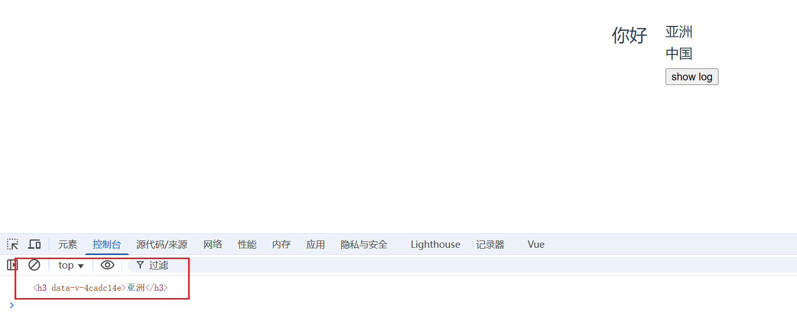

:::info
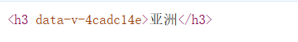
`data-v-xxxx` 这个标记，是因为样式中有了`scoped`
:::

### ref 放在组件身上

> 拿的是组件**实例对象**

子传父

```vue [Person.vue]
<template>
  <div class="person">
    <h3 ref="title">亚洲</h3>
    <h3>中国</h3>
    <h3><button @click="showLog">show log</button></h3>
  </div>
</template>

<script setup lang="ts">
import { ref, defineExpose } from "vue";

defineOptions({
  name: "Person",
});

let title = ref();

let num1 = ref(0);
let num2 = ref(1);
let num3 = ref(2);
const showLog = () => {
  console.log(title.value);
};

// 使用defineExpose，父组件才能拿到num1, num2, num3
// 使用defineExpose将组件中的数据交给外部
defineExpose({ num1, num2, num3 });
</script>

<style scoped>
.person:first-child {
  font-size: 12px;
}
</style>
```

```vue [App.vue]
<template>
  <h2 id="title">你好</h2>
  <Person ref="child" />
  <h2><button @click="showLog">点击展示Person数据</button></h2>
</template>

<script setup lang="ts">
import { ref } from "vue";
import Person from "./components/Person.vue";

defineOptions({
  name: "App",
});

const child = ref();

const showLog = () => {
  console.log(child.value);
  console.log(child.value.num1);
  console.log(child.value.num2);
  console.log(child.value.num3);
};
</script>
<style scoped></style>
```

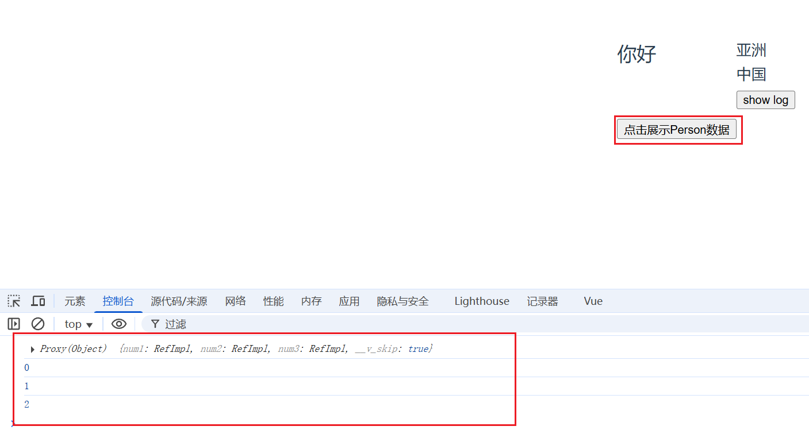

### defineExpose

:::tip
`defineExpose`用于明确地暴露组件的属性或方法给父组件。默认情况下，使用 `<script setup>` 定义的组件是完全封闭的，即其内部的状态和方法对外部（父组件）是不可见的。如果你希望某些状态或方法能够被父组件访问，就需要使用 defineExpose。
:::

## ts 接口、泛型、自定义类型

```ts [index.ts]
// 定义一个接口，用于限制person对象的具体属性

// 暴露方式： 1.默认暴露 2.分别暴露 3.统一暴露
export interface PersonInter {
  id: string;
  name: string;
  age: number;
}

// 自定义类型
export type Persons = Array<PersonInter>;
```

```vue [Person.vue]
<template>
  <div class="person"></div>
</template>

<script setup lang="ts">
// 如果引入的是值，那么就不用type; 但PersonInter是一种约束，就需要标记它是一个类型
import { type PersonInter, type Persons } from "@/types";

defineOptions({
  name: "Person",
});

let person: PersonInter = { id: "xxxx", name: "Jack", age: 30 };

let personList: Persons = [
  { id: "xxxx1", name: "Jack", age: 30 },
  { id: "xxxx2", name: "Marry", age: 23 },
  { id: "xxxx3", name: "Lily", age: 22 },
];
</script>

<style scoped>
.person:first-child {
  font-size: 12px;
}
</style>
```

## props

<span class="marker-evy">**父传子** 简单 demo</span>

可理解为 父传给子一个`a`，值是`你好`

```vue [App.vue]
<template>
  <Person a="你好" b="哈哈" />
</template>

<script setup lang="ts">
import Person from "./components/Person.vue";

defineOptions({
  name: "App",
});
</script>
<style scoped></style>
```

```vue [Person.vue]
<template>
  <div class="person">
    <h2>{{ a }}</h2>
    <h2>{{ b }}</h2>
  </div>
</template>

<script setup lang="ts">
import { defineProps } from "vue";

defineOptions({
  name: "Person",
});

let x = defineProps(["a", "b"]);
console.log(x);
console.log(x.a);
</script>

<style scoped></style>
```

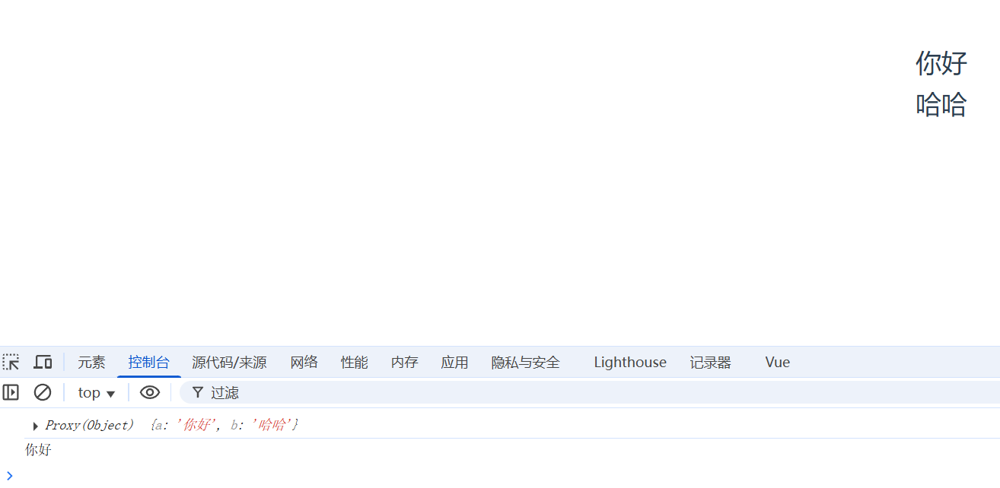

### 简单测试

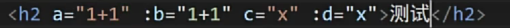
它的值是,被解析为：
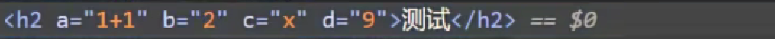
特例就是，ref 不需要加冒号`:`

**完整示例**

```vue [App.vue]
<template>
  <Person :list="personList" />
</template>

<script setup lang="ts">
import { reactive } from "vue";
import Person from "./components/Person.vue";
import type { Persons } from "./types";

defineOptions({
  name: "App",
});

let personList = reactive<Persons>([
  { id: "qwerasdf1", name: "Lily", age: 20 },
  { id: "qwerasdf2", name: "Jack", age: 34 },
  { id: "qwerasdf3", name: "Mary", age: 45 },
]);
</script>
<style scoped></style>
```

```vue [Person.vue]
<template>
  <div class="person">
    <ul>
      <li v-for="item in list" :key="item.id">
        {{ item.name }}-{{ item.age }}
      </li>
    </ul>
  </div>
</template>

<script setup lang="ts">
import type { Persons } from "@/types";
import { withDefaults } from "vue";

defineOptions({
  name: "Person",
});

// 只接收list
let x = defineProps(["list"]);

// 接收list+限制类型
defineProps<{ list: Persons }>();

// 接收list + 限制类型 + 限制必要性(可传，可不传) + 指定默认值
withDefaults(defineProps<{ list?: Persons }>(), {
  list: () => [{ id: "0001", name: "康师傅", age: 34 }],
});
</script>

<style scoped></style>
```

### defineProps

:::tip

- 在 vue3 中，defineXXX 是宏函数，宏函数不用引入可直接使用

- `defineProps`是 Vue 3 提供的一个编译时宏（compile-time macro）用于在 `<script setup>` 中声明和获取 props。当你需要从父组件向子组件传递数据时，你可以在子组件中使用 `defineProps` 来接收这些数据。
  :::

## 生命周期

- 概念：`Vue`组件实例在创建时要经历一系列的初始化步骤，在此过程中`Vue`会在合适的时机，调用特定的函数，从而让开发者有机会在特定阶段运行自己的代码，这些特定的函数统称为：生命周期钩子

- 规律：

  > 生命周期整体分为四个阶段，分别是：**创建、挂载、更新、销毁**，每个阶段都有两个钩子，一前一后。

- `Vue2`的生命周期

  > 创建阶段：`beforeCreate`、`created`
  >
  > 挂载阶段：`beforeMount`、`mounted`
  >
  > 更新阶段：`beforeUpdate`、`updated`
  >
  > 销毁阶段：`beforeDestroy`、`destroyed`

- `Vue3`的生命周期

  > 创建阶段：`setup`
  >
  > 挂载阶段：`onBeforeMount`、`onMounted`
  >
  > 更新阶段：`onBeforeUpdate`、`onUpdated`
  >
  > 卸载阶段：`onBeforeUnmount`、`onUnmounted`

- 常用的钩子：`onMounted`(挂载完毕)、`onUpdated`(更新完毕)、`onBeforeUnmount`(卸载之前)

<br>

又称生命周期、生命周期函数、生命周期钩子

组件的生命周期

**vue2 生命周期：**

> 创建
> 挂载
> 更新
> 销毁

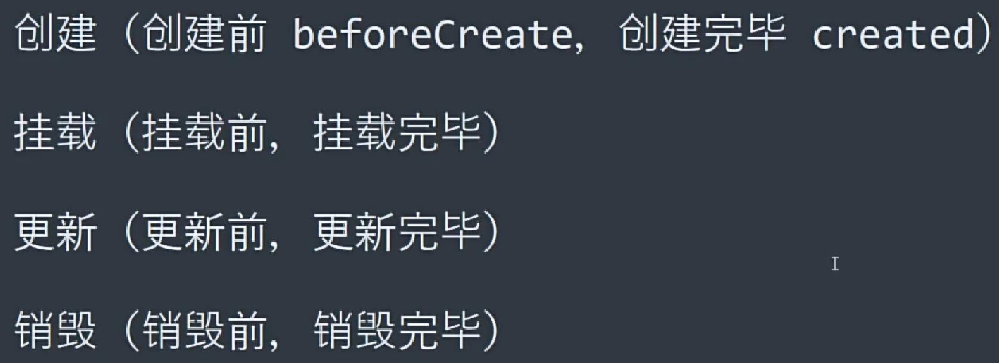

vue3 生命周期

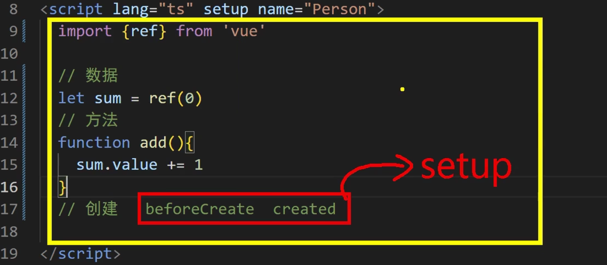

<br>
<span class="marker-evy">demo如下</span>

```vue [Person.vue]
<template>
  <div class="person">
    <h3>当前sum：{{ sum }}</h3>
    <h3><button @click="sumAdd">点击++</button></h3>
  </div>
</template>

<script setup lang="ts">
import {
  ref,
  onBeforeMount,
  onMounted,
  onBeforeUpdate,
  onUpdated,
  onBeforeUnmount,
  onUnmounted,
} from "vue";

defineOptions({
  name: "Person",
});

let sum = ref(0);

const sumAdd = () => {
  sum.value += 1;
};

console.log("创建");

onBeforeMount(() => {
  console.log("挂载前");
});

onMounted(() => {
  console.log("挂载完毕");
});

onBeforeUpdate(() => {
  console.log("更新前");
});

onUpdated(() => {
  console.log("更新完毕");
});

onBeforeUnmount(() => {
  console.log("卸载前");
});
onUnmounted(() => {
  console.log("卸载完毕");
});
</script>

<style scoped></style>
```

```vue [App.vue]
<template>
  <Person v-if="isShow" />
</template>

<script setup lang="ts">
import { ref } from "vue";
import Person from "./components/Person.vue";

defineOptions({
  name: "App",
});

let isShow = ref(true);
</script>
<style scoped></style>
```


## 自定义 hook

- 什么是`hook`？—— 本质是一个函数，把`setup`函数中使用的`Composition API`进行了封装，类似于`vue2.x`中的`mixin`。

- 自定义`hook`的优势：复用代码, 让`setup`中的逻辑更清楚易懂。

如下代码，功能齐全但是，数据与方法比较混乱，可以使用 hook 进行改造

```vue [Person.vue]
<template>
  <div class="person">
    <h3>当前sum：{{ sum }}</h3>
    <h3><button @click="sumAdd">点击++</button></h3>
    <hr />
    <div>
      
    </div>
    <div><button @click="addDog">来一只狗</button></div>
  </div>
</template>

<script setup lang="ts">
import { reactive, ref } from "vue";
import axios from "axios";

defineOptions({
  name: "Person",
});

let sum = ref(0);

const sumAdd = () => {
  sum.value += 1;
};

let dogList = reactive([
  "https://images.dog.ceo/breeds/pembroke/n02113023_7316.jpg",
]);

const addDog = async () => {
  try {
    let result = await axios.get(
      "https://dog.ceo/api/breed/pembroke/images/random"
    );
    dogList.push(result.data.message);
    console.log(result.data.message);
  } catch (error) {
    alert(error);
  }
};
</script>

<style scoped>
.person {
  width: 500px;
  height: 300px;
}
img {
  height: 100px;
  margin-right: 10px;
}
</style>
```

创建 hooks 文件夹，将每个不同模块进行拆分，命名必须使用`useXXX`这种形式

改进过后

```vue [Person.vue]
<template>
  <div class="person">
    <h3>当前sum：{{ sum }}</h3>
    <h3><button @click="sumAdd">点击++</button></h3>
    <hr />
    <div>
      
    </div>
    <div><button @click="addDog">来一只狗</button></div>
  </div>
</template>

<script setup lang="ts">
defineOptions({
  name: "Person",
});
import useDog from "@/hooks/useDog";
import useSum from "@/hooks/useSum";

const { dogList, addDog } = useDog();
const { sum, sumAdd } = useSum();
</script>

<style scoped>
.person {
  width: 500px;
  height: 300px;
}
img {
  height: 100px;
  margin-right: 10px;
}
</style>
```

```ts [useDog.ts]
import { reactive, onMounted } from "vue";
import axios from "axios";
export default () => {
  // 钩子函数也是不影响使用的
  onMounted(() => {
    addDog();
  });

  let dogList = reactive([
    "https://images.dog.ceo/breeds/pembroke/n02113023_7316.jpg",
  ]);

  const addDog = async () => {
    try {
      let result = await axios.get(
        "https://dog.ceo/api/breed/pembroke/images/random"
      );
      dogList.push(result.data.message);
      console.log(result.data.message);
    } catch (error) {
      alert(error);
    }
  };
  return { dogList, addDog };
};
```

```ts [useSum.ts]
import { ref } from "vue";
export default () => {
  let sum = ref(0);

  const sumAdd = () => {
    sum.value += 1;
  };
  return { sum, sumAdd };
};
```


## 路由

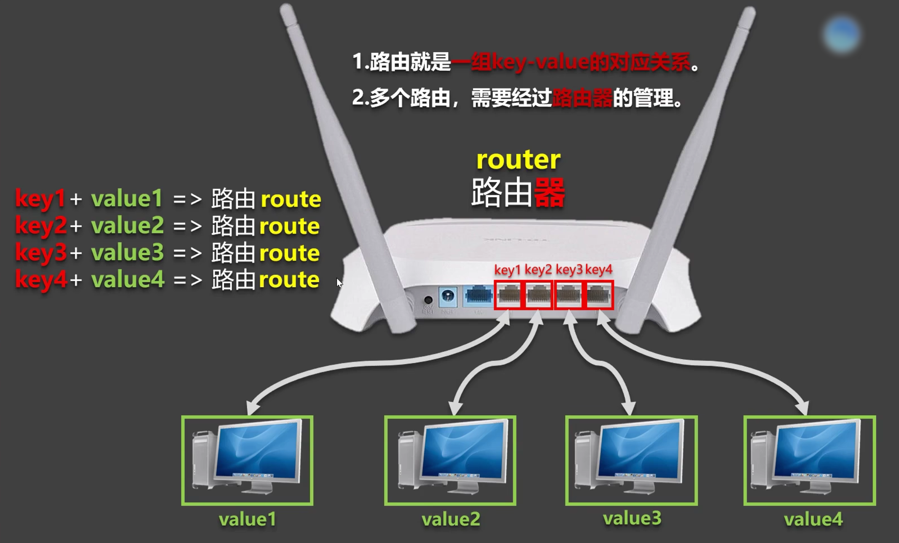

路由安装

```
npm i vue-router
```

### 基本切换

在`src`下创建`router`文件夹，创建`index.ts`文件

```ts [index.ts]
// 创建路由器，暴露出去

// 1.引入crateRouter
import { createRouter, createWebHashHistory } from "vue-router";

// 2.创建路由器
const router = createRouter({
  history: createWebHashHistory(),
  routes: [
    {
      path: "/home",
      name: "home",
      component: () => import("@/views/Home.vue"),
    },
    {
      path: "/about",
      name: "about",
      component: () => import("../views/About.vue"),
    },
    {
      path: "/news",
      name: "news",
      component: () => import("../views/News.vue"),
    },
  ],
});

export default router;
```

```ts [main.ts]
import "./assets/main.css";

import { createApp } from "vue";
import App from "./App.vue";
// 引入路由器
import router from "./router";

// 创建一个应用
const app = createApp(App);
// 使用路由器
app.use(router);
// 挂载整个应用到app容器中
app.mount("#app");
```

```vue [App.vue]
<template>
  <div>
    <h1>路由 示例</h1>
    <div class="navigate">
      <RouterLink to="/home" active-class="highlight">首页</RouterLink>
      <RouterLink to="/news" active-class="highlight">新闻</RouterLink>
      <RouterLink to="/about" active-class="highlight">关于</RouterLink>
    </div>
    <div class="main-content">
      <RouterView></RouterView>
    </div>
  </div>
</template>

<script setup lang="ts">
import { RouterView, RouterLink } from "vue-router";

defineOptions({
  name: "App",
});
</script>
<style scoped>
.highlight {
  color: aqua;
  background-color: rgb(253, 238, 219);
}
.navigate {
  width: 100%;
  height: 100px;
}
.navigate a {
  margin-left: 100px;
  display: block;
  float: left;
  border: 1px solid black;
  padding: 10px;
  border-radius: 10px;
  text-decoration: none;
}

.main-content {
  border: 1px solid rgb(177, 125, 211);
  overflow: hidden;
  height: 350px;
  border-radius: 20px;
}
</style>
```


---

### 注意点

1. 路由组件通常存放在`pages` 或 `views`文件夹，一般组件通常存放在`components`文件夹。

2. 通过点击导航，视觉效果上“消失” 了的路由组件，默认是被**卸载**掉的，需要的时候再去**挂载**。

<br/>
<br/>

- 路由组件
  靠路由规则渲染出来的

- 一般组件
  亲手写标签出来的

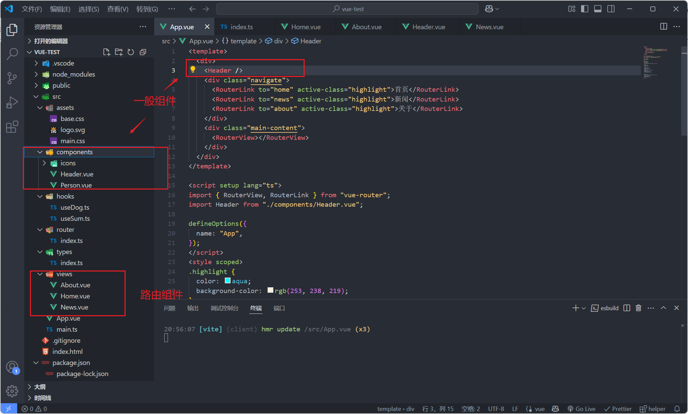

### 路由器工作模式

1. `history`模式

> 优点：`URL`更加美观，不带有`#`，更接近传统的网站`URL`。
>
> 缺点：后期项目上线，需要服务端配合处理路径问题，否则刷新会有`404`错误。

```ts
const router = createRouter({
  history: createWebHistory(), //history模式
  /******/
});
```

2. `hash`模式

> 优点：兼容性更好，因为不需要服务器端处理路径。
>
> 缺点：`URL`带有`#`不太美观，且在`SEO`优化方面相对较差。

```ts
const router = createRouter({
  history: createWebHashHistory(), //hash模式
  /******/
});
```

### to 的两种写法

```vue
<!-- 第一种：to的字符串写法 -->
<router-link active-class="active" to="/home">主页</router-link>

<!-- 第二种：to的对象写法 -->
<router-link active-class="active" :to="{ path: '/home' }">Home</router-link>
```

### 命名路由

```ts
// 创建路由器，暴露出去

// 1.引入crateRouter
import { createRouter, createWebHashHistory } from "vue-router";
import About from "@/views/About.vue";
import Home from "@/views/Home.vue";
import News from "@/views/News.vue";

// 2.创建路由器
const router = createRouter({
  history: createWebHashHistory(),
  routes: [
    {
      path: "/home",
      component: () => Home,
    },
    {
      path: "/about",
      component: () => About,
    },
    {
      name: "xinwen",
      path: "/news",
      component: () => News,
    },
  ],
});

export default router;
```

```vue
<RouterLink :to="{ name: 'xinwen' }" active-class="highlight">新闻</RouterLink>
```

### 嵌套路由

编写子组件

```vue [Detail.vue]
<template>
  <h3>编号：xxx</h3>
  <h3>标题：xxx</h3>
  <h3>详情：xxx</h3>
</template>

<script lang="ts" setup></script>

<style scoped></style>
```

配置路由规则，使用`children`配置项

```ts [index.ts]
// 创建路由器，暴露出去

// 1.引入crateRouter
import { createRouter, createWebHashHistory } from "vue-router";

// 2.创建路由器
const router = createRouter({
  history: createWebHashHistory(),
  routes: [
    {
      path: "/home",
      name: "home",
      component: () => import("@/views/Home.vue"),
    },
    {
      path: "/about",
      name: "about",
      component: () => import("@/views/About.vue"),
    },
    {
      path: "/news",
      name: "news",
      component: () => import("@/views/News.vue"),
      children: [
        {
          path: "detail", // 子路由不用写 ‘/’
          name: "detail",
          component: () => import("@/components/Detail.vue"),
        },
      ],
    },
  ],
});

export default router;
```

跳转路由（记得要加完整路径）

```vue [News.vue]
<template>
  <div class="newsList">
    <RouterLink :to="{ path: '/news/detail' }" v-for="news in newsList">{{
      news.title
    }}</RouterLink>
  </div>
  <div class="news-detail">
    <RouterView></RouterView>
  </div>
</template>

<script setup lang="ts">
import { reactive } from "vue";

const newsList = reactive([
  {
    id: "1904165055277039616",
    title: "海关总署就芬太尼相关问题答记者问",
    content:
      "海关总署有关负责人：《麻醉药品品种目录》（2013年版）里面列管的阿芬太尼、芬太尼、瑞芬太尼、舒芬太尼等具有药品属性的芬太尼按照麻醉药品管理。",
  },
  {
    id: "1904165055281233920",
    title: "NASA“撤回”登月宇航员“多元化”承诺",
    content:
      "今日俄罗斯电视台网站3月23日报道，美国国家航空航天局（NASA）收回其公开承诺，即在阿耳忒弥斯登月计划下，将第一位女性和第一位有色人种送上月球。",
  },
  {
    id: "1904165055281233921",
    title: "春天是最懂氛围感的",
    content:
      "春暖花开，春意融融。近日，北京各大公园里的春天已藏不住了，当古建与春天相遇，一场跨越时空的浪漫邂逅开启。人勤春早，收藏这组壁纸，新的一周，一起与美好同行",
  },
]);
</script>

<style scoped>
.newsList {
  margin-left: 30px;
  float: left;
  width: 400px;
}
.newsList a {
  margin-right: 20px;
  display: block;
  margin-bottom: 20px;
}
.news-detail {
  width: 500px;
  height: 300px;
  border: 2px solid rgb(232, 193, 193);
  float: left;
  border-radius: 20px;
}
</style>
```

记得去`该`组件中预留一个`<router-view>`

### 路由传参-query 参数

**第一种方式**

```vue [News.vue]
<template>
  <div class="newsList">
    <RouterLink
      :to="`/news/detail?id=${news.id}&title=${news.title}&content=${news.content}`"
      v-for="news in newsList"
      >{{ news.title }}</RouterLink
    >
  </div>
  <div class="news-detail">
    <RouterView></RouterView>
  </div>
</template>

<script setup lang="ts">
import { reactive } from "vue";

const newsList = reactive([
  {
    id: "1904165055277039616",
    title: "海关总署就芬太尼相关问题答记者问",
    content:
      "海关总署有关负责人：《麻醉药品品种目录》（2013年版）里面列管的阿芬太尼、芬太尼、瑞芬太尼、舒芬太尼等具有药品属性的芬太尼按照麻醉药品管理。",
  },
  {
    id: "1904165055281233920",
    title: "NASA“撤回”登月宇航员“多元化”承诺",
    content:
      "今日俄罗斯电视台网站3月23日报道，美国国家航空航天局（NASA）收回其公开承诺，即在阿耳忒弥斯登月计划下，将第一位女性和第一位有色人种送上月球。",
  },
  {
    id: "1904165055281233921",
    title: "春天是最懂氛围感的",
    content:
      "春暖花开，春意融融。近日，北京各大公园里的春天已藏不住了，当古建与春天相遇，一场跨越时空的浪漫邂逅开启。人勤春早，收藏这组壁纸，新的一周，一起与美好同行",
  },
]);
</script>

<style scoped>
.newsList {
  margin-left: 30px;
  float: left;
  width: 400px;
}
.newsList a {
  margin-right: 20px;
  display: block;
  margin-bottom: 20px;
}
.news-detail {
  width: 500px;
  height: 300px;
  border: 2px solid rgb(232, 193, 193);
  float: left;
  border-radius: 20px;
}
</style>
```

```vue [Detail.vue]
<template>
  <h3>编号：{{ query.id }}</h3>
  <h3>标题：{{ query.title }}</h3>
  <h3>详情：{{ query.content }}</h3>
</template>

<script lang="ts" setup>
import { toRefs } from "vue";
import { useRoute } from "vue-router";
defineOptions({
  name: "Detail",
});

let route = useRoute();
let { query } = toRefs(route);
console.log("route", route);
</script>

<style scoped></style>
```

**第二种方式**

```vue [News.vue]
<template>
  <div class="newsList">
    <RouterLink
      :to="{
        path: '/news/detail',
        query: {
          id: news.id,
          content: news.content,
          title: news.title,
        },
      }"
      v-for="news in newsList"
      >{{ news.title }}</RouterLink
    >
  </div>
  <div class="news-detail">
    <RouterView></RouterView>
  </div>
</template>

<script setup lang="ts">
import { reactive } from "vue";

const newsList = reactive([
  {
    id: "1904165055277039616",
    title: "海关总署就芬太尼相关问题答记者问",
    content:
      "海关总署有关负责人：《麻醉药品品种目录》（2013年版）里面列管的阿芬太尼、芬太尼、瑞芬太尼、舒芬太尼等具有药品属性的芬太尼按照麻醉药品管理。",
  },
  {
    id: "1904165055281233920",
    title: "NASA“撤回”登月宇航员“多元化”承诺",
    content:
      "今日俄罗斯电视台网站3月23日报道，美国国家航空航天局（NASA）收回其公开承诺，即在阿耳忒弥斯登月计划下，将第一位女性和第一位有色人种送上月球。",
  },
  {
    id: "1904165055281233921",
    title: "春天是最懂氛围感的",
    content:
      "春暖花开，春意融融。近日，北京各大公园里的春天已藏不住了，当古建与春天相遇，一场跨越时空的浪漫邂逅开启。人勤春早，收藏这组壁纸，新的一周，一起与美好同行",
  },
]);
</script>

<style scoped>
.newsList {
  margin-left: 30px;
  float: left;
  width: 400px;
}
.newsList a {
  margin-right: 20px;
  display: block;
  margin-bottom: 20px;
}
.news-detail {
  width: 500px;
  height: 300px;
  border: 2px solid rgb(232, 193, 193);
  float: left;
  border-radius: 20px;
}
</style>
```

```vue [Detail.vue]
<template>
  <h3>编号：{{ query.id }}</h3>
  <h3>标题：{{ query.title }}</h3>
  <h3>详情：{{ query.content }}</h3>
</template>

<script lang="ts" setup>
import { toRefs } from "vue";
import { useRoute } from "vue-router";
defineOptions({
  name: "Detail",
});

let route = useRoute();
let { query } = toRefs(route);
console.log("route", route);
</script>

<style scoped></style>
```


### params 参数

**第一种方式**

```vue [News.vue]
<template>
  <div class="newsList">
    <RouterLink
      v-for="news in newsList"
      :to="`/news/detail/${news.id}/${news.title}/${news.content}`"
      >{{ news.title }}</RouterLink
    >
  </div>
  <div class="news-detail">
    <RouterView></RouterView>
  </div>
</template>

<script setup lang="ts">
import { reactive } from "vue";

const newsList = reactive([
  {
    id: "1904165055277039616",
    title: "海关总署就芬太尼相关问题答记者问",
    content:
      "海关总署有关负责人：《麻醉药品品种目录》（2013年版）里面列管的阿芬太尼、芬太尼、瑞芬太尼、舒芬太尼等具有药品属性的芬太尼按照麻醉药品管理。",
  },
  {
    id: "1904165055281233920",
    title: "NASA“撤回”登月宇航员“多元化”承诺",
    content:
      "今日俄罗斯电视台网站3月23日报道，美国国家航空航天局（NASA）收回其公开承诺，即在阿耳忒弥斯登月计划下，将第一位女性和第一位有色人种送上月球。",
  },
  {
    id: "1904165055281233921",
    title: "春天是最懂氛围感的",
    content:
      "春暖花开，春意融融。近日，北京各大公园里的春天已藏不住了，当古建与春天相遇，一场跨越时空的浪漫邂逅开启。人勤春早，收藏这组壁纸，新的一周，一起与美好同行",
  },
]);
</script>

<style scoped>
.newsList {
  margin-left: 30px;
  float: left;
  width: 400px;
}
.newsList a {
  margin-right: 20px;
  display: block;
  margin-bottom: 20px;
}
.news-detail {
  width: 500px;
  height: 300px;
  border: 2px solid rgb(232, 193, 193);
  float: left;
  border-radius: 20px;
}
</style>
```

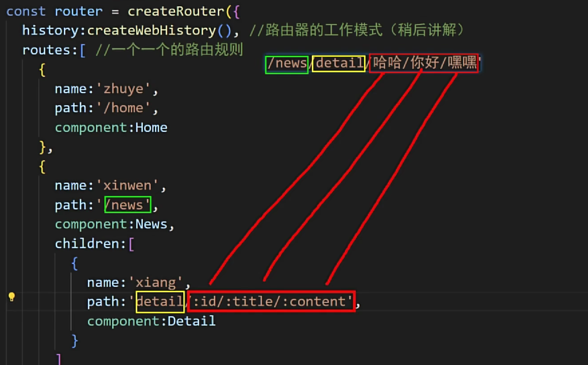

```ts [index.ts]
// 创建路由器，暴露出去

// 1.引入crateRouter
import { createRouter, createWebHashHistory } from "vue-router";

// 2.创建路由器
const router = createRouter({
  history: createWebHashHistory(),
  routes: [
    {
      path: "/home",
      name: "home",
      component: () => import("@/views/Home.vue"),
    },
    {
      path: "/about",
      name: "about",
      component: () => import("@/views/About.vue"),
    },
    {
      path: "/news",
      name: "news",
      component: () => import("@/views/News.vue"),
      children: [
        {
          path: "detail/:id/:title/:content?", // 加? 表示可传可不传
          name: "detail",
          component: () => import("@/components/Detail.vue"),
        },
      ],
    },
  ],
});

export default router;
```

```vue [Detail.vue]
<template>
  <h3>编号：{{ params.id }}</h3>
  <h3>标题：{{ params.title }}</h3>
  <h3>详情：{{ params.content }}</h3>
</template>

<script lang="ts" setup>
import { toRefs } from "vue";
import { useRoute } from "vue-router";
defineOptions({
  name: "Detail",
});

let route = useRoute();
let { params } = toRefs(route);
console.log("route", route);
</script>

<style scoped></style>
```

**第二种方式**

```vue [News.vue]
<template>
  <div class="newsList">
    <RouterLink
      v-for="news in newsList"
      :to="{
        name: 'detail',
        params: {
          id: news.id,
          title: news.title,
          content: news.content,
        },
      }"
      >{{ news.title }}</RouterLink
    >
  </div>
  <div class="news-detail">
    <RouterView></RouterView>
  </div>
</template>

<script setup lang="ts">
import { reactive } from "vue";

const newsList = reactive([
  {
    id: "1904165055277039616",
    title: "海关总署就芬太尼相关问题答记者问",
    content:
      "海关总署有关负责人：《麻醉药品品种目录》（2013年版）里面列管的阿芬太尼、芬太尼、瑞芬太尼、舒芬太尼等具有药品属性的芬太尼按照麻醉药品管理。",
  },
  {
    id: "1904165055281233920",
    title: "NASA“撤回”登月宇航员“多元化”承诺",
    content:
      "今日俄罗斯电视台网站3月23日报道，美国国家航空航天局（NASA）收回其公开承诺，即在阿耳忒弥斯登月计划下，将第一位女性和第一位有色人种送上月球。",
  },
  {
    id: "1904165055281233921",
    title: "春天是最懂氛围感的",
    content:
      "春暖花开，春意融融。近日，北京各大公园里的春天已藏不住了，当古建与春天相遇，一场跨越时空的浪漫邂逅开启。人勤春早，收藏这组壁纸，新的一周，一起与美好同行",
  },
]);
</script>

<style scoped>
.newsList {
  margin-left: 30px;
  float: left;
  width: 400px;
}
.newsList a {
  margin-right: 20px;
  display: block;
  margin-bottom: 20px;
}
.news-detail {
  width: 500px;
  height: 300px;
  border: 2px solid rgb(232, 193, 193);
  float: left;
  border-radius: 20px;
}
</style>
```

:::warning

1. 如果路由中有占位，但传参时没有传会报错，可以通过在路由中这样写：`path:'detail/:id/:title/:content?'` 添加`?`即可,配置参数必要性

2. 传递`params`参数时，若使用`to`的对象写法，必须使用`name`配置项，不能用`path`，并且该写法不能传递数组和对象

3. 传递`params`参数时，需要提前在规则中占位。
   :::

### 路由 props 配置

第一种写法:将路由收到的所有 params 参数作为 props 传给路由组件

```ts [index.ts]
// 创建路由器，暴露出去

// 1.引入crateRouter
import { createRouter, createWebHashHistory } from "vue-router";

// 2.创建路由器
const router = createRouter({
  history: createWebHashHistory(),
  routes: [
    {
      path: "/home",
      name: "home",
      component: () => import("@/views/Home.vue"),
    },
    {
      path: "/about",
      name: "about",
      component: () => import("@/views/About.vue"),
    },
    {
      path: "/news",
      name: "news",
      component: () => import("@/views/News.vue"),
      children: [
        {
          path: "detail/:id/:title/:content?",
          name: "detail",
          component: () => import("@/components/Detail.vue"),
          props: true,
        },
      ],
    },
  ],
});

export default router;
```

```vue [Detail.vue]
<template>
  <h3>编号：{{ id }}</h3>
  <h3>标题：{{ title }}</h3>
  <h3>详情：{{ content }}</h3>
</template>

<script lang="ts" setup>
import { toRefs } from "vue";
import { useRoute } from "vue-router";
defineOptions({
  name: "Detail",
});

defineProps(["id", "title", "content"]);
</script>

<style scoped></style>
```

**第二种写法**:函数写法，可以自己决定将什么作为 props 给路由组件

```ts [index.ts]
// 创建路由器，暴露出去

// 1.引入crateRouter
import { createRouter, createWebHashHistory } from "vue-router";

// 2.创建路由器
const router = createRouter({
  history: createWebHashHistory(),
  routes: [
    {
      path: "/home",
      name: "home",
      component: () => import("@/views/Home.vue"),
    },
    {
      path: "/about",
      name: "about",
      component: () => import("@/views/About.vue"),
    },
    {
      path: "/news",
      name: "news",
      component: () => import("@/views/News.vue"),
      children: [
        {
          path: "detail",
          name: "detail",
          component: () => import("@/components/Detail.vue"),
          // props: true,
          props(route) {
            return route.query;
          },
        },
      ],
    },
  ],
});

export default router;
```

```vue [News.vue]
<template>
  <div class="newsList">
    <RouterLink
      v-for="news in newsList"
      :to="{
        name: 'detail',
        query: {
          id: news.id,
          title: news.title,
          content: news.content,
        },
      }"
      >{{ news.title }}</RouterLink
    >
  </div>
  <div class="news-detail">
    <RouterView></RouterView>
  </div>
</template>

<script setup lang="ts">
import { reactive } from "vue";

const newsList = reactive([
  {
    id: "1904165055277039616",
    title: "海关总署就芬太尼相关问题答记者问",
    content:
      "海关总署有关负责人：《麻醉药品品种目录》（2013年版）里面列管的阿芬太尼、芬太尼、瑞芬太尼、舒芬太尼等具有药品属性的芬太尼按照麻醉药品管理。",
  },
  {
    id: "1904165055281233920",
    title: "NASA“撤回”登月宇航员“多元化”承诺",
    content:
      "今日俄罗斯电视台网站3月23日报道，美国国家航空航天局（NASA）收回其公开承诺，即在阿耳忒弥斯登月计划下，将第一位女性和第一位有色人种送上月球。",
  },
  {
    id: "1904165055281233921",
    title: "春天是最懂氛围感的",
    content:
      "春暖花开，春意融融。近日，北京各大公园里的春天已藏不住了，当古建与春天相遇，一场跨越时空的浪漫邂逅开启。人勤春早，收藏这组壁纸，新的一周，一起与美好同行",
  },
]);
</script>

<style scoped>
.newsList {
  margin-left: 30px;
  float: left;
  width: 400px;
}
.newsList a {
  margin-right: 20px;
  display: block;
  margin-bottom: 20px;
}
.news-detail {
  width: 500px;
  height: 300px;
  border: 2px solid rgb(232, 193, 193);
  float: left;
  border-radius: 20px;
}
</style>
```

```vue [Detail.vue]
<template>
  <h3>编号：{{ id }}</h3>
  <h3>标题：{{ title }}</h3>
  <h3>详情：{{ content }}</h3>
</template>

<script lang="ts" setup>
defineOptions({
  name: "Detail",
});

defineProps(["id", "title", "content"]);
</script>

<style scoped></style>
```

**第三种写法**:对象写法，可以自己决定将什么作为 props 给路由组件

这种写法只能写死，没有什么意义

```ts
children: [
  {
    path: "detail/:id/:title/:content",
    component: () => import("@/components/Detail.vue"),
    // props: true
    // props(route) {
    //     return route.query
    // }
    props: {
      x: 1,
      y: 2,
      z: 3,
    },
  },
];
```


---

### replace属性

1. 作用：控制路由跳转时操作浏览器历史记录的模式。

2. 浏览器的历史记录有两种写入方式：分别为`push`和`replace`：

  - `push`是追加历史记录（默认值）。
  - `replace`是替换当前记录。

3. 开启`replace`模式：

```vue
<RouterLink replace .......>News</RouterLink>
```

### 编程式路由导航

可以理解为，脱离`<RouterLink/>`实现路由跳转

简单demo首页停留三秒后，跳转

```vue
<template>
  <h1>Home</h1>
</template>

<script setup lang="ts">
import { onMounted } from "vue";
import { useRouter } from "vue-router";

let router = useRouter();

onMounted(() => {
  setTimeout(() => {
    router.push("news");
  }, 3000);
});
</script>

<style scoped></style>

```

实现点击按钮也可查看新闻详情⬇️

```vue [News.vue]
<template>
  <div class="newsList" v-for="news in newsList">
    <button @click="showDetail(news)">查看</button>
    <RouterLink
      :to="{
        name: 'detail',
        params: {
          id: news.id,
          title: news.title,
          content: news.content,
        },
      }"
      >{{ news.title }}</RouterLink
    >
  </div>
  <div class="news-detail">
    <RouterView></RouterView>
  </div>
</template>

<script setup lang="ts">
import { reactive } from "vue";
import { useRouter } from "vue-router";

const newsList = reactive([
  {
    id: "1904165055277039616",
    title: "海关总署就芬太尼相关问题答记者问",
    content:
      "海关总署有关负责人：《麻醉药品品种目录》（2013年版）里面列管的阿芬太尼、芬太尼、瑞芬太尼、舒芬太尼等具有药品属性的芬太尼按照麻醉药品管理。",
  },
  {
    id: "1904165055281233920",
    title: "NASA“撤回”登月宇航员“多元化”承诺",
    content:
      "今日俄罗斯电视台网站3月23日报道，美国国家航空航天局（NASA）收回其公开承诺，即在阿耳忒弥斯登月计划下，将第一位女性和第一位有色人种送上月球。",
  },
  {
    id: "1904165055281233921",
    title: "春天是最懂氛围感的",
    content:
      "春暖花开，春意融融。近日，北京各大公园里的春天已藏不住了，当古建与春天相遇，一场跨越时空的浪漫邂逅开启。人勤春早，收藏这组壁纸，新的一周，一起与美好同行",
  },
]);
let router = useRouter();

interface NewsInter {
  id: string;
  title: string;
  content: string;
}
const showDetail = (news: NewsInter) => {
  // 或者router.replace
  router.push({
    name: "detail",
    params: {
      id: news.id,
      title: news.title,
      content: news.content,
    },
  });
};
</script>

<style scoped>
.newsList {
  margin-left: 30px;
  float: left;
  width: 400px;
}
.newsList a {
  margin-right: 20px;
  display: block;
  margin-bottom: 20px;
}
.news-detail {
  width: 500px;
  height: 300px;
  border: 2px solid rgb(232, 193, 193);
  float: left;
  border-radius: 20px;
}
</style>

```

```ts [index.ts]
// 创建路由器，暴露出去

// 1.引入crateRouter
import { createRouter, createWebHashHistory } from "vue-router";


// 2.创建路由器
const router = createRouter({
    history: createWebHashHistory(),
    routes: [
        {
            name:'home',
            path: "/home",
            component: () => import('@/views/Home.vue')
        },
        {
            name:'about',
            path: "/about",
            component: () => import('@/views/About.vue')
        },
        {
            name: 'news',
            path: "/news",
            component: () => import('@/views/News.vue'),
            children: [
                {
                    name: 'detail',
                    path: "detail/:id/:title/:content",
                    component: () => import('@/components/Detail.vue'),
                    props: true
                    // props(route) {
                    //     return route.query
                    // }
                    // props: {
                    //     x: 1,
                    //     y: 2,
                    //     z: 3
                    // }
                }
            ]
        },
    ]
});

export default router;
```

```vue [Detail.vue]
<template>
  <h3>编号：{{ id }}</h3>
  <h3>标题：{{ title }}</h3>
  <h3>详情：{{ content }}</h3>
</template>

<script lang="ts" setup>
defineOptions({
  name: "Detail",
});

defineProps(["id", "title", "content"]);
</script>

<style scoped></style>

```

### 重定向

1. 作用：将特定的路径，重新定向到已有路由。

2. 具体编码：

```ts
routes: [
        {
            path: "/",
            redirect: '/home'
        },
]
```

## Pinia

### 简单搭建

安装个`nanoid`

```
npm i nanoid
```

```vue [Count.vue]
<template>
  <div class="outer">
    <div>当前求和：{{ sum }}</div>
    <div>
      <select v-model.number="n">
        <option value="1">1</option>
        <option value="2">2</option>
        <option value="3">3</option>
      </select>
      <button @click="add">加</button>
      <button @click="subtraction">减</button>
    </div>
  </div>
</template>

<script lang="ts" setup>
import { ref } from "vue";

defineOptions({
  name: "Count",
});

let sum = ref(0);
let n = ref(1);

const add = () => {
  sum.value += n.value;
};

const subtraction = () => {
  sum.value -= n.value;
};
</script>

<style scoped>
.outer {
  height: 250px;
  width: 700px;
  border: 1px solid rebeccapurple;
}
</style>

```

```vue [LoveTalk.vue]
<template>
    <div class="talk">
        <button @click="getTalk">获取一句话</button>
        <div>
            <ul>
                <li v-for="word in talkList">{{ word.title }}</li>
            </ul>
        </div>
    </div>
</template>

<script lang="ts" setup>
import axios from "axios";
import { reactive, ref } from "vue";
import { nanoid } from 'nanoid'

let talkList = reactive([{ id: "001", title: "广厦千间，夜眠仅需六尺；家财万贯，日食不过三餐。" }])

const getTalk = async () => {
    let { data } = await axios.get("https://api.vvhan.com/api/ian/rand");
    console.log(data);
    let obj = { id: nanoid(), title: data };
    talkList.unshift(obj);
};
</script>

```

```vue [App.vue]
<template>
  <Count></Count>
  <LoveTalk></LoveTalk>
</template>

<script setup lang="ts">
import Count from "./components/Count.vue";
import LoveTalk from "./components/LoveTalk.vue";

defineOptions({
  name: "App",
});
</script>


<style scoped>

</style>

```


### 搭建Pinia

```
npm i pinia
```

在`main.ts`

```ts [main.ts]
import { createPinia } from 'pinia'

const pinia = createPinia();
app.use(pinia)
```


### 存储+读取数据

**命名注意**

命名最好相相呼应
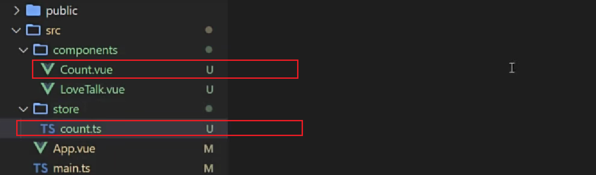

<br>

store中定义的数据不用`.value`，因为它是包在`reactive`中的
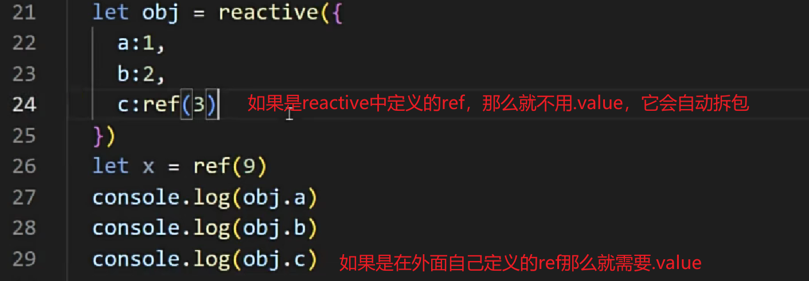

```ts [count.ts]
import { defineStore } from "pinia";

export const useCountStore = defineStore('count', {
    state() {
        return {
            sum: 666
        }
    }
});
```

```ts [loveTalk.ts]
import { defineStore } from "pinia";

export const useLoveTalkStore = defineStore('loveTalk', {
    state() {
        return {
            talkList: [{ id: "001", title: "广厦千间，夜眠仅需六尺；家财万贯，日食不过三餐。" }]
        }
    }
});
```

```vue [Count.vue]
<template>
  <div class="outer">
    <div>当前求和：{{ countStore.sum }}</div>
    <div>
      <select v-model.number="n">
        <option value="1">1</option>
        <option value="2">2</option>
        <option value="3">3</option>
      </select>
      <button @click="add">加</button>
      <button @click="subtraction">减</button>
    </div>
  </div>
</template>

<script lang="ts" setup>
import { ref } from "vue";

import { useCountStore } from '@/store/count'

defineOptions({
  name: "Count",
});

let countStore = useCountStore();
let n = ref(1);

const add = () => {
  // sum.value += n.value;
};

const subtraction = () => {
  // sum.value -= n.value;
};
</script>

<style scoped>
.outer {
  height: 250px;
  width: 700px;
  border: 1px solid rebeccapurple;
}
</style>

```

```vue [LoveTalk.vue]
<template>
    <div class="talk">
        <button @click="getTalk">获取一句话</button>
        <div>
            <ul>
                <li v-for="word in talkList.talkList">{{ word.title }}</li>
            </ul>
        </div>
    </div>
</template>

<script lang="ts" setup>
import axios from "axios";
import { reactive, ref } from "vue";
import { nanoid } from 'nanoid'
import { useLoveTalkStore } from '@/store/loveTalk'


let talkList = useLoveTalkStore();
console.log(talkList);

const getTalk = async () => {
    // let { data } = await axios.get("https://api.vvhan.com/api/ian/rand");
    // console.log(data);
    // let obj = { id: nanoid(), title: data };
    // talkList.unshift(obj);
};
</script>

```

### 修改数据三种方式

**方式1**

```ts
const add = () => {
  // 第一种修改方式
   countStore.sum += n.value;
};
```

**方式2**
批量修改数据
```ts
const add = () => {
   第二种
   countStore.$patch({
     sum: 2,
     position: '河北'
   })

};
```

**方式3**

```ts
const add = () => {
    // 第三种
  countStore.increase(n.value);
};
```

```ts [Count.ts]
import { defineStore } from "pinia";

export const useCountStore = defineStore('count', {
    // 真正存储数据的地方
    state() {
        return {
            sum: 666,
            position: '北京'
        }
    },
    // actions里面放置的是一个一个的方法，用于响应组件中的“动作”
    actions: {
        increase(value: number) {
            // 修改数据（this是当前的store）
            this.sum += value;
        }
    }
});
```

### storeToRefs
- 借助`storeToRefs`将`store`中的数据转为`ref`对象，方便在模板中使用。
- 注意：`pinia`提供的`storeToRefs`只会将数据做转换，而`Vue`的`toRefs`会转换`store`中所有数据（包括方法）。

```vue
<template>
  <div class="outer">
    <div>当前求和：{{ sum }}</div>
    <div>位置：{{ position }}</div>
    <div>
      <select v-model.number="n">
        <option value="1">1</option>
        <option value="2">2</option>
        <option value="3">3</option>
      </select>
      <button @click="add">加</button>
      <button @click="subtraction">减</button>
    </div>
  </div>
</template>

<script lang="ts" setup>
import { ref } from "vue";
import { useCountStore } from '@/store/count'
import { storeToRefs } from "pinia";

defineOptions({
  name: "Count",
});

let countStore = useCountStore();
let { sum, position } = storeToRefs(countStore);
let n = ref(1);

const add = () => {
  countStore.increase(n.value);
};

const subtraction = () => {
  sum.value -= n.value;
};
</script>

<style scoped>
.outer {
  height: 250px;
  width: 700px;
  border: 1px solid rebeccapurple;
}
</style>

```

```ts [count.ts]
import { defineStore } from "pinia";

export const useCountStore = defineStore('count', {
    // 真正存储数据的地方
    state() {
        return {
            sum: 666,
            position: '北京'
        }
    },
    // actions里面放置的是一个一个的方法，用于响应组件中的“动作”
    actions: {
        increase(value: number) {
            // 修改数据（this是当前的store）
            this.sum += value;
        }
    }
});
```

```vue [LoveTalk.vue]
<template>
    <div class="talk">
        <button @click="getTalk">获取一句话</button>
        <div>
            <ul>
                <li v-for="word in talkList">{{ word.title }}</li>
            </ul>
        </div>
    </div>
</template>

<script lang="ts" setup>
import { storeToRefs } from "pinia";
import { useLoveTalkStore } from '@/store/loveTalk'


let talkListStore = useLoveTalkStore();
let { talkList } = storeToRefs(talkListStore);

function getTalk() {
    talkListStore.getTalk();
}
</script>

```

```ts [loveTalk.ts]
import axios from "axios";
import { nanoid } from "nanoid";
import { defineStore } from "pinia";

export const useLoveTalkStore = defineStore('loveTalk', {
    state() {
        return {
            talkList: [{ id: "001", title: "广厦千间，夜眠仅需六尺；家财万贯，日食不过三餐。" }]
        }
    },
    actions: {
        async getTalk() {
            let { data } = await axios.get("https://api.vvhan.com/api/ian/rand");
            console.log(data);
            let obj = { id: nanoid(), title: data };
            this.talkList.unshift(obj);
        }
    }
});
```


### getters

概念：当`state`中的数据，需要经过处理后再使用时，可以使用`getters`配置。

```ts [count.ts]
import { defineStore } from "pinia";

export const useCountStore = defineStore('count', {
    // 真正存储数据的地方
    state() {
        return {
            sum: 10,
            position: 'beijing'
        }
    },
    // actions里面放置的是一个一个的方法，用于响应组件中的“动作”
    actions: {
        increase(value: number) {
            // 修改数据（this是当前的store）
            this.sum += value;
        }
    },
    getters: {
        zoomInTenTimes(state) {
            return state.sum * 10;
        },
        positionCapitalized(): string {
            return this.position.toUpperCase();
        }
    }
});
```

```vue [Count.vue]
<template>
  <div class="outer">
    <div>当前求和：{{ sum }},放大十倍后：{{ zoomInTenTimes }}</div>
    <div>位置：{{ position }},Upper：{{ positionCapitalized }}</div>
    <div>
      <select v-model.number="n">
        <option value="1">1</option>
        <option value="2">2</option>
        <option value="3">3</option>
      </select>
      <button @click="add">加</button>
      <button @click="subtraction">减</button>
    </div>
  </div>
</template>

<script lang="ts" setup>
import { ref } from "vue";
import { useCountStore } from '@/store/count'
import { storeToRefs } from "pinia";

defineOptions({
  name: "Count",
});

let countStore = useCountStore();
let { sum, position, zoomInTenTimes, positionCapitalized } = storeToRefs(countStore);
let n = ref(1);

const add = () => {
  countStore.increase(n.value);
};

const subtraction = () => {
  sum.value -= n.value;
};


</script>

<style scoped>
.outer {
  height: 250px;
  width: 700px;
  border: 1px solid rebeccapurple;
}
</style>

```

**效果**：


### $subscribe

通过 store 的 `$subscribe()` 方法侦听 `state` 及其变化

```vue [LoveTalk.vue]
<template>
    <div class="talk">
        <button @click="getTalk">获取一句话</button>
        <div>
            <ul>
                <li v-for="word in talkList">{{ word.title }}</li>
            </ul>
        </div>
    </div>
</template>

<script lang="ts" setup>
import { storeToRefs } from "pinia";
import { useLoveTalkStore } from '@/store/loveTalk'


let talkListStore = useLoveTalkStore();
let { talkList } = storeToRefs(talkListStore);

talkListStore.$subscribe((mutate, state) => {
    console.log('数据改变了');
    localStorage.setItem('talkList', JSON.stringify(state.talkList));
})

function getTalk() {
    talkListStore.getTalk();
}
</script>

```

```ts [loveTalk.ts]
import axios from "axios";
import { nanoid } from "nanoid";
import { defineStore } from "pinia";

export const useLoveTalkStore = defineStore('loveTalk', {
    state() {
        return {
            // talkList: [{ id: "001", title: "广厦千间，夜眠仅需六尺；家财万贯，日食不过三餐。" }]
            talkList: JSON.parse(localStorage.getItem('talkList') as string) || []
        }
    },
    actions: {
        async getTalk() {
            let { data } = await axios.get("https://api.vvhan.com/api/ian/rand");
            console.log(data);
            let obj = { id: nanoid(), title: data };
            this.talkList.unshift(obj);
        }
    }
});
```

### store组合式写法

```ts [loveTalk.ts]
import axios from "axios";
import { nanoid } from "nanoid";
import { defineStore } from "pinia";

// export const useLoveTalkStore = defineStore('loveTalk', {
//     state() {
//         return {
//             // talkList: [{ id: "001", title: "广厦千间，夜眠仅需六尺；家财万贯，日食不过三餐。" }]
//             talkList: JSON.parse(localStorage.getItem('talkList') as string)||[]
//         }
//     },
//     actions: {
//         async getTalk() {
//             let { data } = await axios.get("https://api.vvhan.com/api/ian/rand");
//             console.log(data);
//             let obj = { id: nanoid(), title: data };
//             this.talkList.unshift(obj);
//         }
//     }
// });

import { reactive } from 'vue'
export const useLoveTalkStore = defineStore('loveTalk', () => {
    let talkList = reactive(JSON.parse(localStorage.getItem('talkList') as string) || []);

    const getTalk = async () => {
        let { data } = await axios.get("https://api.vvhan.com/api/ian/rand");
        console.log(data);
        let obj = { id: nanoid(), title: data };
        talkList.unshift(obj);
    }

    return { talkList, getTalk }
});

```

## 组件通信

### 方式1 props

概述：`props`是使用频率最高的一种通信方式，常用与 ：**父 ↔ 子**。

- 若 **父传子**：属性值是**非函数**。
- 若 **子传父**：属性值是**函数**。

```vue [Father.vue]
<template>
  <div class="father">
    <h3>父组件</h3>
	<div>{{ car }}</div>
	<Child :car="car" :sendToy="getToy"/>	
	<h6>父接收到：{{ toy }}</h6>
  </div>
</template>

<script setup lang="ts" name="Father">
	import { ref } from 'vue';
	import Child from './Child.vue';

	let car = ref('奔驰')
	let toy = ref('')
	
	const getToy = (value:string)=>{
		console.log(value);
		toy.value = value;
	}
	
</script>

<style scoped>
	.father{
		background-color:rgb(165, 164, 164);
		padding: 20px;
		border-radius: 10px;
	}
</style>
```

```vue [Child.vue]
<template>
  <div class="child">
    <h3>子组件</h3>
		<div>{{ toy }}</div>
		<h6>父给子的：{{ car }}</h6>
		<button @click="sendToy(toy)">给父传</button>
  </div>
</template>

<script setup lang="ts" name="Child">
	import { ref } from 'vue';
	
	let toy = ref('奥特曼')
	defineProps(['car','sendToy'])	
</script>

<style scoped>
	.child{
		background-color: skyblue;
		padding: 10px;
		box-shadow: 0 0 10px black;
		border-radius: 10px;
	}
</style>

```

### 方式2 自定义事件

1. 概述：自定义事件常用于：**子 => 父。**
2. 注意区分好：原生事件、自定义事件。

- 原生事件：
  - 事件名是特定的（`click`、`mosueenter`等等）	
  - 事件对象`$event`: 是包含事件相关信息的对象（`pageX`、`pageY`、`target`、`keyCode`）
- 自定义事件：
  - 事件名是任意名称
  - <strong style="color:red">事件对象`$event`: 是调用`emit`时所提供的数据，可以是任意类型！！！</strong >

简单demo，组件挂载3秒后触发事件

```vue
<template>
	<div class="father">
		<h3>父组件</h3>
		<!-- 给子组件Child绑定haha事件 -->
		<Child @haha="xyz" />
	</div>
</template>

<script setup lang="ts" name="Father">
import Child from './Child.vue'
import { ref } from "vue";

function xyz() {
	console.log('xyz');

}

</script>

<style scoped>
.father {
	background-color: rgb(165, 164, 164);
	padding: 20px;
	border-radius: 10px;
}

.father button {
	margin-right: 5px;
}
</style>
```

```vue
<template>
	<div class="child">
		<h3>子组件</h3>
		<h5>玩具：{{ toy }}</h5>
	</div>
</template>

<script setup lang="ts" name="Child">
import { ref, onMounted } from "vue";
let toy = ref('奥特曼')

onMounted(() => {
	setTimeout(() => {
		emit('haha');
	}, 3000);
})

// 声明事件
let emit = defineEmits(['haha'])
</script>

<style scoped>
.child {
	margin-top: 10px;
	background-color: rgb(76, 209, 76);
	padding: 10px;
	box-shadow: 0 0 10px black;
	border-radius: 10px;
}
</style>
```

---

点击触发
```vue
<template>
	<div class="father">
		<h3>父组件</h3>
		<h5 v-show="toy">父收到子：{{ toy }}</h5>
		<!-- 给子组件Child绑定haha事件 -->
		<Child @get-toy="saveToy" />
	</div>
</template>

<script setup lang="ts" name="Father">
import Child from './Child.vue'
import { ref } from "vue";

let toy = ref('')

function saveToy(value: string) {
	toy.value = value;
}

</script>

<style scoped>
.father {
	background-color: rgb(165, 164, 164);
	padding: 20px;
	border-radius: 10px;
}

.father button {
	margin-right: 5px;
}
</style>

```

```vue
<template>
	<div class="child">
		<h3>子组件</h3>
		<h5>玩具：{{ toy }}</h5>
		<button @click="emit('get-toy', toy)">测试</button>
	</div>
</template>

<script setup lang="ts" name="Child">
import { ref, onMounted } from "vue";
let toy = ref('奥特曼')

// 声明事件
let emit = defineEmits(['get-toy'])
</script>

<style scoped>
.child {
	margin-top: 10px;
	background-color: rgb(76, 209, 76);
	padding: 10px;
	box-shadow: 0 0 10px black;
	border-radius: 10px;
}
</style>
```

:::tip
在自定义事件中，vue官方推荐**get-toy**这种命名方式
:::

---

### 方式3 mitt

概述：与消息订阅与发布（`pubsub`）功能类似，可以实现任意组件间通信。


安装`mitt`

```
npm i mitt
```

简单demo,在utils下创建
```ts [emitter.ts]
// 引入mitt
import mitt from 'mitt'

// 调用mitt得到emitter，emitter能：绑定事件、触发事件
const emitter = mitt()

emitter.on('test1', () => {
  console.log('test1被触发了');
})

emitter.on('test2', () => {
  console.log('test2被触发了');
})

setInterval(() => {
  // 触发事件
  emitter.emit('test1');
  emitter.emit('test2');
}, 1000);


setInterval(() => {
  // emitter.off('test1')
  // emitter.off('test2')
  emitter.all.clear();  // 全部解绑 清理事件
}, 3000);

// 暴露emitter
export default emitter
```

```vue [Father.vue]
<template>
  <div class="father">
    <h3>父组件</h3>
    <Child1/>
    <Child2/>
  </div>
</template>

<script setup lang="ts" name="Father">
  import Child1 from './Child1.vue'
  import Child2 from './Child2.vue'
</script>

<style scoped>
	.father{
		background-color:rgb(165, 164, 164);
		padding: 20px;
    border-radius: 10px;
	}
  .father button{
    margin-left: 5px;
  }
</style>
```

```vue [Child1.vue]
<template>
	<div class="child1">
		<h3>子组件1</h3>
		<h5>我的玩具:{{ toy }}</h5>
		<button @click="emitter.emit('getToy', toy)">传给他</button>
	</div>
</template>

<script setup lang="ts" name="Child1">
import { ref } from 'vue'
import emitter from '@/utils/emitter';

let toy = ref('奥特曼')

</script>

<style scoped>
.child1 {
	margin-top: 50px;
	background-color: skyblue;
	padding: 10px;
	box-shadow: 0 0 10px black;
	border-radius: 10px;
}

.child1 button {
	margin-right: 10px;
}
</style>
```

```vue [Child2.vue]
<template>
	<div class="child2">
		<h3>子组件2</h3>
		<h5>我的电脑:{{ computer }}</h5>
		<h5 v-show="toy">接收到：{{ toy }}</h5>
	</div>
</template>

<script setup lang="ts" name="Child2">
import { ref, onUnmounted } from 'vue'
import emitter from '@/utils/emitter';
let toy = ref('')

emitter.on("getToy", (value: any) => {
	console.log(value);
	toy.value = value
})

let computer = ref('联想');


// 在组件卸载时解绑getToy事件
onUnmounted(() => {
	emitter.off('getToy')
})
</script>

<style scoped>
.child2 {
	margin-top: 50px;
	background-color: orange;
	padding: 10px;
	box-shadow: 0 0 10px black;
	border-radius: 10px;
}
</style>
```


### 方式4 $attrs

1. 概述：`$attrs`用于实现**当前组件的父组件**，向**当前组件的子组件**通信（**祖→孙**）。

2. 具体说明：`$attrs`是一个对象，包含所有父组件传入的标签属性。

   >  注意：`$attrs`会自动排除`props`中声明的属性(可以认为声明过的 `props` 被子组件自己“消费”了)


```vue{7}[Father.vue]
<template>
	<div class="father">
		<h3>父组件</h3>
		<h5>{{ a }}</h5>
		<h5>{{ b }}</h5>
		<h5>{{ c }}</h5>
		<Child :a="a" :b="b" :c="c" :updateA="updateA"></Child>
	</div>
</template>

<script setup lang="ts" name="Father">
import Child from './Child.vue'
import { ref } from 'vue'

let a = ref(1);
let b = ref(2);
let c = ref(3);

const updateA = (value: number) => {
	a.value += value;
}

</script>

<style scoped>
.father {
	background-color: rgb(165, 164, 164);
	padding: 20px;
	border-radius: 10px;
}
</style>

```

```vue{4}[Child.vue]
<template>
	<div class="child">
		<h3>子组件</h3>
		<GrandChild v-bind="$attrs"/>
	</div>
</template>

<script setup lang="ts" name="Child">
	import GrandChild from './GrandChild.vue'
</script>

<style scoped>
	.child{
		margin-top: 20px;
		background-color: skyblue;
		padding: 20px;
		border-radius: 10px;
		box-shadow: 0 0 10px black;
	}
</style>
```

```vue{13,7}[GrandChild.vue]
<template>
	<div class="grand-child">
		<h3>孙组件</h3>
		<h5>{{ a }}</h5>
		<h5>{{ b }}</h5>
		<h5>{{ c }}</h5>
		<button @click="updateA(6)">修改祖 A 值</button>
	</div>
</template>

<script setup lang="ts" name="GrandChild">

defineProps(['a', 'b', 'c', 'updateA'])
</script>

<style scoped>
.grand-child {
	margin-top: 20px;
	background-color: orange;
	padding: 20px;
	border-radius: 10px;
	box-shadow: 0 0 10px black;
}
</style>
```


### 方式5 $refs与$parent

1. 概述：

   * `$refs`用于 ：**父→子。**
   * `$parent`用于：**子→父。**

2. 原理如下：

   | 属性      | 说明                                                     |
   | --------- | -------------------------------------------------------- |
   | `$refs`   | 值为对象，包含所有被`ref`属性标识的`DOM`元素或组件实例。 |
   | `$parent` | 值为对象，当前组件的父组件实例对象。                     |

```vue [Father.vue]
<template>
	<div class="father">
		<h3>父组件</h3>
		<h5>房产：{{ house }}</h5>
		<button @click="addBook($refs)">增加书籍</button>
		<Child1 ref="c1" />
		<Child2 ref="c2" />
	</div>
</template>

<script setup lang="ts" name="Father">
import Child1 from './Child1.vue'
import Child2 from './Child2.vue'
import { ref, reactive } from "vue"

let house = ref(3)

const addBook = (refs: any) => {
	for (let key in refs) {
		refs[key].book += 3;
	}
}

defineExpose({ house })
</script>

<style scoped>
.father {
	background-color: rgb(165, 164, 164);
	padding: 20px;
	border-radius: 10px;
}

.father button {
	margin-bottom: 10px;
	margin-left: 10px;
}
</style>

```

```vue [Child1.vue]
<template>
	<div class="child1">
		<h3>子组件1</h3>
		<h5>书籍：{{ book }}</h5>
		<h5>玩具：{{ toy }}</h5>
		<button @click="reduceProperty($parent)">房产干掉</button>
	</div>
</template>

<script setup lang="ts" name="Child1">
import { ref } from "vue";
let book = ref(3)
let toy = ref('奥特曼')

const reduceProperty = (parent: any) => {
	parent.house -= 1;
}


defineExpose({ book, toy })
</script>

<style scoped>
.child1 {
	margin-top: 20px;
	background-color: skyblue;
	padding: 20px;
	border-radius: 10px;
	box-shadow: 0 0 10px black;
}
</style>

```

```vue [Child2.vue]
<template>
	<div class="child2">
		<h3>子组件2</h3>
		<h5>书籍：{{ book }}</h5>
		<h5>电脑：{{ computer }}</h5>
	</div>
</template>

<script setup lang="ts" name="Child2">
import { ref } from 'vue';

let book = ref(6)
let computer = ref('联想')

defineExpose({ book, computer })
</script>

<style scoped>
.child2 {
	margin-top: 20px;
	background-color: orange;
	padding: 20px;
	border-radius: 10px;
	box-shadow: 0 0 10px black;
}
</style>

```


---

### 方式6 provide、inject

1. 概述：实现**祖孙组件**直接通信

2. 具体使用：

   * 在祖先组件中通过`provide`配置向后代组件提供数据
   * 在后代组件中通过`inject`配置来声明接收数据


```vue [Father.vue]
<template>
  <div class="father">
    <h3>父组件</h3>
    <h5>money:{{ money }}</h5>
    <h5>car:{{ car.brand }}--价格：{{ car.price }}</h5>
    <Child />
  </div>
</template>

<script setup lang="ts" name="Father">
import { reactive, ref, provide } from 'vue';
import Child from './Child.vue'

let money = ref(100);

let car = reactive({
  brand: 'BMW',
  price: 200
})

function reduceMoney(value: number) {
  money.value -= value;
}

// 向后代提供数据
provide('moneyContext', { money, reduceMoney })
provide('car', car)

</script>

<style scoped>
.father {
  background-color: rgb(165, 164, 164);
  padding: 20px;
  border-radius: 10px;
}
</style>
```

```vue [GrandChild.vue]
<template>
  <div class="grand-child">
    <h3>我是孙组件</h3>
    <h5>{{ money }}</h5>
    <h5>{{ y.brand }}--{{ y.price }}</h5>
    <button @click="reduceMoney(6)">减钱</button>
  </div>
</template>

<script setup lang="ts" name="GrandChild">
import { inject } from 'vue';

let { money, reduceMoney } = inject('moneyContext', { money: 0, reduceMoney: (param: number) => { } })
let y = inject('car', { brand: 'BMW', price: 0 })


</script>

<style scoped>
.grand-child {
  background-color: orange;
  padding: 20px;
  border-radius: 10px;
  box-shadow: 0 0 10px black;
}
</style>
```

```vue [Child.vue]
<template>
  <div class="child">
    <h3>我是子组件</h3>
    <GrandChild/>
  </div>
</template>

<script setup lang="ts" name="Child">
  import GrandChild from './GrandChild.vue'
</script>

<style scoped>
  .child {
    margin-top: 20px;
    background-color: skyblue;
    padding: 20px;
    border-radius: 10px;
    box-shadow: 0 0 10px black;
  }
</style>
```


:::warning
使用`provide`提供数据的时候，不要`.value` ,否则数据不是响应式的
:::


## slot

### 1.默认插槽

```vue [Father.vue]
<template>
  <div class="father">
    <h3>父组件</h3>
    <div class="content">
      <Game title="游戏列表">
        <ul>
          <li v-for="g in games" :key="g.id">{{ g.name }}</li>
        </ul>
      </Game>
      <Game title="美食城市">
        
      </Game>
      <Game title="影视推荐">
        <video :src="videoUrl" controls></video>
      </Game>
    </div>

  </div>
</template>

<script setup lang="ts" name="Father">
import { reactive, ref } from "vue";
import Game from "./Game.vue";
import { nanoid } from "nanoid";

let games = reactive([{
  id: nanoid(),
  name: "LOL"
},
{
  id: nanoid(),
  name: "王者农药"
}])

let imgUrl = ref("https://th.bing.com/th/id/R.6f2c45f0e1970f362d4cb5eab87727c2?rik=y5WZ1SI%2fQsLR%2fA&riu=http%3a%2f%2fimg.daimg.com%2fuploads%2fallimg%2f190325%2f1-1Z325231625.jpg&ehk=O4I2%2bCxYfa8flgaMO4bok8%2fOAc8lDH1fs8%2fhpgKoBZ0%3d&risl=&pid=ImgRaw&r=0")
let videoUrl = ref("https://cdn.pixabay.com/video/2018/04/20/15711-266043576_large.mp4")
</script>

<style scoped>
.father {
  background-color: rgb(165, 164, 164);
  padding: 20px;
  border-radius: 10px;

}

.content {
  display: flex;
  justify-content: space-evenly;
}

img,
video {
  width: 100%;
}
</style>
```


```vue [Game.vue]
<template>
  <div class="game">
    <h2>{{ title }}</h2>
    <slot>默认内容</slot>
  </div>
</template>

<script setup lang="ts" name="Game">
import { reactive } from 'vue'


defineProps(['title'])
</script>

<style scoped>
.game {
  width: 200px;
  height: 300px;
  background-color: skyblue;
  border-radius: 10px;
  box-shadow: 0 0 10px;
}

h2 {
  background-color: orange;
  text-align: center;
  font-size: 20px;
  font-weight: 800;
}
</style>
```

### 2.具名插槽

```vue{26,29}[Father.vue]
<template>
  <div class="father">
    <h3>父组件</h3>
    <div class="content">
      <Game>
        <template v-slot:s2>
          <ul>
            <li v-for="g in games" :key="g.id">{{ g.name }}</li>
          </ul>
        </template>
        <template v-slot:s1>
          <h2>游戏列表</h2>
        </template>
      </Game>

      <Game>
        <template v-slot:s1>
          <h2>美食城市</h2>
        </template>
        <template v-slot:s2>
          
        </template>
      </Game>

      <Game>
        <template #s2>
          <video :src="videoUrl" controls></video>
        </template>
        <template #s1>
          <h2>影视推荐</h2>
        </template>
      </Game>
    </div>

  </div>
</template>

<script setup lang="ts" name="Father">
import { reactive, ref } from "vue";
import Game from "./Game.vue";
import { nanoid } from "nanoid";

let games = reactive([{
  id: nanoid(),
  name: "LOL"
},
{
  id: nanoid(),
  name: "王者农药"
}])

let imgUrl = ref("https://th.bing.com/th/id/R.6f2c45f0e1970f362d4cb5eab87727c2?rik=y5WZ1SI%2fQsLR%2fA&riu=http%3a%2f%2fimg.daimg.com%2fuploads%2fallimg%2f190325%2f1-1Z325231625.jpg&ehk=O4I2%2bCxYfa8flgaMO4bok8%2fOAc8lDH1fs8%2fhpgKoBZ0%3d&risl=&pid=ImgRaw&r=0")
let videoUrl = ref("https://cdn.pixabay.com/video/2018/04/20/15711-266043576_large.mp4")
</script>

<style scoped>
.father {
  background-color: rgb(165, 164, 164);
  padding: 20px;
  border-radius: 10px;

}

.content {
  display: flex;
  justify-content: space-evenly;
}

img,
video {
  width: 100%;
}

h2 {
  background-color: orange;
  text-align: center;
  font-size: 20px;
  font-weight: 800;
}
</style>
```

```vue [Game.vue]
<template>
  <div class="game">
    <slot name="s1">默认内容</slot>
    <slot name="s2">默认内容</slot>
  </div>
</template>

<script setup lang="ts" name="Game">
</script>

<style scoped>
.game {
  width: 200px;
  height: 300px;
  background-color: skyblue;
  border-radius: 10px;
  box-shadow: 0 0 10px;
}

h2 {
  background-color: orange;
  text-align: center;
  font-size: 20px;
  font-weight: 800;
}
</style>
```


### 3.作用域插槽

场景：数据在子那边，但根据数据生成的结构，却由父亲决定，

```vue [Father.vue]
<template>
  <div class="father">
    <h3>父组件</h3>
    <div class="content">
      <Game>
        <template v-slot:qwer="{ games, x }">
          {{ x }}
          <h2>游戏列表</h2>
          <ul>
            <li v-for="g in games" :key="g.id">{{ g.name }}</li>
          </ul>
        </template>
      </Game>

      <Game>
        <template #qwer="{ games }">
          <h2>游戏列表</h2>
          <ol>
            <li v-for="g in games" :key="g.id">{{ g.name }}</li>
          </ol>
        </template>
      </Game>

      <Game>
        <template v-slot:qwer="{ games }">
          <h2>游戏列表</h2>
          <h4 v-for="g in games" :key="g.id">{{ g.name }}</h4>
        </template>
      </Game>
    </div>
  </div>
</template>

<script setup lang="ts" name="Father">
import Game from "./Game.vue";
</script>

<style scoped>
.father {
  background-color: rgb(165, 164, 164);
  padding: 20px;
  border-radius: 10px;

}

.content {
  display: flex;
  justify-content: space-evenly;
}

img,
video {
  width: 100%;
}

h2 {
  background-color: orange;
  text-align: center;
  font-size: 20px;
  font-weight: 800;
}
</style>
```

```vue [Game.vue]
<template>
  <div class="game">
    <slot name="qwer" :games="gameList" x="Hello">默认内容</slot>
  </div>
</template>

<script setup lang="ts" name="Game">
import { nanoid } from 'nanoid';
import { reactive } from 'vue';


let gameList = reactive([{
  id: nanoid(),
  name: "LOL"
},
{
  id: nanoid(),
  name: "王者农药"
}])
</script>

<style scoped>
.game {
  width: 200px;
  height: 300px;
  background-color: skyblue;
  border-radius: 10px;
  box-shadow: 0 0 10px;
}

h2 {
  background-color: orange;
  text-align: center;
  font-size: 20px;
  font-weight: 800;
}
</style>
```

## 其它 API

### shallowRef 与 shallowReactive

#### `shallowRef`

1. 作用：创建一个响应式数据，但只对顶层属性进行响应式处理。

2. 用法：

   ```js
   let myVar = shallowRef(initialValue);
   ```

3. 特点：只跟踪引用值的变化，不关心值内部的属性变化。

#### `shallowReactive`

1. 作用：创建一个浅层响应式对象，只会使对象的最顶层属性变成响应式的，对象内部的嵌套属性则不会变成响应式的

2. 用法：

   ```js
   const myObj = shallowReactive({ ... });
   ```

3. 特点：对象的顶层属性是响应式的，但嵌套对象的属性不是。

#### 总结

> 通过使用 [`shallowRef()`](https://cn.vuejs.org/api/reactivity-advanced.html#shallowref) 和 [`shallowReactive()`](https://cn.vuejs.org/api/reactivity-advanced.html#shallowreactive) 来绕开深度响应。浅层式 `API` 创建的状态只在其顶层是响应式的，对所有深层的对象不会做任何处理，避免了对每一个内部属性做响应式所带来的性能成本，这使得属性的访问变得更快，可提升性能。

### readonly 与 shallowReadonly

#### **`readonly`**

1. 作用：用于创建一个对象的深只读副本。

2. 用法：

   ```js
   // original可以随便改，readOnlyCopy不可修改
   const original = reactive({ ... });
   const readOnlyCopy = readonly(original);
   ```

3. 特点：

   * 对象的所有嵌套属性都将变为只读。
   * 任何尝试修改这个对象的操作都会被阻止（在开发模式下，还会在控制台中发出警告）。

4. 应用场景：

   * 创建不可变的状态快照。
   * 保护全局状态或配置不被修改。


#### **`shallowReadonly`**

1. 作用：与 `readonly` 类似，但只作用于对象的顶层属性。

2. 用法：

   ```js
   const original = reactive({ ... });
   const shallowReadOnlyCopy = shallowReadonly(original);
   ```

3. 特点：

   * 只将对象的顶层属性设置为只读，对象内部的嵌套属性仍然是可变的。

   * 适用于只需保护对象顶层属性的场景。