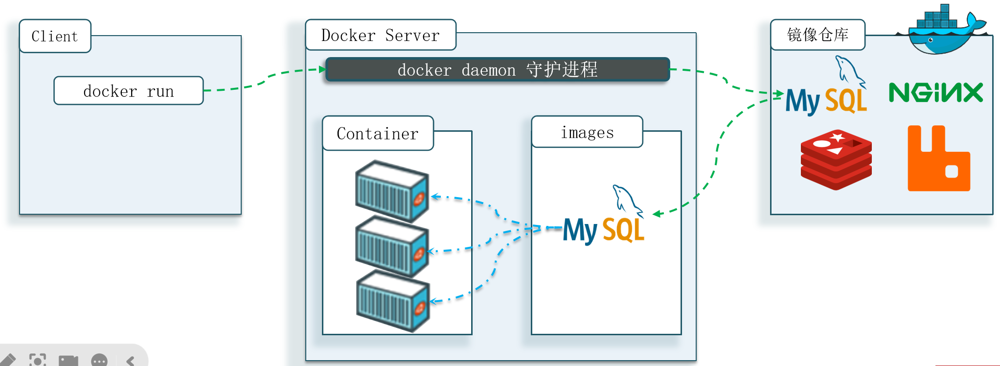
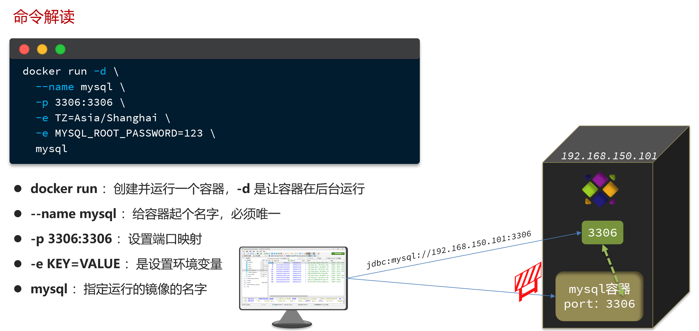
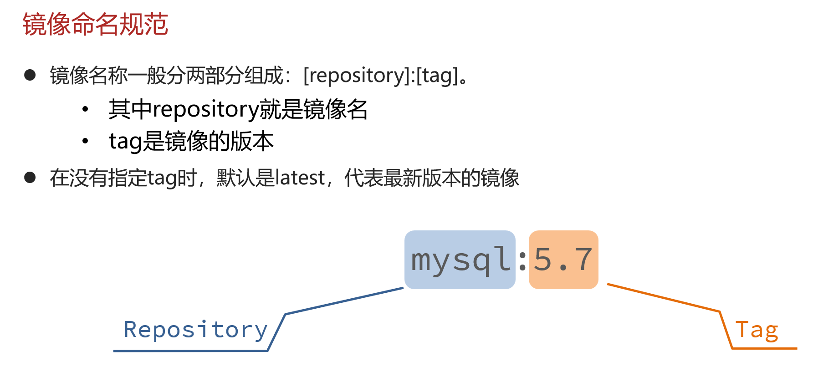
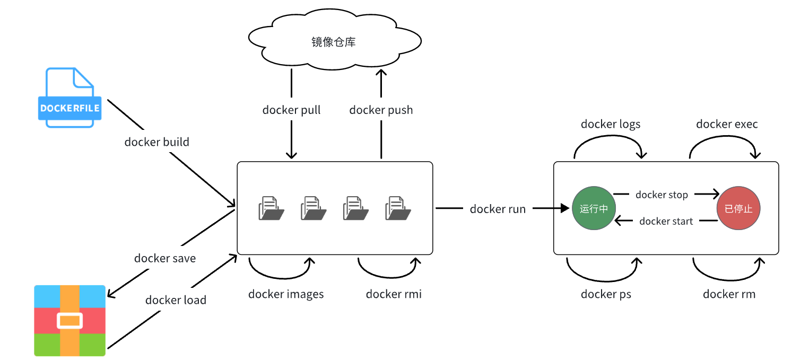
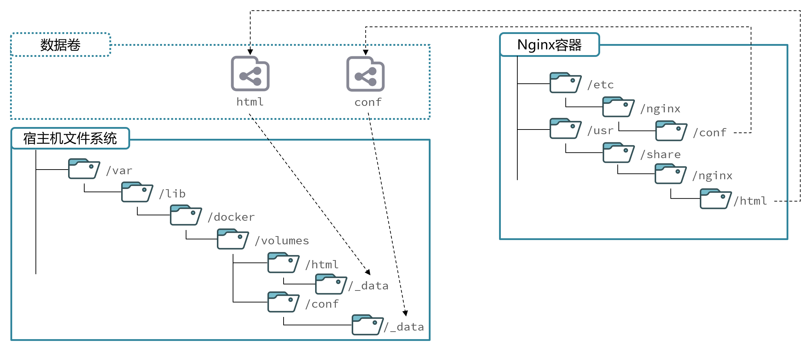
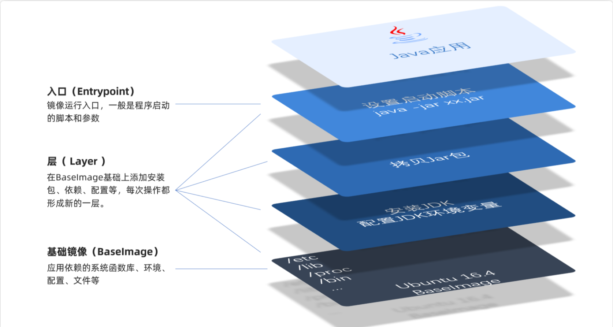

# Docker

## 安装docker

1. 卸载旧版

```shell
yum remove docker \
    docker-client \
    docker-client-latest \
    docker-common \
    docker-latest \
    docker-latest-logrotate \
    docker-logrotate \
    docker-engine \
    docker-selinux 
```

2. 配置Docker的yum库

首先要安装一个yum工具
```Bash
sudo yum install -y yum-utils device-mapper-persistent-data lvm2

```

安装成功后，执行命令，配置Docker的yum源

```Bash
sudo yum-config-manager --add-repo https://mirrors.aliyun.com/docker-ce/linux/centos/docker-ce.repo

sudo sed -i 's+download.docker.com+mirrors.aliyun.com/docker-ce+' /etc/yum.repos.d/docker-ce.repo
```

更新yum，建立缓存

```Bash
sudo yum makecache fast
```

3. 安装docker
```Bash
yum install -y docker-ce docker-ce-cli containerd.io docker-buildx-plugin docker-compose-plugin
```

4. 启动和校验
```Bash
# 启动Docker
systemctl start docker

# 停止Docker
systemctl stop docker

# 重启
systemctl restart docker

# 设置开机自启
systemctl enable docker

# 执行docker ps命令，如果不报错，说明安装启动成功
docker ps
```

5. 配置镜像加速
[Docker/DockerHub 国内镜像源/加速列表](https://xuanyuan.me/blog/archives/1154)

镜像地址可能会变更，如果失效可以百度找最新的docker镜像。
配置镜像步骤如下：

```Bash
# 创建目录
mkdir -p /etc/docker

# 复制内容
tee /etc/docker/daemon.json <<-'EOF'
{
    "registry-mirrors": [
        "http://hub-mirror.c.163.com",
        "https://mirrors.tuna.tsinghua.edu.cn",
        "http://mirrors.sohu.com",
        "https://ustc-edu-cn.mirror.aliyuncs.com",
        "https://ccr.ccs.tencentyun.com",
        "https://docker.m.daocloud.io",
        "https://docker.awsl9527.cn"
    ]
}
EOF

# 重新加载配置
systemctl daemon-reload

# 重启Docker
systemctl restart docker
```


## 镜像和容器

当我们利用Docker安装应用时，Docker:会自动搜索并下载应用镜像(image)。镜像不仅包含应用本身，还包含应用
运行所需要的环境、配置、系统函数库。Docker会在运行镜像时创建一个隔离环境，称为容器(container)。

**镜像仓库**: 存储和管理镜像的平台，Docker官方维护了一个公共仓库:[DockerHub](https://hub.docker.com/)


**总结**

>Docker是做什么的?
>
>Docker可以帮助我们下载应用镜像，创建并运行镜像的容器，从而快速部署应用

>什么是镜像?
>
>将应用所需的函数库、依赖、配置等与应用一起打包得到的就是镜像

>什么是容器?
>
>为每个镜像的应用进程创建的隔离运行环境就是容器

>什么是镜像仓库?
>
>存储和管理镜像的服务就是镜像仓库 DockerHub是目前最大的镜像仓库，其中包含各种常见的应用镜像


## 命令解读

```Bash
docker run -d \
  --name mysql \
  -p 3306:3306 \
  -e TZ=Asia/Shanghai \
  -e MYSQL_ROOT_PASSWORD=123 \
  mysql
  ```

  就是因为Docker会自动搜索并下载MySQL。注意：这里下载的不是安装包，而是镜像。镜像中不仅包含了MySQL本身，还包含了其运行所需要的环境、配置、系统级函数库。因此它在运行时就有自己独立的环境，就可以跨系统运行，也不需要手动再次配置环境了。这套独立运行的隔离环境我们称为容器。

说明：
- 镜像：英文是image
- 容器：英文是container

解读：
>- docker run -d ：创建并运行一个容器，-d则是让容器以后台进程运行
>- --name mysql  : 给容器起个名字叫mysql，你可以叫别的
>- -p 3306:3306 : 设置端口映射。
>  - 容器是隔离环境，外界不可访问。但是可以将宿主机端口映射容器内到端口，当访问宿主机指定端口时，就是在访问容器内的端口了。
>  - 容器内端口往往是由容器内的进程决定，例如MySQL进程默认端口是3306，因此容器内端口一定是3306；而宿主机端口则可以任意指定，一般与容器内保持一致。
>  - 格式： -p 宿主机端口:容器内端口，示例中就是将宿主机的3306映射到容器内的3306端口
>- -e TZ=Asia/Shanghai : 配置容器内进程运行时的一些参数
>  - 格式：-e KEY=VALUE，KEY和VALUE都由容器内进程决定
>  - 案例中，TZ=Asia/Shanghai是设置时区；MYSQL_ROOT_PASSWORD=123是设置MySQL默认密码
>- mysql : 设置镜像名称，Docker会根据这个名字搜索并下载镜像
>  - 格式：REPOSITORY:TAG，例如mysql:8.0，其中REPOSITORY可以理解为镜像名，TAG是版本号
>  - 在未指定TAG的情况下，默认是最新版本，也就是mysql:latest



镜像的名称不是随意的，而是要到DockerRegistry中寻找，镜像运行时的配置也不是随意的，要参考镜像的帮助文档，这些在DockerHub网站或者软件的官方网站中都能找到。




## 常见命令

|命令|说明|
|----|----|
|docker pull|拉取镜像
|docker push|推送镜像到DockerRegistry
|docker images|查看本地镜像
|docker rmi|删除本地镜像
|docker run|创建并运行容器（不能重复创建）
|docker stop|停止指定容器
|docker start|启动指定容器
|docker restart|重新启动容器
|docker rm|删除指定容器
|docker ps|查看运行的容器
|docker ps -a|查看所有容器
|docker logs|查看容器运行日志
|docker exec|进入容器
|docker save|保存镜像到本地压缩文件
|docker load|加载本地压缩文件到镜像
|docker inspect|查看容器详细信息


Docker最常见的命令就是操作镜像、容器的命令，详见官方文档： https://docs.docker.com/





**如何保存下载好的镜像，并打包？**

```Bash
[root@localhost ~]# docker save --help

Usage:  docker save [OPTIONS] IMAGE [IMAGE...]

Save one or more images to a tar archive (streamed to STDOUT by default)

Aliases:
  docker image save, docker save

Options:
  -o, --output string   Write to a file, instead of STDOUT


[root@localhost ~]# docker save -o nginx.tar nginx:latest


[root@localhost ~]# ll
总用量 192044
-rw-------. 1 root root      1241 6月  22 2024 anaconda-ks.cfg
-rw-------. 1 root root 196647424 4月  22 22:32 nginx.tar
 
```


**如何加载回来呢？**

docker load -i nginx.tar

```Bash
[root@localhost ~]# docker load --help

Usage:  docker load [OPTIONS]

Load an image from a tar archive or STDIN

Aliases:
  docker image load, docker load

Options:
  -i, --input string   Read from tar archive file, instead of STDIN
  -q, --quiet          Suppress the load output
[root@localhost ~]# docker load -i nginx.tar
ea680fbff095: Loading layer [==================================================>]   77.9MB/77.9MB
bd903131a05e: Loading layer [==================================================>]  118.7MB/118.7MB
9aad78ecf380: Loading layer [==================================================>]  3.584kB/3.584kB
9e3c6e8c1e25: Loading layer [==================================================>]  4.608kB/4.608kB
8d83f6b79143: Loading layer [==================================================>]   2.56kB/2.56kB
ccc5aac17fc4: Loading layer [==================================================>]   5.12kB/5.12kB
d1e3e4dd1aaa: Loading layer [==================================================>]  7.168kB/7.168kB
Loaded image: nginx:latest
[root@localhost ~]# docker images
REPOSITORY            TAG       IMAGE ID       CREATED        SIZE
nginx                 latest    4e1b6bae1e48   6 days ago     192MB
uums-web              1         d1c9ee2b1a26   8 months ago   946MB
zzy                   1.0.0     5d520aecab93   8 months ago   877MB
tomcat                8         2d2bccf89f53   3 years ago    678MB
redis                 5.0       c5da061a611a   3 years ago    110MB
mysql                 5.6       dd3b2a5dcb48   3 years ago    303MB
centos                7         eeb6ee3f44bd   3 years ago    204MB
mysql                 8.0.25    5c62e459e087   3 years ago    556MB
eclipse/centos_jdk8   latest    5bd02d36ed35   6 years ago    877MB
[root@localhost ~]# 
```

**nginx常规操作**

```Bash
docker pull nginx

docker images

docker run -d --name nginx -p 80:80 nginx

#查看运行中容器
docker ps
# 也可以加格式化方式访问，格式会更加清爽
docker ps --format "table {{.ID}}\t{{.Image}}\t{{.Ports}}\t{{.Status}}\t{{.Names}}"

#停止容器
docker stop nginx

#再次启动nginx容器
docker start nginx

#查看容器详细信息
docker inspect nginx

# 进入容器,查看容器内目录
docker exec -it nginx bash
# 或者，可以进入MySQL
docker exec -it mysql mysql -uroot -p

#删除容器
docker rm nginx
# 发现无法删除，因为容器运行中，强制删除容器
docker rm -f nginx

#查看日志
docker logs -f nginx

#动态查看日志
docker logs -f bef8969d1e0c


```
补充：

默认情况下，每次重启虚拟机我们都需要手动启动Docker和Docker中的容器。通过命令可以实现开机自启：

```Bash
# Docker开机自启
systemctl enable docker

# Docker容器开机自启
docker update --restart=always [容器名/容器id]
```

## 命令别名

```Bash
# 修改/root/.bashrc文件
vi /root/.bashrc
内容如下：
# .bashrc

# User specific aliases and functions

alias rm='rm -i'
alias cp='cp -i'
alias mv='mv -i'
alias dps='docker ps --format "table {{.ID}}\t{{.Image}}\t{{.Ports}}\t{{.Status}}\t{{.Names}}"'
alias dis='docker images'

# Source global definitions
if [ -f /etc/bashrc ]; then
        . /etc/bashrc
fi
```

然后，执行命令使别名生效
```Bash
source /root/.bashrc
```

## 数据卷

容器是隔离环境，容器内程序的文件、配置、运行时产生的容器都在容器内部，我们要读写容器内的文件非常不方便。大家思考几个问题：
- 如果要升级MySQL版本，需要销毁旧容器，那么数据岂不是跟着被销毁了？
- MySQL、Nginx容器运行后，如果我要修改其中的某些配置该怎么办？
- 我想要让Nginx代理我的静态资源怎么办？

因此，容器提供程序的运行环境，但是程序运行产生的数据、程序运行依赖的配置都应该与容器解耦。

**数据卷（volume）**是一个虚拟目录，是**容器内目录**与**宿主机目录**之间映射的桥梁。

以Nginx为例，我们知道Nginx中有两个关键的目录：
- html：放置一些静态资源
- conf：放置配置文件
如果我们要让Nginx代理我们的静态资源，最好是放到html目录；如果我们要修改Nginx的配置，最好是找到conf下的nginx.conf文件。
但遗憾的是，容器运行的Nginx所有的文件都在容器内部。所以我们必须利用数据卷将两个目录与宿主机目录关联，方便我们操作。如图：



在上图中：
- 我们创建了两个数据卷：`conf`、`html`
- Nginx容器内部的conf目录和html目录分别与两个数据卷关联。
- 而数据卷conf和html分别指向了宿主机的`/var/lib/docker/volumes/conf/_data`目录和`/var/lib/docker/volumes/html/_data`目录

这样以来，容器内的conf和html目录就 与宿主机的conf和html目录关联起来，我们称为**挂载**。此时，我们操作宿主机的`/var/lib/docker/volumes/html/_data`就是在操作容器内的`/usr/share/nginx/html/_data`目录。只要我们将静态资源放入宿主机对应目录，就可以被Nginx代理了。

:::tip
`/var/lib/docker/volumes`这个目录就是默认的存放所有容器数据卷的目录，其下再根据数据卷名称创建新目录，格式为`/数据卷名/_data`。
:::

### 数据卷命令

|命令|说明|
|----|----|
|docker volume create|创建数据卷
|docker volume ls|查看所有数据卷
|docker volume rm|删除指定数据卷
|docker volume inspect|查看某个数据卷的详情
|docker volume prune|清除数据卷

注意：容器与数据卷的挂载要在创建容器时配置，对于创建好的容器，是不能设置数据卷的。而且**创建容器的过程中，数据卷会自动创建**。

```Bash
docker run -d --name nginx -p 80:80 -v html:/usr/share/nginx/html nginx


docker volume ls


[root@localhost ~]# docker volume ls
DRIVER    VOLUME NAME
local     html
[root@localhost ~]# docker volume inspect html
[
    {
        "CreatedAt": "2025-04-23T21:37:48+08:00",
        "Driver": "local",
        "Labels": null,
        "Mountpoint": "/var/lib/docker/volumes/html/_data",
        "Name": "html",
        "Options": null,
        "Scope": "local"
    }
]

[root@localhost ~]# cd /var/lib/docker/volumes/html/_data
[root@localhost _data]# ls
50x.html  index.html

#进入容器内部，查看/usr/share/nginx/html目录内的文件是否变化
docker exec -it nginx bash


```


### 总结

**什么是数据卷?**
- 数据卷是一个虚拟目录，它将宿主机目录映射到容器内目录，方便我们操作容器内文件，或者方便迁移容器产生的数据

**如何挂载数据卷?**
- 在创建容器时，利用-v数据卷名:容器内目录完成挂载

- 容器创建时，如果发现挂载的数据卷不存在时，会自动创建

**数据卷的常见命令有哪些?**

- docker volume ls:查看数据卷
- docker volumerm:删除数据卷
- docker volumeinspect:查看数据卷详情
- docker volume prune:删除未使用的数据卷


### 挂载本地目录

**mysql挂载**

数据卷的目录结构较深，如果我们去操作数据卷目录会不太方便。在很多情况下，我们会直接将容器目录与宿主机指定目录挂载。挂载语法与数据卷类似：

```Bash
# 挂载本地目录
-v 本地目录:容器内目录
# 挂载本地文件
-v 本地文件:容器内文件
```

注意：本地目录或文件必须以 / 或 ./开头，如果直接以名字开头，会被识别为数据卷名而非本地目录名。


例如
```
-v mysql:/var/lib/mysql # 会被识别为一个数据卷叫mysql，运行时会自动创建这个数据卷
-v ./mysql:/var/lib/mysql # 会被识别为当前目录下的mysql目录，运行时如果不存在会创建目录
```

mysql挂载位置

- 挂载`/root/mysql/data`到容器内的`/var/lib/mysql`目录
- 挂载`/root/mysql/init`到容器内的`/docker-entrypoint-initdb.d`目录（初始化的SQL脚本目录）
- 挂载`/root/mysql/conf`到容器内的`/etc/mysql/conf.d`目录（这个是MySQL配置文件目录）

init放`xxx.sql`，初始化时只会执行一次

conf放`xxx.cnf`文件

**本地目录挂载：**

```Bash
# 1.删除原来的MySQL容器
docker rm -f mysql

# 2.进入root目录
cd ~

# 3.创建并运行新mysql容器，挂载本地目录
docker run -d \
  --name mysql \
  -p 3306:3306 \
  -e TZ=Asia/Shanghai \
  -e MYSQL_ROOT_PASSWORD=123 \
  -v ./mysql/data:/var/lib/mysql \
  -v ./mysql/conf:/etc/mysql/conf.d \
  -v ./mysql/init:/docker-entrypoint-initdb.d \
  mysql

# 5.1.进入MySQL
docker exec -it mysql mysql -uroot -p123
# 5.2.查看编码表
show variables like "%char%";

# 查看数据库
show databases;


# 切换到xxx数据库
use xxx;

#查看表
show tables;


```

## 镜像

**镜像结构**

镜像之所以能让我们快速跨操作系统部署应用而忽略其运行环境、配置，就是因为镜像中包含了程序运行需要的系统函数库、环境、配置、依赖。

因此，自定义镜像本质就是依次准备好程序运行的基础环境、依赖、应用本身、运行配置等文件，并且打包而成。

那因此，我们打包镜像也是分成这么几步：
- 准备Linux运行环境（java项目并不需要完整的操作系统，仅仅是基础运行环境即可）
- 安装并配置JDK
- 拷贝jar包
- 配置启动脚本

上述步骤中的每一次操作其实都是在生产一些文件（系统运行环境、函数库、配置最终都是磁盘文件），所以**镜像就是一堆文件的集合**。

但需要注意的是，镜像文件不是随意堆放的，而是按照操作的步骤分层叠加而成，每一层形成的文件都会单独打包并标记一个唯一id，称为**Layer（层）**。这样，如果我们构建时用到的某些层其他人已经制作过，就可以直接拷贝使用这些层，而不用重复制作。

例如，第一步中需要的Linux运行环境，通用性就很强，所以Docker官方就制作了这样的只包含Linux运行环境的镜像。我们在制作java镜像时，就无需重复制作，直接使用Docker官方提供的CentOS或Ubuntu镜像作为基础镜像。然后再搭建其它层即可，这样逐层搭建，最终整个Java项目的镜像结构如图所示：




### Dockerfile
记录镜像结构的文件就称为Dockerfile，其对应的语法可以参考官方文档：
https://docs.docker.com/engine/reference/builder/

其中的语法比较多，比较常用的有：

|指令|说明|示例|
|------|------|-----|
|FROM|指定基础镜像|`FROM centos:6`
|ENV|设置环境变量，可在后面指令使用|`ENV key value`
|COPY|拷贝本地文件到镜像的指定目录|`COPY ./xx.jar /tmp/app.jar`
|RUN|执行Linux的shell命令，一般是安装过程的命令|`RUN yum install gcc`
|EXPOSE|指定容器运行时监听的端口，是给镜像使用者看的|`EXPOSE 8080`
|ENTRYPOINT|镜像中应用的启动命令，容器运行时调用|`ENTRYPOINT java -jar xx.jar`


例如，要基于Ubuntu镜像来构建一个Java应用，其Dockerfile内容如下：

```Dockerfile
# 指定基础镜像
FROM ubuntu:16.04
# 配置环境变量，JDK的安装目录、容器内时区
ENV JAVA_DIR=/usr/local
ENV TZ=Asia/Shanghai
# 拷贝jdk和java项目的包
COPY ./jdk8.tar.gz $JAVA_DIR/
COPY ./docker-demo.jar /tmp/app.jar
# 设定时区
RUN ln -snf /usr/share/zoneinfo/$TZ /etc/localtime && echo $TZ > /etc/timezone
# 安装JDK
RUN cd $JAVA_DIR \
 && tar -xf ./jdk8.tar.gz \
 && mv ./jdk1.8.0_144 ./java8
# 配置环境变量
ENV JAVA_HOME=$JAVA_DIR/java8
ENV PATH=$PATH:$JAVA_HOME/bin
# 指定项目监听的端口
EXPOSE 8080
# 入口，java项目的启动命令
ENTRYPOINT ["java", "-jar", "/app.jar"]
```

以后我们会有很多很多java项目需要打包为镜像，他们都需要Linux系统环境、JDK环境这两层，只有上面的3层不同（因为jar包不同）。如果每次制作java镜像都重复制作前两层镜像，是不是很麻烦。

所以，就有人提供了基础的系统加JDK环境，我们在此基础上制作java镜像，就可以省去JDK的配置了：


```Dockerfile
# 基础镜像
FROM openjdk:11.0-jre-buster
# 设定时区
ENV TZ=Asia/Shanghai
RUN ln -snf /usr/share/zoneinfo/$TZ /etc/localtime && echo $TZ > /etc/timezone
# 拷贝jar包
COPY docker-demo.jar /app.jar
# 入口
ENTRYPOINT ["java", "-jar", "/app.jar"]
```


### 构建镜像

**命令**
```Bash
# 进入镜像目录
cd /root/demo
# 开始构建
docker build -t docker-demo:1.0 .
```

命令说明：
- `docker build` : 就是构建一个docker镜像
- `-t docker-demo:1.0` ：`-t`参数是指定镜像的名称（`repository`和`tag`）
- ` .` : 最后的点是指构建时**Dockerfile所在路径**，由于我们进入了demo目录，所以指定的是`.`代表当前目录，也可以直接指定`Dockerfile`目录：

```Bash
# 直接指定Dockerfile目录
docker build -t docker-demo:1.0 /root/demo
```

#### 示例
上传我们写好的`Dockerfile`和`jar包`


```Dockerfile
# 基础镜像
FROM openjdk:11.0-jre-buster
# 设定时区
ENV TZ=Asia/Shanghai
RUN ln -snf /usr/share/zoneinfo/$TZ /etc/localtime && echo $TZ > /etc/timezone
# 拷贝jar包
COPY docker-demo.jar /app.jar
# 入口
ENTRYPOINT ["java", "-jar", "/app.jar"]
```

执行命令

```Bash
[root@localhost demo]# docker build -t docker-demo:1.0 .

[+] Building 35.5s (8/8) FINISHED                                                             docker:default
 => [internal] load build definition from Dockerfile                                                    0.0s
 => => transferring dockerfile: 359B                                                                    0.0s
 => [internal] load metadata for docker.io/library/openjdk:11.0-jre-buster                              9.7s
 => [internal] load .dockerignore                                                                       0.0s
 => => transferring context: 2B                                                                         0.0s
 => [1/3] FROM docker.io/library/openjdk:11.0-jre-buster@sha256:569ba9252ddd693a29d39e81b3123481f308e  23.4s
 => => resolve docker.io/library/openjdk:11.0-jre-buster@sha256:569ba9252ddd693a29d39e81b3123481f308eb  0.0s
 => => sha256:4fe4e1c58b4af82939a918665dd1e7b5b636dd73c710b4bccb530edbb15470d2 7.86MB / 7.86MB         16.1s
.........


root@localhost demo]# docker images

REPOSITORY            TAG       IMAGE ID       CREATED          SIZE
docker-demo           1.0       678e0af7095e   32 seconds ago   315MB

[root@localhost demo]# docker run -d --name dockerDemo -p 8080:8080 docker-demo:1.0

364781fb488c583e3d2e59daaf7546a1975338851b29207d952d447f07634982
[root@localhost demo]# dps
CONTAINER ID   IMAGE             PORTS                                       STATUS         NAMES
7e90d418321d   docker-demo:1.0   0.0.0.0:8080->8080/tcp, :::8080->8080/tcp   Up 3 seconds   dockerDemo
[root@localhost demo]# curl localhost:8080/hello/count
<h5>欢迎访问商城, 这是您第1次访问<h5>[root@localhost demo]#

[root@localhost demo]# docker logs dockerDemo

  .   ____          _            __ _ _
 /\\ / ___'_ __ _ _(_)_ __  __ _ \ \ \ \
( ( )\___ | '_ | '_| | '_ \/ _` | \ \ \ \
 \\/  ___)| |_)| | | | | || (_| |  ) ) ) )
  '  |____| .__|_| |_|_| |_\__, | / / / /
 =========|_|==============|___/=/_/_/_/
 :: Spring Boot ::               (v2.7.12)

21:28:56  INFO 1 --- [           main] com.itheima.mp.MpDemoApplication         : Starting MpDemoApplication v0.0.1-SNAPSHOT using Java 11.0.16 on 7e90d418321d with PID 1 (/app.jar started by root in /)
21:28:56 DEBUG 1 --- [           main] com.itheima.mp.MpDemoApplication         : Running with Spring Boot v2.7.12, Spring v5.3.27
21:28:56  INFO 1 --- [           main] com.itheima.mp.MpDemoApplication         : No active profile set, falling back to 1 default profile: "default"
21:28:58  INFO 1 --- [           main] o.s.b.w.embedded.tomcat.TomcatWebServer  : Tomcat initialized with port(s): 8080 (http)
21:28:58  INFO 1 --- [           main] o.apache.catalina.core.StandardService   : Starting service [Tomcat]
21:28:58  INFO 1 --- [           main] org.apache.catalina.core.StandardEngine  : Starting Servlet engine: [Apache Tomcat/9.0.75]
21:28:58  INFO 1 --- [           main] o.a.c.c.C.[Tomcat].[localhost].[/]       : Initializing Spring embedded WebApplicationContext
21:28:58  INFO 1 --- [           main] w.s.c.ServletWebServerApplicationContext : Root WebApplicationContext: initialization completed in 2075 ms
21:28:59  INFO 1 --- [           main] o.s.b.w.embedded.tomcat.TomcatWebServer  : Tomcat started on port(s): 8080 (http) with context path ''
21:28:59  INFO 1 --- [           main] com.itheima.mp.MpDemoApplication         : Started MpDemoApplication in 4.308 seconds (JVM running for 4.953)
21:29:03  INFO 1 --- [nio-8080-exec-1] o.a.c.c.C.[Tomcat].[localhost].[/]       : Initializing Spring DispatcherServlet 'dispatcherServlet'
21:29:03  INFO 1 --- [nio-8080-exec-1] o.s.web.servlet.DispatcherServlet        : Initializing Servlet 'dispatcherServlet'
21:29:03  INFO 1 --- [nio-8080-exec-1] o.s.web.servlet.DispatcherServlet        : Completed initialization in 1 ms
[root@localhost demo]# 
```

### 总结
镜像的结构是怎样的?

- 镜像中包含了应用程序所需要的运行环境、函数库、配置、以及应用本身等各种文件，这些文件分层打包而成，

Dockerfile是做什么的?

- Dockerfile就是利用固定的指令来描述镜像的结构和构建过程，这样Docker才可以依次来构建镜像

构建镜像的命令是什么?

- docker build -t 镜像名 [Dockerfile目录]


## 容器网络互联


刚刚我们创建了一个Java项目的容器，而Java项目往往需要访问其它各种中间件，例如MySQL、Redis等。现在，我们的容器之间能否互相访问呢？我们来测试一下

首先，我们查看下Nginx容器的详细信息，重点关注其中的网络IP地址：

```Bash
docker inspect nginx

  "Networks": {
                "bridge": {
                    "IPAMConfig": null,
                    "Links": null,
                    "Aliases": null,
                    "MacAddress": "02:42:ac:11:00:04",
                    "NetworkID": "8bbc5fd1fe07fc2539250796feede9bb5c617c28b0f64521e9744b1ffb5cd8ea",
                    "EndpointID": "4e20a441965ddedc5264bf9296546342448c4aeb965324eedff362293fa6c809",
                    "Gateway": "172.17.0.1",
                    "IPAddress": "172.17.0.4",
                    "IPPrefixLen": 16,
                    "IPv6Gateway": "",
                    "GlobalIPv6Address": "",
                    "GlobalIPv6PrefixLen": 0,
                    "DriverOpts": null,
                    "DNSNames": null
                }
            }

[root@localhost ~]# docker exec -it dockerDemo bash

root@7e90d418321d:/# ping 172.17.0.4
PING 172.17.0.4 (172.17.0.4) 56(84) bytes of data.
64 bytes from 172.17.0.4: icmp_seq=1 ttl=64 time=0.286 ms
64 bytes from 172.17.0.4: icmp_seq=2 ttl=64 time=0.085 ms
64 bytes from 172.17.0.4: icmp_seq=3 ttl=64 time=0.092 ms
64 bytes from 172.17.0.4: icmp_seq=4 ttl=64 time=0.087 ms


```

发现可以互联，没有问题。

但是，容器的网络IP其实是一个虚拟的IP，其值并不固定与某一个容器绑定，如果我们在开发时写死某个IP，而在部署时很可能MySQL容器的IP会发生变化，连接会失败。

所以，我们必须借助于docker的网络功能来解决这个问题，官方文档：https://docs.docker.com/engine/reference/commandline/network/

**常见命令有：**
|命令|说明|
|----|-----|
|`docker network create`|创建一个网络|
|`docker network ls`|查看所有网络|
|`docker network rm`|删除指定网络|
|`docker network prune`|清除未使用的网络|
|`docker network connect`|使指定容器连接加入某网络|
|`docker network disconnect`|使指定容器连接离开某网络|
|`docker network inspect`|查看网络详细信息|


### 自定义网络

```Bash
# 1.首先通过命令创建一个网络
docker network create customizeNetwork

# 2.然后查看网络
docker network ls
# 结果：
NETWORK ID     NAME      DRIVER    SCOPE
639bc44d0a87   bridge    bridge    local
403f16ec62a2   customizeNetwork     bridge    local
0dc0f72a0fbb   host      host      local
cd8d3e8df47b   none      null      local
# 其中，除了customizeNetwork以外，其它都是默认的网络

# 3.让dockerDemo和mysql都加入该网络，注意，在加入网络时可以通过--alias给容器起别名
# 这样该网络内的其它容器可以用别名互相访问！
# 3.1.mysql容器，指定别名为db，另外每一个容器都有一个别名是容器名
docker network connect customizeNetwork mysql --alias db
# 3.2.dockerDemo容器，也就是我们的java项目
docker network connect customizeNetwork dockerDemo

# 4.进入dockerDemo容器，尝试利用别名访问db
# 4.1.进入容器
docker exec -it dockerDemo bash
# 4.2.用db别名访问
ping db
# 结果
PING db (172.18.0.2) 56(84) bytes of data.
64 bytes from mysql.hmall (172.18.0.2): icmp_seq=1 ttl=64 time=0.070 ms
64 bytes from mysql.hmall (172.18.0.2): icmp_seq=2 ttl=64 time=0.056 ms
# 4.3.用容器名访问
ping mysql
# 结果：
PING mysql (172.18.0.2) 56(84) bytes of data.
64 bytes from mysql.hmall (172.18.0.2): icmp_seq=1 ttl=64 time=0.044 ms
64 bytes from mysql.hmall (172.18.0.2): icmp_seq=2 ttl=64 time=0.054 ms
```

现在无需记住IP地址也可以实现容器互联了。

**总结：**
- 在自定义网络中，可以给容器起多个别名，默认的别名是容器名本身
- 在同一个自定义网络中的容器，可以通过别名互相访问


## 部署项目

上传我们的`jar包`和`Dockerfile`

```Bash
docker build -t 项目名:版本 .
```

### **网络**

```Bash
docker network create xxx-network

docker network connect xxx-network mysql --alias db

docker network connect xxxx-network nginx
```


### Mysql

*挂载目录*

`/root/mysql/conf`

`/root/mysql/data`

`/root/mysql/init`

cnf文件:
```  [xxx.cnf]
[client]
default_character_set=utf8mb4
[mysql]
default_character_set=utf8mb4
[mysqld]
character_set_server=utf8mb4
collation_server=utf8mb4_unicode_ci
init_connect='SET NAMES utf8mb4'
```

init是初始化文件:
`xxx.sql`

```Bash
docker run -d \
  --name mysql \
  -p 3306:3306 \
  -e TZ=Asia/Shanghai \
  -e MYSQL_ROOT_PASSWORD=123 \
  -v ./mysql/data:/var/lib/mysql \
  -v ./mysql/conf:/etc/mysql/conf.d \
  -v ./mysql/init:/docker-entrypoint-initdb.d \
  --network hmall-network \
  --restart always \
  mysql:latest
```


### Nginx

*创建挂载目录*

`/root/nginx/html/`

`/root/nginx/nginx.conf/`

- 把`/root/nginx/nginx.conf`挂载到`/etc/nginx/nginx.conf`
- 把`/root/nginx/html`挂载到`/usr/share/nginx/html`

配置文件中，这里不要写死，用于容器之间互相通信


```[nginx.conf]

worker_processes  1;

events {
    worker_connections  1024;
}

http {
    include       mime.types;
    default_type  application/json;

    sendfile        on;
    
    keepalive_timeout  65;

    server {
        listen       18080;
        # 指定前端项目所在的位置
        location / {
            root /usr/share/nginx/html/hmall-portal;
        }

        error_page   500 502 503 504  /50x.html;
        location = /50x.html {
            root   html;
        }
        location /api {
            rewrite /api/(.*)  /$1 break;
            proxy_pass http://hmall:8080;
        }
    }
    server {
        listen       18081;
        # 指定前端项目所在的位置
        location / {
            root /usr/share/nginx/html/hmall-admin;
        }

        error_page   500 502 503 504  /50x.html;
        location = /50x.html {
            root   html;
        }
        location /api {
            rewrite /api/(.*)  /$1 break;
            proxy_pass http://hmall:8080;
        }
    }
}

```

```Bash
docker run -d \
      --name nginx \
      -p 80:80 \
      -p 443:443 \
      -v /root/nginx/conf.d/default.conf:/etc/nginx/conf.d/default.conf \
      -v /root/nginx/conf/nginx.conf:/etc/nginx/conf/nginx.conf \
      -v /root/nginx/ssl:/etc/nginx/ssl \
      -v /root/nginx/html:/usr/share/nginx/html \
      -v /root/nginx/logs:/var/log/nginx \
      --network xxx-network
      --restart always \
      nginx
```

```Bash
docker run -d \
  --name nginx \
  -p 18080:18080 \
  -p 18081:18081 \
  -v /root/nginx/html:/usr/share/nginx/html \
  -v /root/nginx/nginx.conf:/etc/nginx/nginx.conf \
  --network hmall \
  nginx
```


### Java
```Bash
docker run -d --name hm -p 8080:8080 --network xxx-network hmall
```


## DockerCompose

Docker Compose就可以帮助我们实现**多个相互关联的Docker容器的快速部署**。它允许用户通过一个单独的 docker-compose.yml 模板文件（YAML 格式）来定义一组相关联的应用容器。


**对比如下：**
|docker run 参数|docker compose 指令|说明|
|----|-----|----|
|--name |   container_name|容器名称|
|-p |   ports|端口映射|
|-e |   environment|环境变量|
|-v |   volumes|数据卷配置|
|--network |   networks|网络|


```
hmall:
  build:
    context: .
    dockerfile: Dockerfile
```

构建Java项目，意为在当前目录下的Dockerfile，进行构建


```yaml [docker-compose.yaml]
services:
  mysql:
    image: mysql
    container_name: mysql
    ports:
      - "3306:3306"
    environment:
      TZ: Asia/Shanghai
      MYSQL_ROOT_PASSWORD: 123
    volumes:
      - "./mysql/conf:/etc/mysql/conf.d"
      - "./mysql/data:/var/lib/mysql"
      - "./mysql/init:/docker-entrypoint-initdb.d"
    networks:
      - hmall-network
  hmall:
    build: 
      context: .
      dockerfile: Dockerfile
    container_name: hmall
    ports:
      - "8080:8080"
    networks:
      - hmall-network
    depends_on:
      - mysql
  nginx:
    image: nginx
    container_name: nginx
    ports:
      - "18080:18080"
      - "18081:18081"
    volumes:
      - "./nginx/nginx.conf:/etc/nginx/nginx.conf"
      - "./nginx/html:/usr/share/nginx/html"
    depends_on:
      - hmall
    networks:
      - hmall-network
networks:
  hmall-network:
    driver: bridge
```

```Bash
[root@localhost ~]# docker compose up -d

[+] Building 0.2s (8/8) FINISHED                                                                   docker:default
 => [hmall internal] load build definition from Dockerfile                                                   0.0s
 => => transferring dockerfile: 358B                                                                         0.0s
 => [hmall internal] load metadata for docker.io/library/openjdk:11.0-jre-buster                             0.0s
 => [hmall internal] load .dockerignore                                                                      0.0s
 => => transferring context: 2B                                                                              0.0s
 => [hmall 1/3] FROM docker.io/library/openjdk:11.0-jre-buster                                               0.0s
 => [hmall internal] load build context                                                                      0.0s
 => => transferring context: 98B                                                                             0.0s
 => CACHED [hmall 2/3] RUN ln -snf /usr/share/zoneinfo/Asia/Shanghai /etc/localtime && echo Asia/Shanghai >  0.0s
 => CACHED [hmall 3/3] COPY hm-service.jar /app.jar                                                          0.0s
 => [hmall] exporting to image                                                                               0.0s
 => => exporting layers                                                                                      0.0s
 => => writing image sha256:164bc4806232609ccf993f792dd31f00c5af7c1d51734487f2dce67a334fe87b                 0.0s
 => => naming to docker.io/library/root-hmall                                                                0.0s
[+] Running 4/4
 ✔ Network root_hmall-network  Created                                                                       0.2s 
 ✔ Container mysql             Started                                                                       0.8s 
 ✔ Container hmall             Started                                                                       1.3s 
 ✔ Container nginx             Started                                                                       2.0s 
[root@localhost ~]# 
```

启动成功后，就会在镜像中自动生成root-hmall的镜像


**命令**

```Bash
docker compose [OPTIONS] [COMMAND]
```
其中，OPTIONS和COMMAND都是可选参数，比较常见的有：

| 类型       | 参数或指令 | 说明                                                                 |
|------------|------------|----------------------------------------------------------------------|
| **Options**| `-f`       | 指定 `compose` 文件的路径和名称                                           |
|            | `-p`       | 指定项目名称。`project` 就是当前 `compose` 文件中设置的多个 `service` 的集合，是逻辑概念 |
| **Commands**| `up`      | 创建并启动所有 `service` 容器                                             |
|            | `down`     | 停止并移除所有容器、网络                                                   |
|            | `ps`       | 列出所有启动的容器                                                         |
|            | `logs`     | 查看指定容器的日志                                                         |
|            | `stop`     | 停止容器                                                                 |
|            | `start`    | 启动容器                                                                 |
|            | `restart`  | 重启容器                                                                 |
|            | `top`      | 查看运行的进程                                                             |
|            | `exec`     | 在指定的运行中容器中执行命令                                               |
