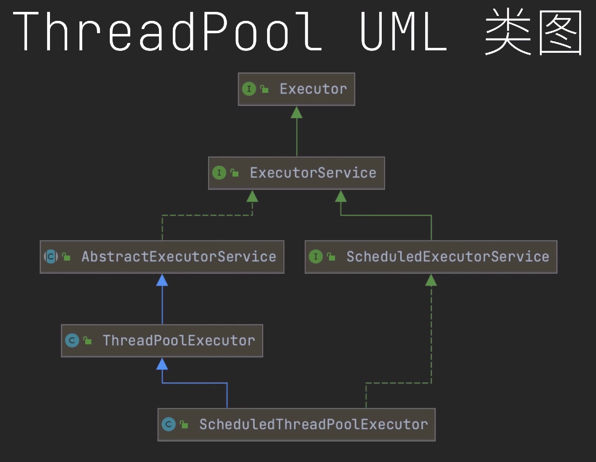
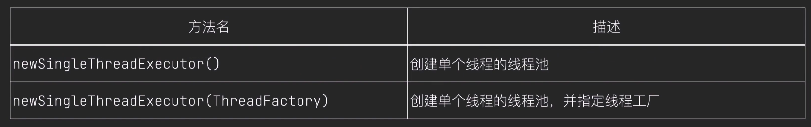
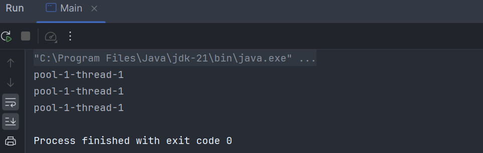

# 线程池

## 为什么要使用线程池？

在没有使用线程池之前，是这样执行任务的

一个线程只能执行一个任务，不能连续执行任务

```java [Task]
public class Task implements Runnable {
    @Override
    public void run() {
        System.out.println(Thread.currentThread().getName());
    }
}
```

```java [Main]
public class Main {
    public static void main(String[] args) {
        Task task = new Task();
        Thread thread = new Thread(task);
        thread.start();
    }
}
```


这暴露了一个问题，线程不能复用，重复创建和销毁线程耗时耗资源，若能复用就好了，复用的好处就是省时省资源

看线程池如何执行⤵️

创建只有一个线程的线程池，这个线程池中只有一个线程，重点是它里面的线程可以复用

```java
public class Main {
    public static void main(String[] args) {
        Runnable task1 = new Task();
        Runnable task2 = new Task();
        Runnable task3 = new Task();

        ExecutorService threadPool = Executors.newSingleThreadExecutor();
        threadPool.execute(task1);
        threadPool.execute(task2);
        threadPool.execute(task3);

        threadPool.shutdown();
    }
}
```
说明一个线程执行了3个任务


## **线程池的好处**
1. 降低资源消耗:通过重复利用已创建的线程降低线程创建和销毁造成的消耗
2. 提高响应速度:当有任务时，任务可以不需要等到线程创建就能立即执行
3. 提高线程的可管理性:线程是稀缺资源，如果无限制的创建，不仅会消耗系统资源，还会降低系统的稳定性，线程池可以进行统一的分配，调优和监控

## 什么是线程池

线程池是一种基于池化思想管理线程的工具

在没有线程池之前，当有任务需要执行时，我们会创建一个线程，然后将任务传递给线程，并且一个线程只能执行一个任务，如果还有任务，我们就只能再创建一个线程去执行它，当任务执行完时，线程就销毁了，重复创建和销毁线程是一件很耗时耗资源的事，如果线程能复用，那么就减少很多不必要的消耗，于是线程池就孕育而生了，事先将线程创建好，当有任务需要执行时，提交给线程池，线程池分配线程去执行，有再多的任务也不怕线程池中的线程能复用，执行完一个任务，再接着执行其他任务，当所有任务都执行完时，我们可以选择关闭线程池，也可以选择等待接收任务。

<br>

## 原生方式创建线程池

**线程池核心UML类图**



`ThreadPoolExecutor`是线程池核心类，它一共有四个构造方法


最复杂的说起，它一共有7个参数⤵️
```java [ThreadPoolExecutor.java]
public ThreadPoolExecutor(int corePoolSize,
                        int maximumPoolSize,
                        long keepAliveTime,
                        TimeUnit unit,
                        BlockingQueue<Runnable> workQueue,
                        ThreadFactory threadFactory,
                        RejectedExecutionHandler handler) 
```

参数含义：
| 参数        |      描述      |
| ------------- | :-----------:|
| corePoolSize      | 核心线程数|
| maximumPoolSize      |   最大线程数   |
| keepAliveTime      |   空闲线程存活时间   |
| unit      |   时间单位   |
| workQueue |   任务队列   |
| threadFactory |   线程工厂   |
| handler |   拒绝任务策略   |

**参数解析：**


核心线程的好处：只要线程池不关闭，就不会被销毁

最大线程数：表示线程池中最多允许有25个线程

除去核心线程之外的线程是非核心线程，非核心线程没有执行任务的话，是要被清理的，在被清理之前能存活多久取决于第三个和第四个参数；
当任务都执行完以后，所有线程都成了空闲线程，还是要分核心与非核心线程，再过十秒，若非核心线程没有工作，就要被销毁，剩下的都是核心线程

workQueue是任务队列，线程池中的线程们也都是在这领取的任务，我一般用的是 `LinkedBlockingQueue`链式阻塞队列，基于链表的阻塞队列；还有一个常用的是`ArrayBlockingQueue`数组阻塞队列，这是一个基于数组的阻塞队列

threadFactory：线程工厂，指定线程该如何生产，它是一个接口,实现它里面的 newThread 方法,可以自定义线程的相关设置; 例如：可以指定线程名称，还可以指定是否为后台线程

```java [ThreadFactory.java]
public interface ThreadFactory {

    /**
    *  构造一个新线程，可以指定线程名称、优先级等等
    *
    * @param r 新线程执行的任务
    * @return 构造的新线程，如果创建线程的请求被拒绝，则为 nulL
    */
    Thread newThread(Runnable r);
}
```


如果你不想自定义线程工厂，那么可以使用，Executors类中的默认线程工程


handler：任务拒绝策略，什么情况下我们提交给线程池的任务会被拒绝呢，要满足以下四种情况
1. 线程池中线程已满
2. 无法继续扩容
3. 没有空闲线程，所有线程都在执行任务
4. 任务队列已满，无法再存入新任务

同时满足这四种情况时，我们提交给线程池的任务才会被拒绝

线程池拒绝我们的方式也有四种：


示例：

自定义线程工厂
```java [CustomThreadFactory.java]
public class CustomThreadFactory implements ThreadFactory {
    private final AtomicInteger i = new AtomicInteger(1);

    @Override
    public Thread newThread(Runnable r) {
        // 创建线程，执行任务
        Thread thread = new Thread(r);
        // 设置线程名称
        thread.setName("线程" + i.getAndIncrement() + "号");
        // 返回线程
        return thread;
    }
}
```

```java
public class Task implements Runnable {
    @Override
    public void run() {
        System.out.println(Thread.currentThread().getName());
    }
}
```

```java
public class Main {
    public static void main(String[] args) {
        // 创建任务
        Runnable task1 = new Task();
        Runnable task2 = new Task();
        Runnable task3 = new Task();
        // 创建线程池
        ThreadPoolExecutor threadPoolExecutor = new ThreadPoolExecutor(5, 25, 10L,
                TimeUnit.SECONDS, 
                new LinkedBlockingQueue<>(), 
                new CustomThreadFactory(), 
                new ThreadPoolExecutor.AbortPolicy());
        // 提交任务
        threadPoolExecutor.execute(task1);
        threadPoolExecutor.execute(task2);
        threadPoolExecutor.execute(task3);
        // 关闭线程池
        threadPoolExecutor.shutdown();
    }
}
```


## 这 3 种创建线程池的方式有风险

分别是 

1. 固定大小线程池 `FixedThreadPool`
2. 单个线程的线程池 `SingleThreadExecuton`
3. 可缓存的线程池 `CachedThreadPool`

这三种创建方式都在Executors 工具类中


所有已new开头的都能创建线程池

一共有12个这样的方法，去掉重载方法后，就剩下6个


---

### FixedThreadPool


FixedThreadPool，它内部采用 `ThreadPoolExecutor`来创建线程池，核心线程数和最大线程数一样，意味着它里面全是核心线程；空闲线程存活时间为0毫秒，这样空闲线程就不会被销毁，任务队列采用的是 `LinkedBlockingQueue`;

此队列有资源耗尽的风险，因为`LinkedBlockingQueue`的容量为Interger的最大值，Interger的最大值是2<sup>31</sup>，意味着任务队列中的任务数量可高达 21亿之多，内存随时都有可能爆掉，不推荐使用 `FixedThreadPool`;


在《阿里巴巴Java开发手册》的第一章第7小节，第4条中这样写道⤵️


创建固定大小的线程池有两个方法⤵️

演示一个参数的方法：

```java [Task.java]
public class Task implements Runnable {
    @Override
    public void run() {
        System.out.println(Thread.currentThread().getName());
    }
}
```

```java
public class Main {
    public static void main(String[] args) {
        // 创建任务
        Runnable task1 = new Task();
        Runnable task2 = new Task();
        Runnable task3 = new Task();
        // 创建线程池
        ExecutorService threadPoolExecutor = Executors.newFixedThreadPool(10);
        // 提交任务
        threadPoolExecutor.execute(task1);
        threadPoolExecutor.execute(task2);
        threadPoolExecutor.execute(task3);
        // 关闭线程池
        threadPoolExecutor.shutdown();
    }
```
*运行结果*


---

### SingleThreadExecutor

它内部也采用 `ThreadPoolExecutor`来创建线程池，核心线程数和最大线程数一样，意味着它里面全也都是核心线程，只不过只有一个，空闲线程存活时间为0毫秒，它里面的空闲线程也不会被销毁，任务队列采用的是 `LinkedBlockingQueue`，风险和FixedThreadPool一样的问题，不推荐使用 `SingleThreadExecutor`


方法:


```java
public class Main {
    public static void main(String[] args) {
        // 创建任务
        Runnable task1 = new Task();
        Runnable task2 = new Task();
        Runnable task3 = new Task();
        // 创建线程池
        ExecutorService threadPoolExecutor = Executors.newSingleThreadExecutor();
        // 提交任务
        threadPoolExecutor.execute(task1);
        threadPoolExecutor.execute(task2);
        threadPoolExecutor.execute(task3);
        // 关闭线程池
        threadPoolExecutor.shutdown();
    }
```
程序输出三个一样的线程名称，说明线程池中的确只有一个线程


---

### CachedThreadPool


可缓存的线程池，可缓存的意思是，它里面除了核心线程以外，还有非核心线程，他内部也采用了`ThreadPoolExecutor`来创建线程池，核心线程数是0，意味着可缓存的线程池里面全都是非核心线程，最大线程数是 Integer的最大值，风险不言而喻，弊端就不再赘述了，和前面两个线程池的问题一样，不推荐使用 `CachedThreadPool`，空闲线程存活时间为 60 秒，空闲线程 60 秒内没工作就会被销毁，任务队列采用的是 `SynchronousQueue`，这是一个同步队列。


创建可缓存的线程池有两个方法


```java
public class Main {
    public static void main(String[] args) {
        // 创建任务
        Runnable task1 = new Task();
        Runnable task2 = new Task();
        Runnable task3 = new Task();
        // 创建线程池
        ExecutorService threadPoolExecutor = Executors.newCachedThreadPool();
        // 提交任务
        threadPoolExecutor.execute(task1);
        threadPoolExecutor.execute(task2);
        threadPoolExecutor.execute(task3);
        // 关闭线程池
        threadPoolExecutor.shutdown();
    }
```
程序输出三个不一样的线程名称


**总结**
- `FixedThreadPool`:固定大小的线程池
- `SingleThreadExecutor`:单个线程的线程池
- `CachedThreadPool`:可缓存的线程池
- `FixedThreadPool`和`SingleThreadExecutor` 允许的请求队列长度为 `Integer.MAX_VALUE`，可能会堆积大量的请求，从而导致00M。
- `CachedThreadPool` 允许的创建线程数量为`Integer.MAX_VALUE`可能会创建大量的线程，从而导致 00M。

## execute与submit

### execute

execute位于Executor接口中，作用是向线程池中提交Runnable任务，Runnable是无返回值的任务，也就是它执行完是没有结果返回给你的，所以，execute 只适合提交无返回值的任务，如果你的任务是有返回结果的，那么你就要创建Callable任务，它是一个有返回值的任务，Callable任务执行完，会将任务执行结果封装到 Future 对象中，然后返回给调用者，调用者再通过 Future 对象获取结果。


```java [Task.java]
public class Task implements Runnable {
    @Override
    public void run() {
        System.out.println(Thread.currentThread().getName());
    }
}
```

```java
public class Main {
    public static void main(String[] args) {
        Runnable task = new Task();

        ExecutorService threadPool = Executors.newSingleThreadExecutor();
        threadPool.execute(task);

        threadPool.shutdown();
    }
```
程序只输出了一个线程名称


### submit


该方法位于 ExecutorService 接口中，一共有三个 submit 方法，他们的作用稍有不同，我将三个方法的作用分别列举出来


它们的返回值类型都是 Future 类型，而且都带泛型，任务执行结果就封装在 Future 对象里面，Future是一个接口，该接口定义了与任务执行结果相关的功能


这是 Future 的 UML类图，他一共有5个可用的方法，这5个方法的作用如图所示


---

回到submit本身


第一个方法，它的作用是提交 Runnable 任多，submit 方法也可以提交 Runnable 任务，方法返回一个 Future 对象，都无返回值了，为什么还有返回Future对象呢？因为 Future 除了获取任务执行结果以外，还可以观察任务是否执行完毕，以及取消任务，等等操作，所以，Future 对象你可以选择接收，你也可以选择不接收，我们来演示：

```java
public class Main {
    public static void main(String[] args) {
        Runnable task = new Task();

        ExecutorService threadPool = Executors.newSingleThreadExecutor();
        // 提交任务
        Future<?> future = threadPool.submit(task);
        try {
            // 获取任务执行结果
            Object result = future.get();
            // 输出任务执行结果
            System.out.println(result);
        } catch (InterruptedException | ExecutionException e) {
            e.printStackTrace();
            throw new RuntimeException(e);
        } finally {
            // 关闭线程池
            threadPool.shutdown();
        }
    }
```
null是我们获取的任务执行结果，因为我们提交的是无返回值任务，所以结果为null，如果我们非要给无返回值任务一个结果，是否可以？那也是可以的，这就是我们要介绍第二个 submit 方法


第二个方法，它的作用就是提交一个 Runnable 任务给线程池，并且还可以附带一个执行结果，别的任务都是执行完才知道结果，这个 submit 方法是执行任务之前，都已经知道了任务执行结果，所以，它只适用于，执行任务的同时还要附带一个参数的场景，该方法依然是返回一个 Futrue 对象，这个 Futrue 对象里面装的结果，就是我们刚刚传递的第二个参数；示例：

```java
public class Main {
    public static void main(String[] args) {
        Runnable task = new Task();

        ExecutorService threadPool = Executors.newSingleThreadExecutor();
        // 提交任务
        Future<String> future = threadPool.submit(task, "任务完成");
        try {
            // 获取任务执行结果
            String result = future.get();
            // 输出任务执行结果
            System.out.println(result);
        } catch (InterruptedException | ExecutionException e) {
            e.printStackTrace();
            throw new RuntimeException(e);
        } finally {
            // 关闭线程池
            threadPool.shutdown();
        }
    }
```


再介绍最后一个 submit 方法，它的作用是提交 Callable 任务，也就是有返回值的任务，方法是返回一个 Futrue 对象，示例：

```java [ResultTask.java]
public class ResultTask implements Callable<Integer> {
    @Override
    public Integer call() throws Exception {
        return 1 + 1;
    }
}
```


```java
public class Main {
    public static void main(String[] args) {
        ResultTask task = new ResultTask();

        ExecutorService threadPool = Executors.newSingleThreadExecutor();
        // 提交任务
        Future<Integer> future = threadPool.submit(task);
        try {
            // 获取任务执行结果
            Integer result = future.get();
            // 输出任务执行结果
            System.out.println(result);
        } catch (InterruptedException | ExecutionException e) {
            e.printStackTrace();
            throw new RuntimeException(e);
        } finally {
            // 关闭线程池
            threadPool.shutdown();
        }
    }
```
符合预期


### execute与submit 的区别


**总结**

