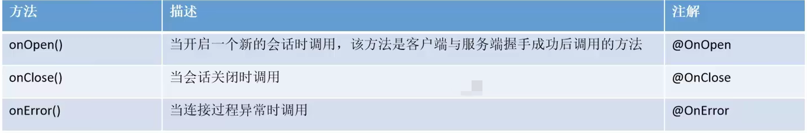

# WebSocket 实现简易聊天室

## 消息推送的常见方式
	1.轮询 浏览器以指定的时间间隔向服务器发出HTTP请求，服务器实时遮回数据给浏览器
		
	2.长轮询 浏览器发出ajax请求，服务器端接收到请求后，会阻塞请求直到有数据或者超时才返回
		
	3.SSE（server-sent event）服务器发送事件
		SSE在服务器和客户端之间打开一个单向通道
		服务端响应的不再是一次性的数据包，而是text/event-stream类型的数据流信息
		服务器有数据变更时将数据流式传输到客户端
		
	4.WebSocket Websocket是一种在基于TCP连接上进行全双工通信的协议

:::tip
全双工: 全双工(Full Duplex):允许数据在两个方向上同时传输

半双工: 半双工(Half Duplex):允许数据在两个方向上传输，但是同一个时间段内只允许一个方向上传输。
:::
		

## 客户端

**客户端方法**


**代码概览**


## 服务端

Tomcat的7.0.5 版本开始支持WebSocket,并且实现了Java WebSocket规范。

Java Websocket应用<span class="marker-evy">由一系列的Endpoint组成</span>。Endpoint 是一个java对象，代表Websocket链接的一端，对于服务端，我们可以视为处理具体WebSocket消息的接口。

**如何定义Endpoint?**


<details>
  <summary>我们可以通过两种方式定义Endpoint:</summary>

	第一种是编程式, 即继承类javax.websocket.Endpoint并实现其方法
	第二种是注解式, 即定义一个POJO, 并添加@ServerEndpoint相关注解
</details>


**生命周期方法**

	Endpoint实例在Websocket握手时创建，并在客户端与服务端链接过程中有效，最后在链接关闭时结束。
	在Endpoint接口中明确定义了与其生命周期相关的方法， 规范实现者确保生命周期的各个阶段调用实例的相关方法。
	生命周期方法如下:


:::danger
⬆ 没有onError，应为onMessage   @OnMessage

:::


### 服务端如何接收客户端发送的数据？

	1.编程式	通过添加 MessageHandler 消息处理器来接收消息
	2.注解式	在定义Endpoint时，通过@OnMessage注解指定接收消息的方法


### 服务端如何推送数据给客户端？

	发送消息则由 RemoteEndpoint 完成，其实例由Session 维护发送消息有2种方式发送消息
	方式1：通过session.getBasicRemote 获取同步消息发送的实例，然后调用其 sendXxx()方法发送消息
	方式2：通过session.getAsyncRemote 获取异步消息发送实例，然后调用其 sendXxx()方法发送消息

**代码概览**


## SpringBoot整合Websocket

**引入依赖**

```xml [pom.xml]
<!--websocket-->
<dependency>
	<groupId>org.springframework.boot</groupId>
	<artifactId>spring-boot-starter-websocket</artifactId>
</dependency>
```

**配置类**

	编写配置类，扫描添加有@ServerEndpoint注解的Bean
	该配置类会自动扫描带有@ServerEndpoint注解的

```java [WebSocketConfig]
@Configuration
public class WebSocketConfig {
    @Bean
    public ServerEndpointExporter serverEndpointExporter() {
        return new ServerEndpointExporter();
    }
}
```

	编写配置类，用于获取HttpSession对象
```java [GetHttpSessionConfig]
public class GetHttpSessionConfig extends ServerEndpointConfig.Configurator {

    @Override
    public void modifyHandshake(ServerEndpointConfig sec, HandshakeRequest request, HandshakeResponse response) {
        // 获取HttpSession对象
        HttpSession httpSession = (HttpSession) request.getHttpSession();
        // 将httpSession对象保存起来
        sec.getUserProperties().put(HttpSession.class.getName(), httpSession);
    }
}

```

**定义Bean，在@serverEndpoint中引入配置器**

```java
@ServerEndpoint(value = "/chat", configurator = GetHttpSessionConfig.class)
@Component
public class ChatEndPoint {

    private static final Map<String, Session> onlineUsers = new ConcurrentHashMap<>();

    private HttpSession httpSession;

    /**
     * 建立websocket连接后，被调用
     *
     * @param session
     */
    @OnOpen
    public void onOpen(Session session, EndpointConfig config) {
        // 1.将session进行保存
        this.httpSession = (HttpSession) config.getUserProperties().get(HttpSession.class.getName());
        String userName = (String) this.httpSession.getAttribute("userName");
        onlineUsers.put(userName, session);
        // 2. 广播消息，需要将登录的所有用户推送给所有用户
        String message = MessageUtil.getMessage(true, null, getAllUserName());
        broadcastAllUsers(message);
    }

    /**
     * 浏览器发送消息到服务端，该方法被调用
     *
     * @param message
     */
    @OnMessage
    public void onMessage(String message) {
        // 将消息推送给指定用户
        Message msgObj = JSON.parseObject(message, Message.class);
        // 获取消息接收方
        String toName = msgObj.getToName();
        String msg = msgObj.getMessage();
        // 接收方 session对象
        Session session = onlineUsers.get(toName);
        String sendMsg = MessageUtil.getMessage(false, (String) this.httpSession.getAttribute("userName"), msg);
        try {
            session.getBasicRemote().sendText(sendMsg);
        } catch (IOException e) {
            e.printStackTrace();
            throw new RuntimeException(e);
        }
    }

    /**
     * 断开websocket连接时被调用
     *
     * @param session
     */
    @OnClose
    public void onClose(Session session) {
        // 1.从onlineUsers中剔除当前用户的session对象
        onlineUsers.remove((String) this.httpSession.getAttribute("userName"));
        // 2.通知其他所有用户，当前用户下线了
        String message = MessageUtil.getMessage(true, null, getAllUserName());
        broadcastAllUsers(message);
    }

    private Set getAllUserName() {
        Set<String> strings = onlineUsers.keySet();
        return strings;
    }

    private void broadcastAllUsers(String message) {
        onlineUsers.forEach((k, v) -> {
            // 获取所有用户的session对象
            Session session = v;
            // 发送消息
            try {
                session.getBasicRemote().sendText(message);
            } catch (IOException e) {
                e.printStackTrace();
                throw new RuntimeException(e);
            }
        });
    }


}

```

**注意**

在onOpen中的<span class="marker-evy">EndpointConfig</span> 与 GetHttpSessionConfig类中modifyHandshake方法的<span class="marker-evy">ServerEndpointConfig</span>这俩其实是一个对象

保存HttpSession对象时


## 用到的代码片段

```java
public class MessageUtil {

    public static String getMessage(boolean isSystemMessage, String fromName, Object message) {
        ResultMessage resultMessage = new ResultMessage();
        resultMessage.setMessage(message);
        resultMessage.setSystem(isSystemMessage);
        if (!ObjectUtils.isEmpty(fromName)) {
            resultMessage.setFromName(fromName);
        }
        return JSON.toJSONString(resultMessage);
    }
}
```

```java
@AllArgsConstructor
@NoArgsConstructor
@Data
public class Message {
    private String toName;
    private String message;
}
```

```java
@Data
@AllArgsConstructor
@NoArgsConstructor
public class ResultMessage {
    private boolean system;
    private Object message;
    private String fromName;
}
```

## 消息格式


