# XXL-JOB

## 什么是任务调度？
我们可以思考一下下面业务场景的解决方案:

- 某电商平台需要每天上午10点，下午3点，晚上8点发放一批优惠券
- 某银行系统需要在信用卡到期还款日的前三天进行短信提醒
- 某财务系统需要在每天凌晨0:10分结算前一天的财务数据，统计汇总

以上场景就是任务调度所需要解决的问题

**任务调度是为了自动完成特定任务，在约定的特定时刻去执行任务的过程**


## 为什么需要分布式调度？
使用Spring中提供的注解@Scheduled，也能实现调度的功能

在业务类中方法中贴上这个注解,然后在启动类上贴上`@EnableScheduling`注解
```java
@Scheduled(cron = "0/20 * * * * ? ")
 public void doWork(){
 	//doSomething   
 }
```

感觉Spring给我们提供的这个注解可以完成任务调度的功能，好像已经完美解决问题了，为什么还需要分布式呢?

主要有如下这几点原因:

1. 高可用：单机版的定式任务调度只能在一台机器上运行，如果程序或者系统出现异常就会导致功能不可用。
2. 防止重复执行: 在单机模式下，定时任务是没什么问题的。但当我们部署了多台服务，同时又每台服务又有定时任务时，若不进行合理的控制在同一时间，只有一个定时任务启动执行，这时，定时执行的结果就可能存在混乱和错误了
3. 单机处理极限：原本1分钟内需要处理1万个订单，但是现在需要1分钟内处理10万个订单；原来一个统计需要1小时，现在业务方需要10分钟就统计出来。你也许会说，你也可以多线程、单机多进程处理。的确，多线程并行处理可以提高单位时间的处理效率，但是单机能力毕竟有限（主要是CPU、内存和磁盘），始终会有单机处理不过来的情况。

## XXL-JOB介绍

XXL-Job：是大众点评的分布式任务调度平台，是一个轻量级分布式任务调度平台, 其核心设计目标是开发迅速、学习简单、轻量级、易扩展

大众点评目前已接入XXL-JOB，该系统在内部已调度约100万次，表现优异。

目前已有多家公司接入xxl-job，包括比较知名的大众点评，京东，优信二手车，360金融 (360)，联想集团 (联想)，易信 (网易)等等

官网地址 https://www.xuxueli.com/xxl-job/

**系统架构图**
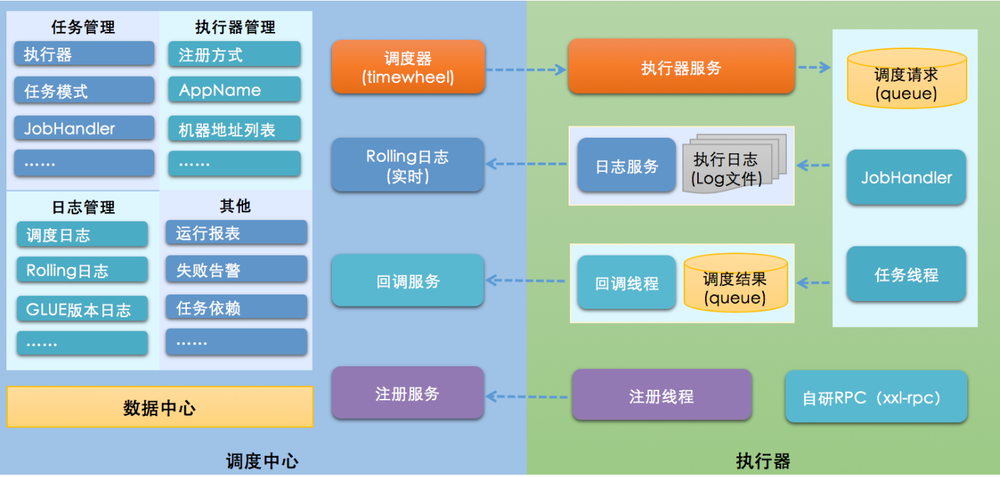

**设计思想**

将调度行为抽象形成**调度中心**公共平台，而平台自身并不承担业务逻辑，“调度中心”负责发起调度请求。

将任务抽象成分散的JobHandler，交由“执行器”统一管理，“执行器”负责接收调度请求并执行对应的JobHandler中业务逻辑。

因此，“调度”和“任务”两部分可以相互解耦，提高系统整体稳定性和扩展性；

## 调度中心部署
**源码下载地址:**

[github地址](https://github.com/xuxueli/xxl-job)

[gitee地址](https://gitee.com/xuxueli0323/xxl-job)

执行该路径下的sql文件：<span class="marker-evy">xxl-job\doc\db\tables_xxl_job.sql</span>

需要修该项目配置文件下的数据源（**application.properties文件**）
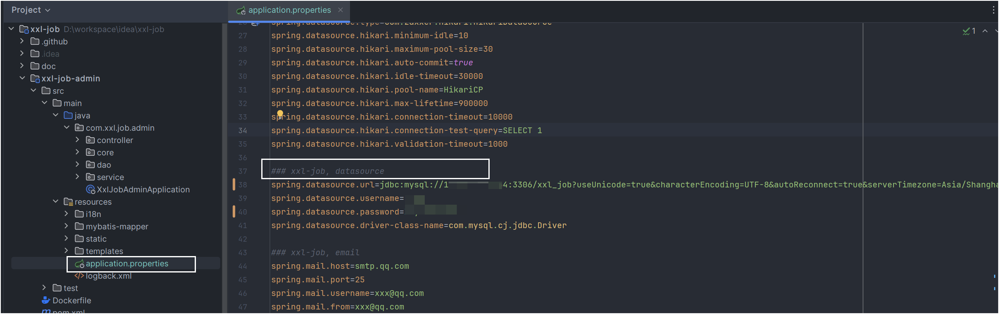

这里可以配置，如果任务执行失败，会给予通知
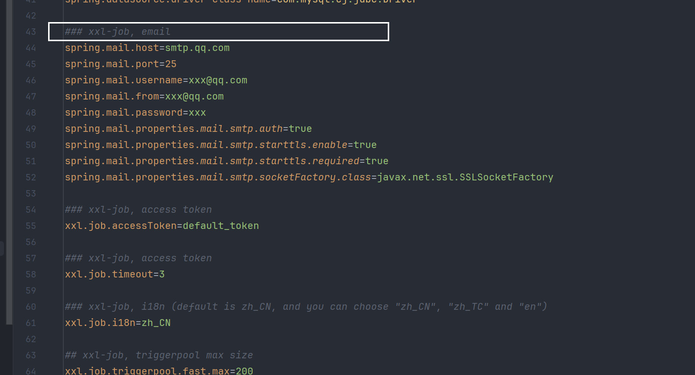

执行该启动文件`XxlJobAdminApplication`

拉下来的xxl-job项目，配置文件内容`application.properties`
```properties
### web
server.port=8080
server.servlet.context-path=/xxl-job-admin

### actuator
management.server.base-path=/actuator
management.health.mail.enabled=false

### resources
spring.mvc.servlet.load-on-startup=0
spring.mvc.static-path-pattern=/static/**
spring.web.resources.static-locations=classpath:/static/

### freemarker
spring.freemarker.templateLoaderPath=classpath:/templates/
spring.freemarker.suffix=.ftl
spring.freemarker.charset=UTF-8
spring.freemarker.request-context-attribute=request
spring.freemarker.settings.number_format=0.##########
spring.freemarker.settings.new_builtin_class_resolver=safer

### mybatis
mybatis.mapper-locations=classpath:/mybatis-mapper/*Mapper.xml

### datasource-pool
spring.datasource.type=com.zaxxer.hikari.HikariDataSource
spring.datasource.hikari.minimum-idle=10
spring.datasource.hikari.maximum-pool-size=30
spring.datasource.hikari.auto-commit=true
spring.datasource.hikari.idle-timeout=30000
spring.datasource.hikari.pool-name=HikariCP
spring.datasource.hikari.max-lifetime=900000
spring.datasource.hikari.connection-timeout=10000
spring.datasource.hikari.connection-test-query=SELECT 1
spring.datasource.hikari.validation-timeout=1000

### xxl-job, datasource
spring.datasource.url=jdbc:mysql://数据库ip:端口号/xxl_job?useUnicode=true&characterEncoding=UTF-8&autoReconnect=true&serverTimezone=Asia/Shanghai
spring.datasource.username=root
spring.datasource.password=数据库密码
spring.datasource.driver-class-name=com.mysql.cj.jdbc.Driver

### xxl-job, email
spring.mail.host=smtp.qq.com
spring.mail.port=25
spring.mail.username=xxx@qq.com
spring.mail.from=xxx@qq.com
spring.mail.password=xxx
spring.mail.properties.mail.smtp.auth=true
spring.mail.properties.mail.smtp.starttls.enable=true
spring.mail.properties.mail.smtp.starttls.required=true
spring.mail.properties.mail.smtp.socketFactory.class=javax.net.ssl.SSLSocketFactory

### xxl-job, access token
xxl.job.accessToken=default_token

### xxl-job, access token
xxl.job.timeout=3

### xxl-job, i18n (default is zh_CN, and you can choose "zh_CN", "zh_TC" and "en")
xxl.job.i18n=zh_CN

## xxl-job, triggerpool max size
xxl.job.triggerpool.fast.max=200
xxl.job.triggerpool.slow.max=100

### xxl-job, log retention days
xxl.job.logretentiondays=30

```

调度中心访问地址: `http://localhost:8080/xxl-job-admin`

默认登录账号 “admin/123456”

## 执行器部署

也就是使用我们现有项目，或新建一个demo项目

添加依赖
```xml [pom.xml]
<dependency>
    <groupId>com.xuxueli</groupId>
    <artifactId>xxl-job-core</artifactId>
    <version>2.3.1</version>
</dependency>
```

配置**resources/application.properties或yaml**文件

::: code-group

```yaml [application.yaml]
### 调度中心部署根地址 [选填]：如调度中心集群部署存在多个地址则用逗号分隔。执行器将会使用该地址进行"执行器心跳注册"和"任务结果回调"；为空则关闭自动注册；
xxl:
  job:
    admin:
      addresses: http://127.0.0.1:8080/xxl-job-admin
    accessToken: default_token
    executor:
      appname: xxl-job-executor-sample
      address: 
      ip: 127.0.0.1
      port: 9999
      logpath: /data/applogs/xxl-job/jobhandler
      logretentiondays: 30
```

```yaml [application.properties]
### 调度中心部署根地址 [选填]：如调度中心集群部署存在多个地址则用逗号分隔。执行器将会使用该地址进行"执行器心跳注册"和"任务结果回调"；为空则关闭自动注册；
xxl.job.admin.addresses=http://127.0.0.1:8080/xxl-job-admin
### 执行器通讯TOKEN [选填]：非空时启用；
xxl.job.accessToken=default_token
### 执行器AppName [选填]：执行器心跳注册分组依据；为空则关闭自动注册
xxl.job.executor.appname=xxl-job-executor-sample
### 执行器注册 [选填]：优先使用该配置作为注册地址，为空时使用内嵌服务 ”IP:PORT“ 作为注册地址。从而更灵活的支持容器类型执行器动态IP和动态映射端口问题。
xxl.job.executor.address=
### 执行器IP [选填]：默认为空表示自动获取IP，多网卡时可手动设置指定IP，该IP不会绑定Host仅作为通讯实用；地址信息用于 "执行器注册" 和 "调度中心请求并触发任务"；
xxl.job.executor.ip=127.0.0.1
### 执行器端口号 [选填]：小于等于0则自动获取；默认端口为9999，单机部署多个执行器时，注意要配置不同执行器端口；
xxl.job.executor.port=9999
### 执行器运行日志文件存储磁盘路径 [选填] ：需要对该路径拥有读写权限；为空则使用默认路径；
xxl.job.executor.logpath=/data/applogs/xxl-job/jobhandler
### 执行器日志文件保存天数 [选填] ： 过期日志自动清理, 限制值大于等于3时生效; 否则, 如-1, 关闭自动清理功能；
xxl.job.executor.logretentiondays=30
```

:::


:::warning
xxl.job.accessToken=default_token 调度中心与执行器中的token必须一致
:::

### 添加执行器配置
```java [XxlJobConfig.java]
@Configuration
public class XxlJobConfig {
    @Value("${xxl.job.admin.addresses}")
    private String adminAddresses;
    @Value("${xxl.job.accessToken}")
    private String accessToken;
    @Value("${xxl.job.executor.appname}")
    private String appname;
    @Value("${xxl.job.executor.address}")
    private String address;
    @Value("${xxl.job.executor.ip}")
    private String ip;
    @Value("${xxl.job.executor.port}")
    private int port;
    @Value("${xxl.job.executor.logpath}")
    private String logPath;
    @Value("${xxl.job.executor.logretentiondays}")
    private int logRetentionDays;

    @Bean
    public XxlJobSpringExecutor xxlJobExecutor() {
        XxlJobSpringExecutor xxlJobSpringExecutor = new XxlJobSpringExecutor();
        xxlJobSpringExecutor.setAdminAddresses(adminAddresses);
        xxlJobSpringExecutor.setAppname(appname);
        xxlJobSpringExecutor.setAddress(address);
        xxlJobSpringExecutor.setIp(ip);
        xxlJobSpringExecutor.setPort(port);
        xxlJobSpringExecutor.setAccessToken(accessToken);
        xxlJobSpringExecutor.setLogPath(logPath);
        xxlJobSpringExecutor.setLogRetentionDays(logRetentionDays);
        return xxlJobSpringExecutor;
    }
}
```

添加一个简单的任务处理
```java [SimpleXxlJob.java]
@Component
public class SimpleXxlJob {
    @XxlJob("demoJobHandler")
    public void demoJobHandler() throws Exception {
        System.out.println("执行定时任务,执行时间:" + new Date());
    }
}

```

执行程序后，简单配置一个demo
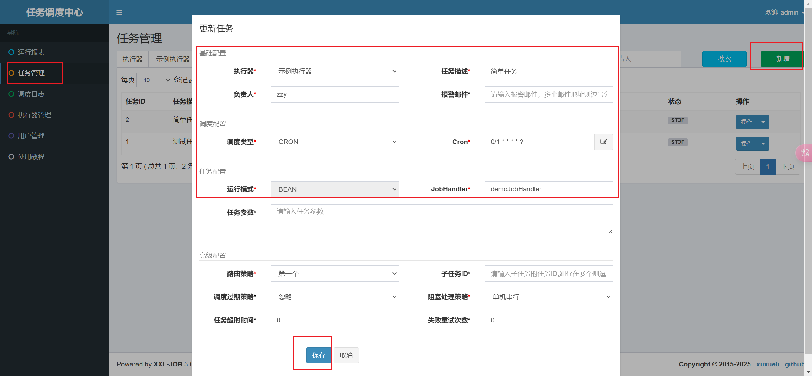
调度中心中点击启动，执行结果如下


## GLUE模式(Java)
任务以源码方式维护在调度中心，支持通过Web IDE在线更新，实时编译和生效，因此不需要指定JobHandler。

可以不在程序中进行编写即可执行

假设程序中有该service业务方法
```java
@Service
public class HelloService {
    public void methodA() {
        System.out.println("执行MethodA的方法");
    }

    public void methodB() {
        System.out.println("执行MethodB的方法");
    }
}
```

创建GLUE模式任务

编辑GLUD IDE
```java 
package com.xxl.job.service.handler;

import com.xxl.job.core.context.XxlJobHelper;
import com.xxl.job.core.handler.IJobHandler;
import org.springframework.beans.factory.annotation.Autowired;
import com.zzy.xxl.service.HelloService;

public class DemoGlueJobHandler extends IJobHandler {

  	@Autowired
    private HelloService helloService;
  
	@Override
	public void execute() throws Exception {
        helloService.methodA();
	}

}


```
注入要执行的业务层，调用执行的方法

:::warning
1. 导包路径一定要写正确

2. 如果报了这个错
```
Exception in thread "xxl-job, EmbedServer bizThreadPool-1827643357" java.lang.NoClassDefFoundError: javax/annotation/Resource
at com.xxl.job.core.glue.impl.SpringGlueFactory.injectService(SpringGlueFactory.java:45)
at com.xxl.job.core.glue.GlueFactory.loadNewInstance(GlueFactory.java:53)
at com.xxl.job.core.biz.impl.ExecutorBizImpl.run(ExecutorBizImpl.java:93)
```

添加 javax.annotation-api 依赖
```
<dependency>
    <groupId>javax.annotation</groupId>
    <artifactId>javax.annotation-api</artifactId>
    <version>1.3.2</version>
</dependency>
```

:::

启动后


## 执行器集群-负载均衡


在后端服务集群的时候


:::warning
如果报错
```
java.net.BindException: Address already in use: bind
	at java.base/sun.nio.ch.Net.bind0(Native Method) ~[na:na]
	at java.base/sun.nio.ch.Net.bind(Net.java:555) ~[na:na]
	at java.base/sun.nio.ch.ServerSocketChannelImpl.netBind(ServerSocketChannelImpl.java:337) ~[na:na]
```
注意修改该配置

:::


在这里可以看到集群
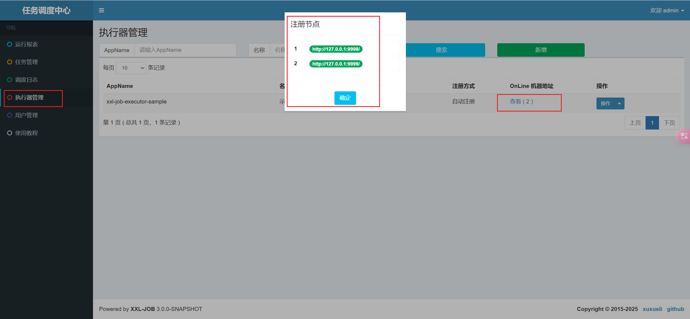


在编辑中修改策略
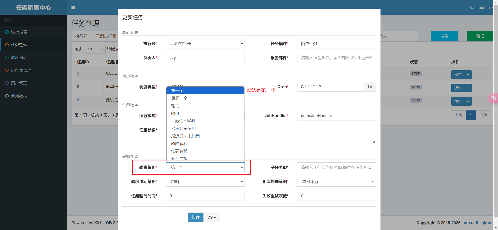

### 调度路由算法讲解
当执行器集群部署时，提供丰富的路由策略，包括:
1. `FIRST（第一个）：固定选择第一个机器`

2. `LAST（最后一个）：固定选择最后一个机器；`

3. `ROUND（轮询）：依次的选择在线的机器发起调度`

4. `RANDOM（随机）：随机选择在线的机器；`

5. `CONSISTENT_HASH（一致性HASH）：`        
   `每个任务按照Hash算法固定选择某一台机器，且所有任务均匀散列在不同机器上。`

6. `LEAST_FREQUENTLY_USED（最不经常使用）：使用频率最低的机器优先被选举；`

7. `LEAST_RECENTLY_USED（最近最久未使用）：最久未使用的机器优先被选举；`

8. `FAILOVER（故障转移）：按照顺序依次进行心跳检测，第一个心跳检测成功的机器选定为目标执行器并发起调度；`

9. `BUSYOVER（忙碌转移）：按照顺序依次进行空闲检测，第一个空闲检测成功的机器选定为目标执行器并发起调度；`

10. `SHARDING_BROADCAST(分片广播)：`        
    `广播触发对应集群中所有机器执行一次任务，同时系统自动传递分片参数；可根据分片参数开发分片任务；`

## 分片案例准备

引入pom依赖
```xml
<dependency>
    <groupId>com.alibaba</groupId>
    <artifactId>druid</artifactId>
    <version>1.2.20</version>
</dependency>
<dependency>
    <groupId>org.projectlombok</groupId>
    <artifactId>lombok</artifactId>
    <version>1.18.30</version>
</dependency>
<dependency>
    <groupId>com.baomidou</groupId>
    <artifactId>mybatis-plus-boot-starter</artifactId>
    <version>3.5.3.1</version>
</dependency>
<dependency>
    <groupId>mysql</groupId>
    <artifactId>mysql-connector-java</artifactId>
    <version>8.0.33</version>
</dependency>
```

修改配置文件
```properties
spring.datasource.url=jdbc:mysql://IP地址:3306/xxl_job_demo?serverTimezone=GMT%2B8&useUnicode=true&characterEncoding=UTF-8
spring.datasource.driverClassName=com.mysql.jdbc.Driver
spring.datasource.type=com.alibaba.druid.pool.DruidDataSource
spring.datasource.username=root
spring.datasource.password=密码
```

接口与任务
```java [UserMobilePlanService.java]
void sendMsgHandler();
```

```java [UserMobilePlanServiceImpl.java]
    @Override
    @XxlJob("sendMsgHandler")
    public void sendMsgHandler() {
        List<UserMobilePlan> userMobilePlans = userMobilePlanMapper.selectList(new LambdaQueryWrapper<UserMobilePlan>()
                .orderByDesc(UserMobilePlan::getId));
        System.out.println("任务开始时间:" + new Date() + ",处理任务数量:" + userMobilePlans.size());
        Long startTime = System.currentTimeMillis();
        userMobilePlans.forEach(item -> {
            try {
                //模拟发送短信动作
                TimeUnit.MILLISECONDS.sleep(5);
            } catch (InterruptedException e) {
                e.printStackTrace();
            }
        });
        System.out.println("任务结束时间:" + new Date());
        System.out.println("任务耗时:" + (System.currentTimeMillis() - startTime) + "毫秒");
    }
```

:::info
注意这个
`@XxlJob("sendMsgHandler")`
:::

在任务调度中心，添加新任务
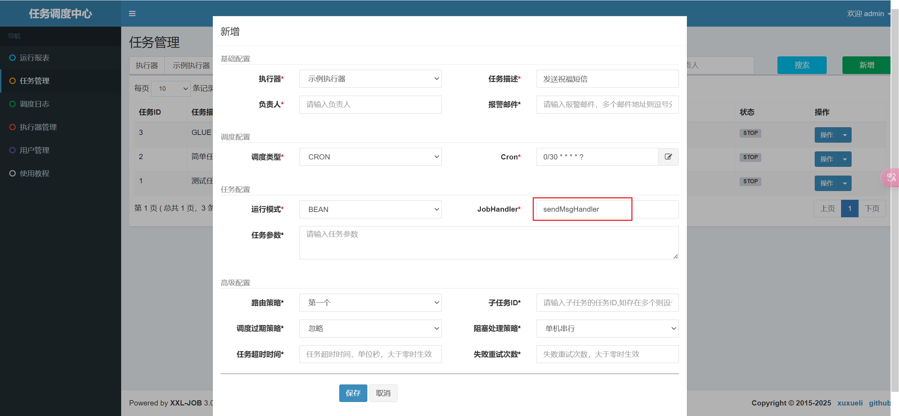

启动之后就会看到


## 分片案例改造

比如我们的案例中有2000+条数据，如果不采取分片形式的话，任务只会在一台机器上执行，这样的话需要20+秒才能执行完任务.

如果采取分片广播的形式的话，一次任务调度将会广播触发对应集群中所有执行器执行一次任务，同时系统自动传递分片参数；可根据分片参数开发分片任务；

获取分片参数方式:

可以理解为一台执行器就是一个分片，索引则是从0开始
```java
int shardIndex = XxlJobHelper.getShardIndex();
int shardTotal = XxlJobHelper.getShardTotal();
```

通过这两个参数，我们可以通过求模取余的方式，分别查询，分别执行，这样的话就可以提高处理的速度；

之前2000+条数据只在一台机器上执行需要20+秒才能完成任务，分片后，有两台机器可以共同完成2000+条数据，每台机器处理1000+条数据，这样的话只需要10+秒就能完成任务；

改造之前的方法
```java  [UserMobilePlanServiceImpl.java]
@Override
    @XxlJob("sendMsgHandler")
    public void sendMsgHandler() {
        System.out.println("任务开始时间:" + new Date());
        int shardTotal = XxlJobHelper.getShardTotal();
        int shardIndex = XxlJobHelper.getShardIndex();
        List<UserMobilePlan> userMobilePlans;
        if (shardTotal == 1) {
            //如果没有分片就直接查询所有数据
            userMobilePlans = userMobilePlanMapper.selectList(new LambdaQueryWrapper<UserMobilePlan>()
                    .orderByDesc(UserMobilePlan::getId));
        } else {
            userMobilePlans = userMobilePlanMapper.selectByMod(shardIndex, shardTotal);
        }
        System.out.println("处理任务数量:" + userMobilePlans.size());
        Long startTime = System.currentTimeMillis();
        userMobilePlans.forEach(item -> {
            try {
                TimeUnit.MILLISECONDS.sleep(5);
            } catch (InterruptedException e) {
                e.printStackTrace();
            }
        });
        System.out.println("任务结束时间:" + new Date());
        System.out.println("任务耗时:" + (System.currentTimeMillis() - startTime) + "毫秒");
    }
```

```java [UserMobilePlanMapper.java]
    List<UserMobilePlan> selectByMod(@Param("shardingIndex") Integer shardingIndex, @Param("shardingTotal") Integer shardingTotal);
```

```xml [UserMobilePlanMapper.xml]
  <select id="selectByMod" resultMap="BaseResultMap">
    select * from t_user_mobile_plan where mod(id,#{shardingTotal})=#{shardingIndex}
  </select>
```

修改调度中心
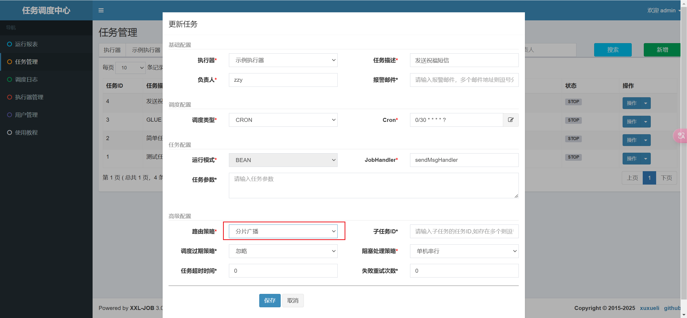

发现每个执行器执行任务的速度大大缩短
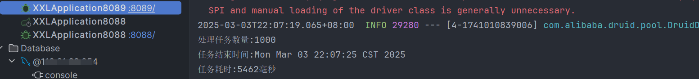

:::info
`shardTotal`：表示任务的总分片数（即任务被拆分成多少份）。

`shardIndex`：表示当前任务实例的分片索引（从 0 开始）。

分片机制允许将一个大任务拆分成多个小任务，分配到不同的机器或线程中并行执行。

`XxlJobHelper` 是 XXL-JOB 提供的工具类，用于获取任务运行时的相关信息。
:::

分片适用场景：适用于需要处理大量数据的任务，尤其是需要分布式部署的场景。
通过分片机制，可以有效提升任务的并发处理能力。


### sql分析

`#{shardingTotal}`：分片总数，表示任务被拆分成多少份。

`#{shardingIndex}`：当前分片索引，表示当前任务实例负责处理哪一部分数据。

`mod(id, #{shardingTotal})` ：
使用 mod 函数对 id 取模运算，结果是 `id % shardingTotal`。
例如，如果 `shardingTotal = 4`，则 id 的取模结果可能是 0, 1, 2, 3。

`= #{shardingIndex}` ：
将取模结果与当前分片索引 `shardingIndex` 比较，筛选出符合条件的数据。
例如，如果 `shardingIndex = 2`，则只选择 `id % shardingTotal = 2` 的记录。


假设表中有以下数据（id 列）：
id: 1, 2, 3, 4, 5, 6, 7, 8, 9, 10

如果 shardingTotal = 4，shardingIndex = 2，则计算过程如下：
```
1 % 4 = 1 → 不符合
2 % 4 = 2 → 符合
3 % 4 = 3 → 不符合
4 % 4 = 0 → 不符合
5 % 4 = 1 → 不符合
6 % 4 = 2 → 符合
7 % 4 = 3 → 不符合
8 % 4 = 0 → 不符合
9 % 4 = 1 → 不符合
10 % 4 = 2 → 符合
```
最终查询结果为：
id: 2, 6, 10


## 项目集成xxl-job

引入依赖
```xml
<dependency>
    <groupId>com.xuxueli</groupId>
    <artifactId>xxl-job-core</artifactId>
    <version>2.3.1</version>
</dependency>
```

在Nacos中或yaml文件中配置
```yaml
# 调度中心部署根地址 [选填]：如调度中心集群部署存在多个地址则用逗号分隔。执行器将会使用该地址进行"执行器心跳注册"和"任务结果回调"；为空则关闭自动注册。
xxl:
  job:
    admin:
      addresses: http://127.0.0.1:8080/xxl-job-admin

# 执行器通讯TOKEN [选填]：非空时启用。
    accessToken: default_token

# 执行器AppName [选填]：执行器心跳注册分组依据；为空则关闭自动注册。
    executor:
      appname: xxl-job-executor-sample 执行器的AppName

# 执行器注册 [选填]：优先使用该配置作为注册地址，为空时使用内嵌服务 ”IP:PORT“ 作为注册地址。从而更灵活地支持容器类型执行器动态IP和动态映射端口问题。
      address:

# 执行器IP [选填]：默认为空表示自动获取IP，多网卡时可手动设置指定IP，该IP不会绑定Host仅作为通讯实用；地址信息用于 "执行器注册" 和 "调度中心请求并触发任务"。
      ip: 127.0.0.1

# 执行器端口号 [选填]：小于等于0则自动获取；默认端口为9999，单机部署多个执行器时，注意要配置不同执行器端口。
      port: 9999

# 执行器运行日志文件存储磁盘路径 [选填] ：需要对该路径拥有读写权限；为空则使用默认路径。
      logpath: /data/applogs/xxl-job/jobhandler

# 执行器日志文件保存天数 [选填] ： 过期日志自动清理, 限制值大于等于3时生效; 否则, 如-1, 关闭自动清理功能。
      logretentiondays: 30
```

添加配置类
```java
@Configuration
public class XxlJobConfig {
    @Value("${xxl.job.admin.addresses}")
    private String adminAddresses;
    @Value("${xxl.job.accessToken}")
    private String accessToken;
    @Value("${xxl.job.executor.appname}")
    private String appname;
    // @Value("${xxl.job.executor.address}")
    // private String address;
    @Value("${xxl.job.executor.ip}")
    private String ip;
    @Value("${xxl.job.executor.port}")
    private int port;
    @Value("${xxl.job.executor.logpath}")
    private String logPath;
    @Value("${xxl.job.executor.logretentiondays}")
    private int logRetentionDays;

    @Bean
    public XxlJobSpringExecutor xxlJobExecutor() {
        XxlJobSpringExecutor xxlJobSpringExecutor = new XxlJobSpringExecutor();
        xxlJobSpringExecutor.setAdminAddresses(adminAddresses);
        xxlJobSpringExecutor.setAppname(appname);
        // xxlJobSpringExecutor.setAddress(address);
        xxlJobSpringExecutor.setIp(ip);
        xxlJobSpringExecutor.setPort(port);
        xxlJobSpringExecutor.setAccessToken(accessToken);
        xxlJobSpringExecutor.setLogPath(logPath);
        xxlJobSpringExecutor.setLogRetentionDays(logRetentionDays);
        return xxlJobSpringExecutor;
    }
}

```

添加执行器
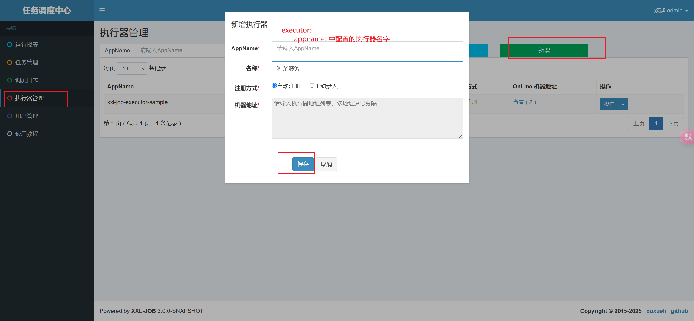

在`OnLine 机器地址`一栏中便可查看，服务注册的机器


代码中添加job任务
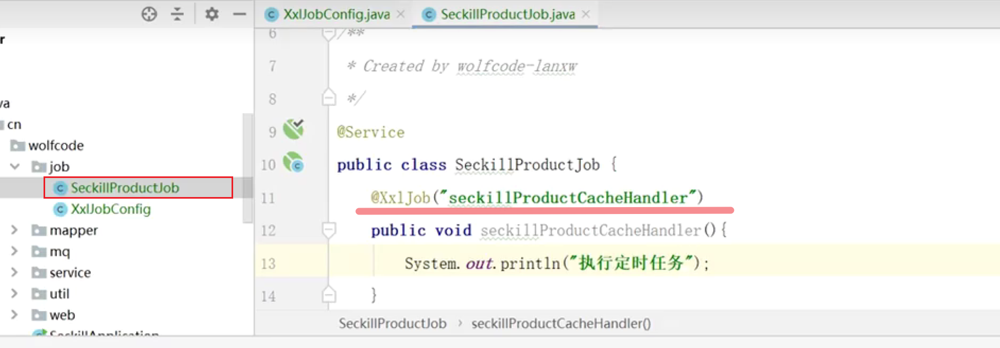

调度中心新增任务
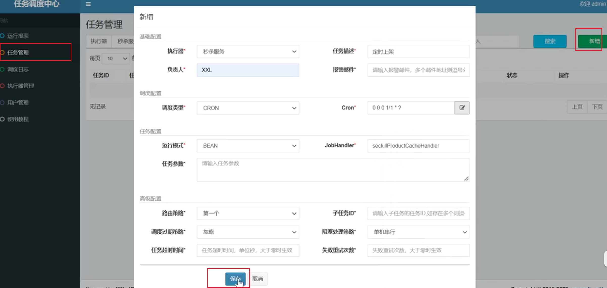